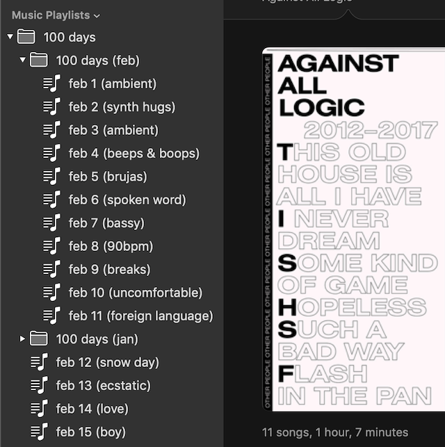
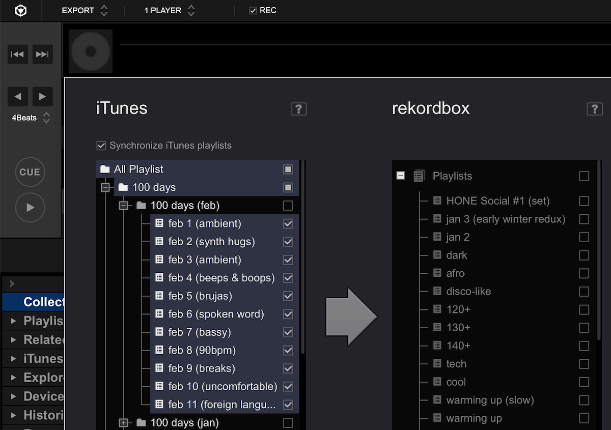
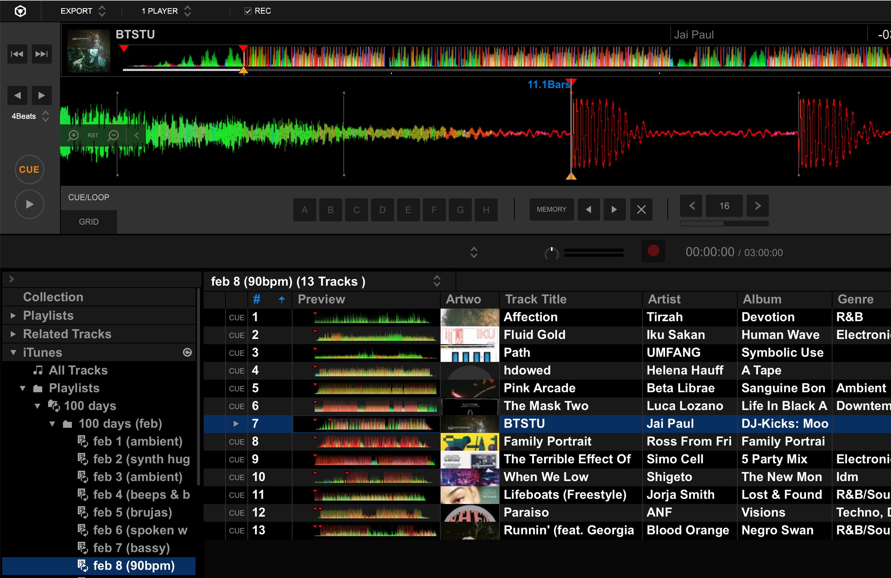

100 days has been going pretty well for me. In this blog post I'd like to give an overview of my making process and some reflections so far.

### The making process

My 100 days creations so far have all been mixed with a 2-deck DJ controller and rekordbox on my Macbook. In general, my process follows these steps:

1. Listen to some music and get inspired to create an iTunes playlist based on some theme. Order the songs generally in the order I want to play them.

    

2. Sync the playlist to rekordbox. It will start auto-analyzing tracks' beat grids.

    

3. Still in rekordbox's Export mode, check out the beat grid info. Adjust it as necessary and set cue points (I usually do one where the track audio starts, one on the first kick drum, one for the first instance of vocals if there are any, and more for any significant thematic changes during the track).

    

4. Switch to Performance mode (2Deck Horizontal) and perform the mix. Sometimes I use the built-in digital effects, but in general I like to let tracks stand on their own.

I haven't touched on music discovery here; that probably deserves a blog post of its own.

### Reflections so far

Some thoughts on my 100 days project so far ([read about the original intent of the project here](../day-1)):

- Sometimes I listen back to the mix and think that it was too easy to make. I will admit that have been relying on the sync button on my controller a lot, which makes it easy to line up beats. There will be the occasional track which has a bad beat grid (or tweaking the beat grid was so tedious that I consciously gave up), so I am forced to beat match it manually, but I want to feel comfortable doing that _all the time_. I want to collect some more records (and borrow some from my friends) so that I can practice vinyl beatmatching during this project, but unfortunately with my current setup the DDJ-RR controller cannot record its line input where I have my turntable plugged in... so I will have to get creative here.
- I don't really feel afraid anymore to mix in any kind of track on the spot. Of course track selection (in the right order) matters a lot in a mix, but I know that the worst thing that can happen is that the audience feels a little surprised. I don't feel like I'm in danger of messing up the transition and thereby creating a lot of sonic / rhythmic dissonance, like I used to feel early on. I'm also more confident about changing tempos by 10+ bpm if I need to.
- I saw some pretty quick improvements in my mixing techniques in January. I stopped relying on the Pioneer filter effects as much and use plain EQ more. The built-in filters can feel cheesy, especially if you use them too much, since they have a lot of resonance. I also started incorporating drops in a more pleasing way.
- I sometimes feel myself wishing I had more than 2 decks to work with, especially with sparse ambient tracks in the mix. I don't see a great way to work around this limitation without building some kind of custom DJ software, but that could be _a lot_ of work, considering how much functionality rekordbox provides. And I don't know if the beat grid analysis information stored by rekordbox is accessible in any friendly way (it probably isn't).
