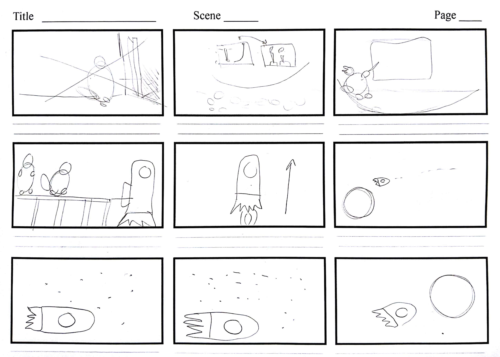
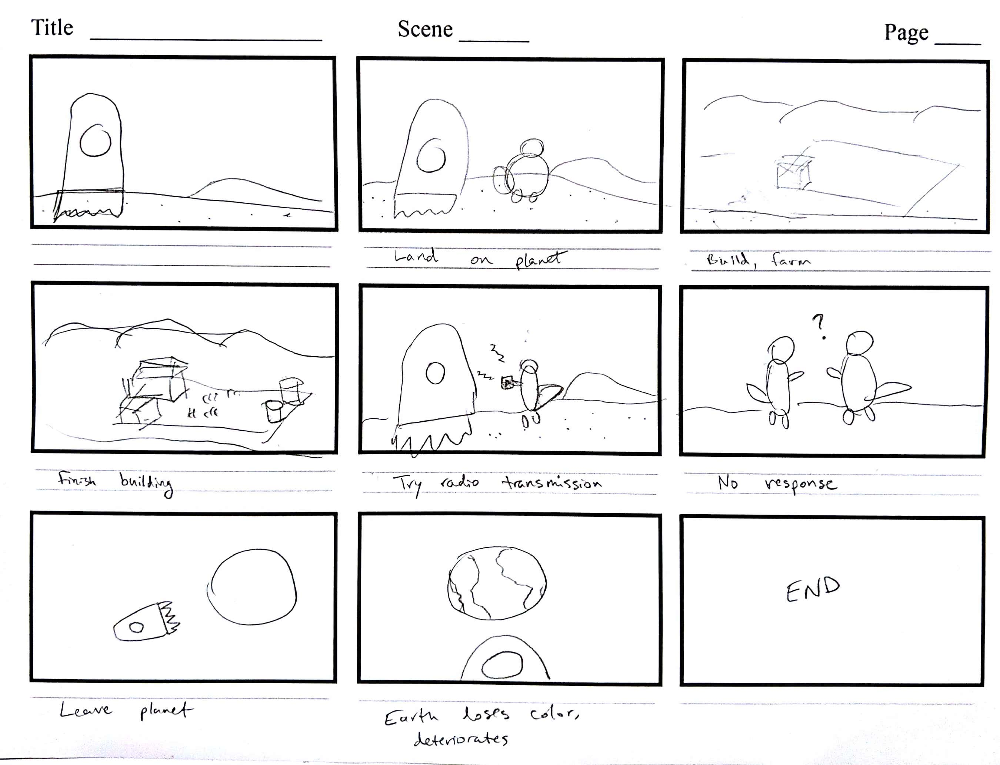

### Final video

<iframe src="https://player.vimeo.com/video/303558271?title=0&byline=0&portrait=0" style="position:absolute;top:0;left:0;width:100%;height:100%;" frameborder="0" webkitallowfullscreen mozallowfullscreen allowfullscreen></iframe>

### Behind the scenes

First, we created a story board and started compiling assets for the animation idea which would feature a group of squirrels traveling to a Mars-like planet and attempting to set up a space colony.

We also created a [mood board](https://www.are.na/adi-dahiya/good-planets-are-hard-to-find-mood-board) for visual inspiration.

In this assignment, I was tasked with the beginning section of the story, where a scientist-type squirrel is explaining the dangers of climate change to an auditorium of people and symbolically puts on a space helmet to indicate that he is going to go build a space colony. When animating this section, I found subtle camera movement to produce a nice cinematic effect. After we met as a group again, I also designed and animated the night/day space colony building scene, which was an interesting challenge. I ended up bringing Photoshop adjustment layers into After Effects and animating them as I moved around other assets in the scene to achieve the look you see in the final video. During the overall process, I also helped David & Jingyi create smoother animations using AE Easy Ease. My group members did the sound design after we completed the visuals.
