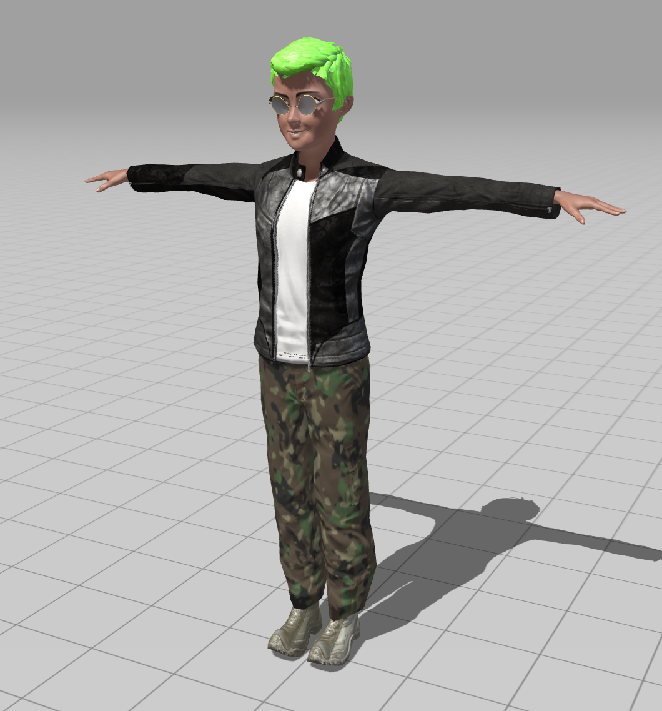
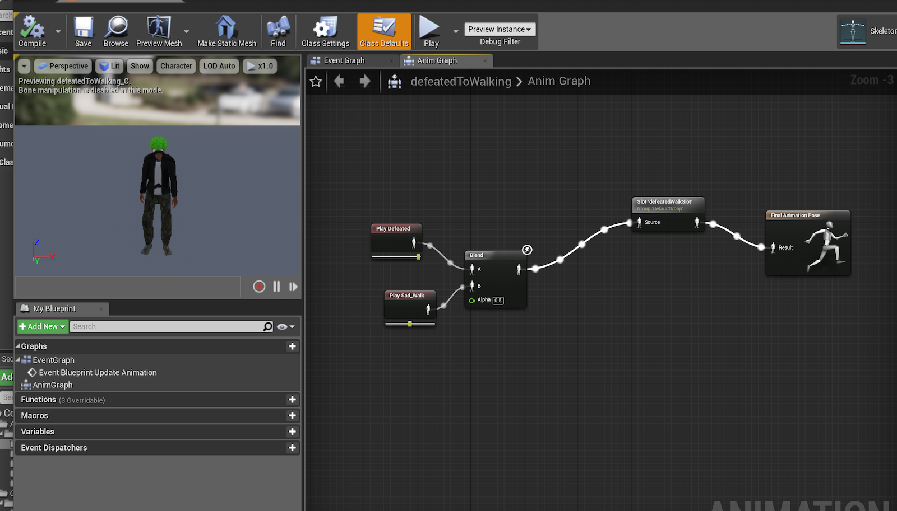
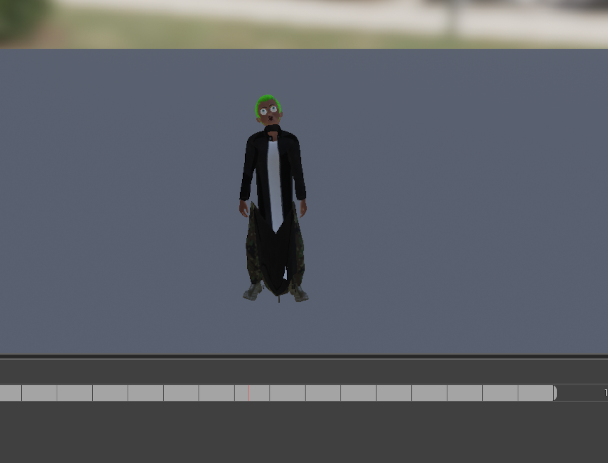
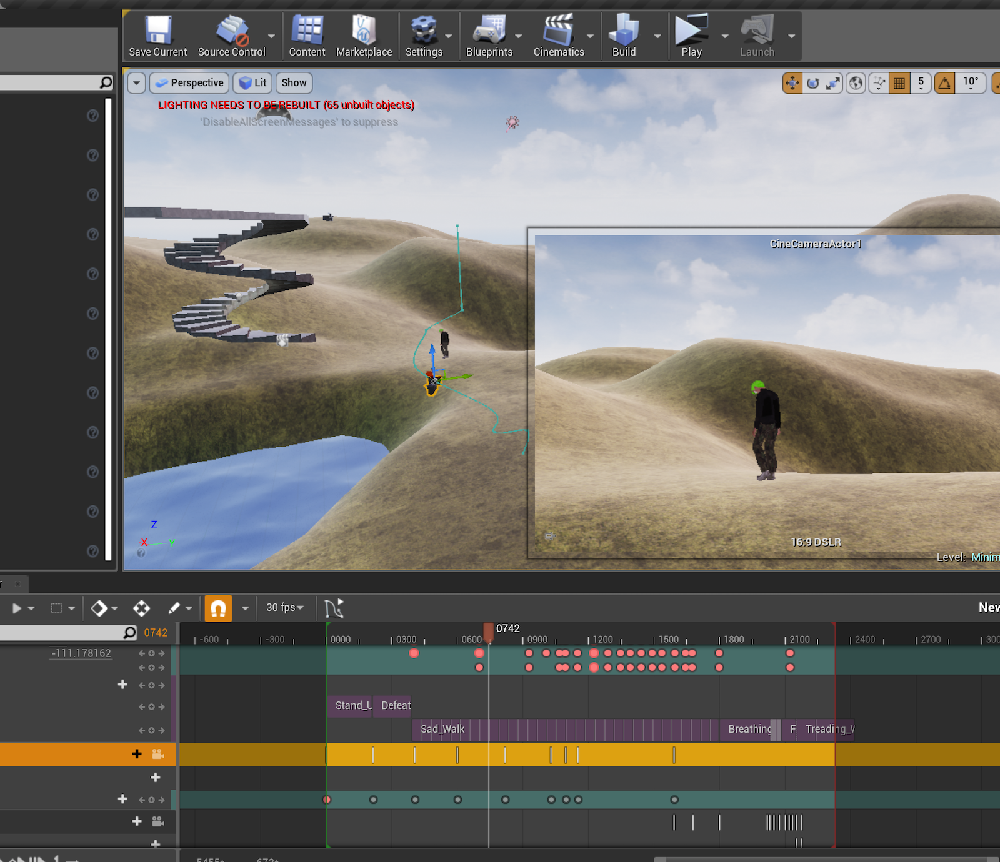

### Final video

<iframe src="https://player.vimeo.com/video/307546719?title=0&byline=0&portrait=0" style="position:absolute;top:0;left:0;width:100%;height:100%;" frameborder="0" webkitallowfullscreen mozallowfullscreen allowfullscreen></iframe>

### Behind the scenes

I had a bit of trouble getting Unreal Engine to work reliably and save my work across sessions working on different production laptops. At one point my level sequence got corrupted so I had to start over. Working in Fuse and Mixamo was pretty nice and straightforward, though. Here's my character based on Fuse's "toon male":

I did attempt to use Blend Spaces and Animation Blueprints, and I got pretty close to adding these to my level sequence, but my character's mesh got warped when I attempted to record an animation from the blended blueprint I created. I eventually decided to rely on camera movement / cuts to hide the jarring transitions between character animations.

My first attempt at blending animations (not quite right):

My second attempt, after creating a 1D Blend Space and recording the result of changing a "progress" variable I had created (still not quite right):

This assignment was really just a short study in Unreal animation for me; I can see that the program has a lot of potential and a lot of depth in its capabilities. At this point I'm not sure if I will continue developing ITP projects in this environment; I feel like I have at least a basic conceptual grasp on 3D animation software from my work in 3ds Max in high school.

