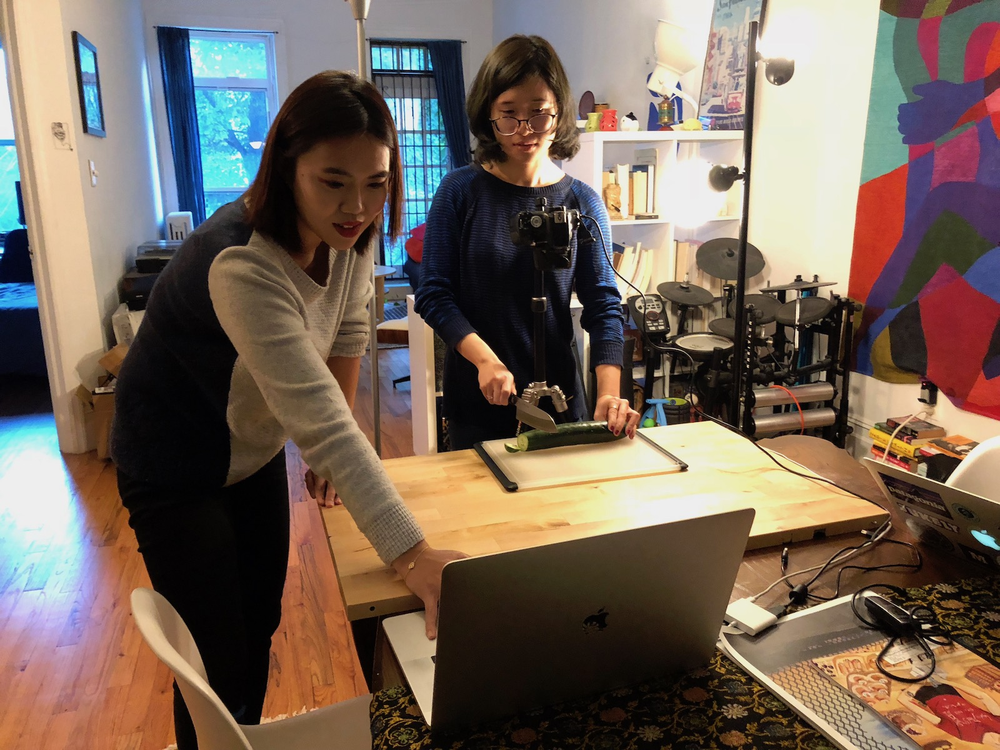
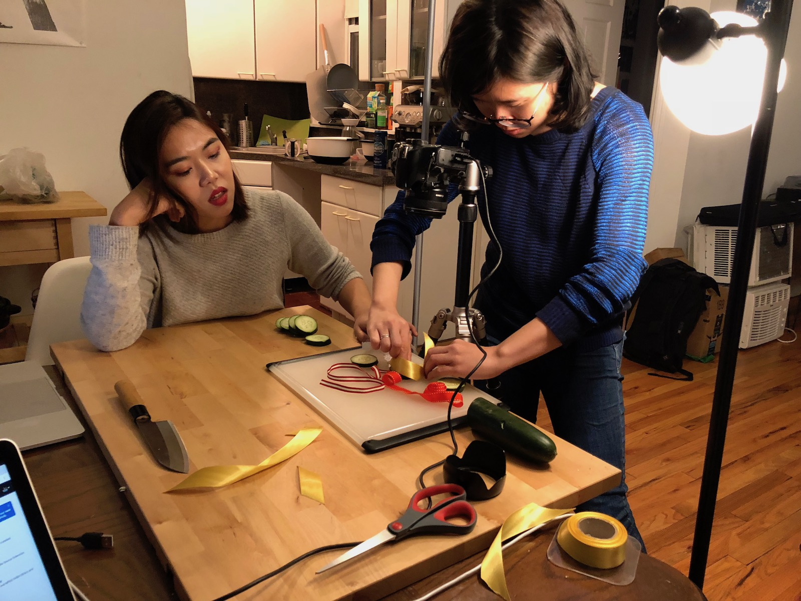

### Final video

<iframe src="https://player.vimeo.com/video/298453001?loop=1&title=0&byline=0&portrait=0" style="position:absolute;top:0;left:0;width:100%;height:100%;" frameborder="0" webkitallowfullscreen mozallowfullscreen allowfullscreen></iframe>

### Behind the scenes

After the initial brainstorming session, Jiwon, Jenny, and I split up the storyboard into three sections which we would each "direct". I directed the cucumber chopping sequences and put together the sound effects and background music.

We shot the animation on my dining table since I had a camera setup and some lights available. It was nice to get out of the ITP floor for a little while. After we got 20-25 seconds worth of still frames here, Jiwon later illustrated her section of the story board on her tablet and I compiled the final animation in Premiere.

This was my first time making a stop motion animation and, while tedious at times, I think it was pretty fun!

