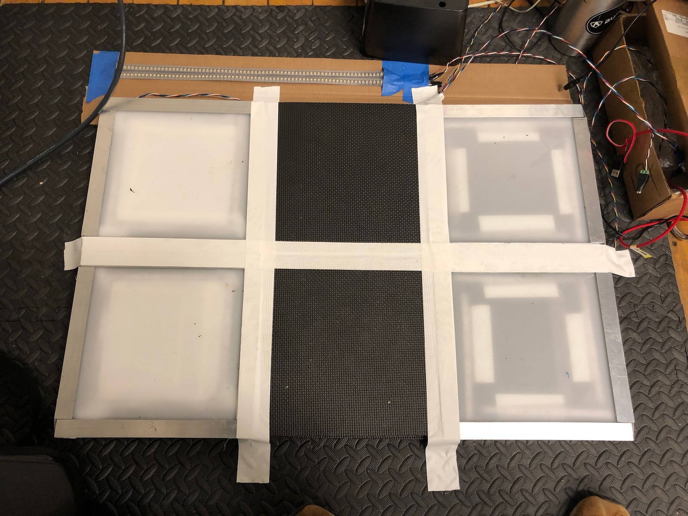

I produced four working tiles for the final presentation of my Dance Floor MPC project on December 10. Because I set up the sensors as analog inputs, I was able to detect varying pressure and program the device to support _accents_ in the sequencer. Stepping on the tiles with greater force provides feedback with a different LED color:

<iframe src="https://player.vimeo.com/video/305814941?loop=1&title=0&byline=0&portrait=0" width="640" height="360" frameborder="0" webkitallowfullscreen mozallowfullscreen allowfullscreen></iframe>

During the actual presentation, I taped the tiles to the foam tile base to keep them in place. By this point, I had not yet fabricated the [floor console](../../physical-computing/week-13-dance-floor-mpc-3) I had designed, so I kept the microcontroller and breadboard in a cardboard box next to the tiles and simply placed the transport LED strip in front of them.

