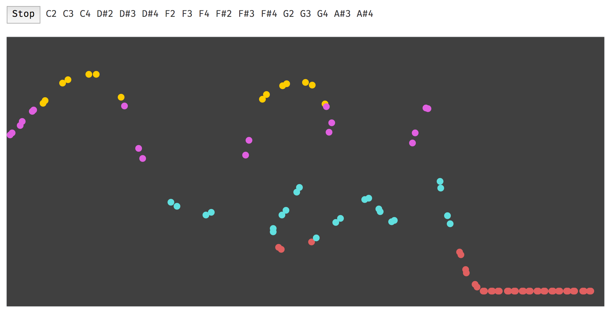

### Listen

LCD Soundsystem's _pulse (v.1)_ starts off with an interesting arpeggiated synth melody which fades in and out of the track. It moves up an down a scale in a humanized pattern, but I'm sure it was programmed by James Murphy into one of his many synthesis machines. I took some inspiration from this when coding my sketch.

<iframe width="560" height="315" src="https://www.youtube-nocookie.com/embed/yCWc1Zzv_GU?rel=0" frameborder="0" allow="autoplay; encrypted-media" allowfullscreen></iframe>

### Code

[Check out my p5.js sketch for the week here](/projects/code-of-music/melody-sketch).

I used `Tone.Pattern()` to play around with the minor blues scale and some of its harmonies. In this sketch, a constant sixteenth note pattern is playing random notes on a scale. The user can change the notes being played by moving their mouse up and down in the canvas. Higher up in the canvas, the low-frequency notes in the scale are filtered out, so you're left with higher frequencies (and vice versa, for lower in the canvas).

