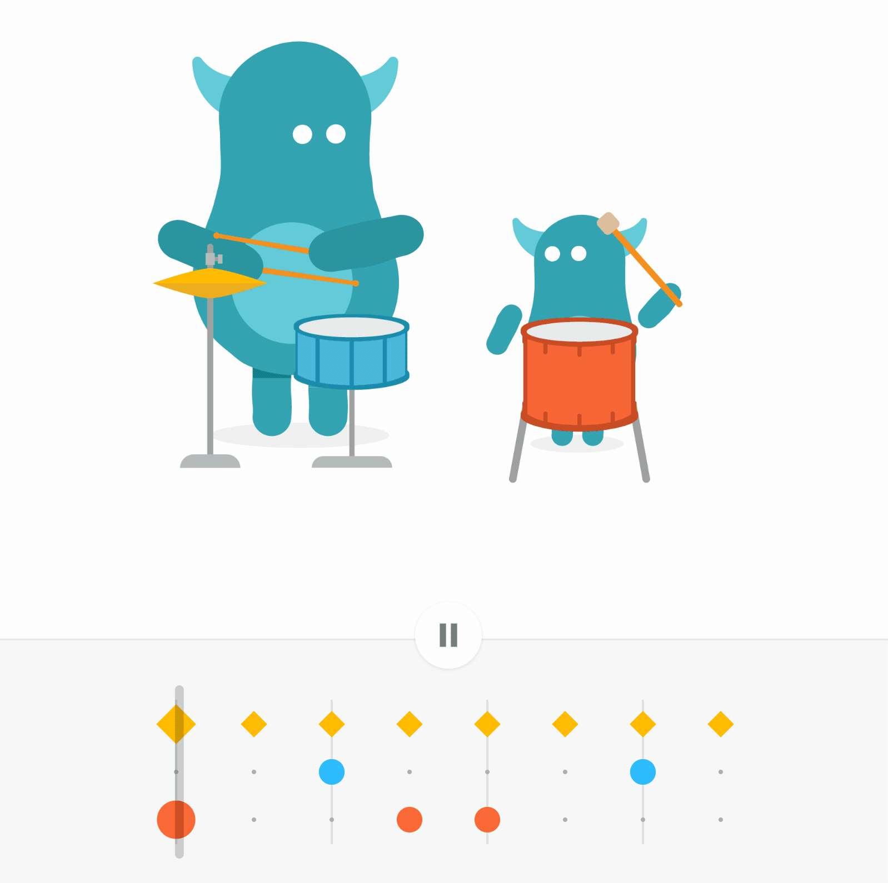
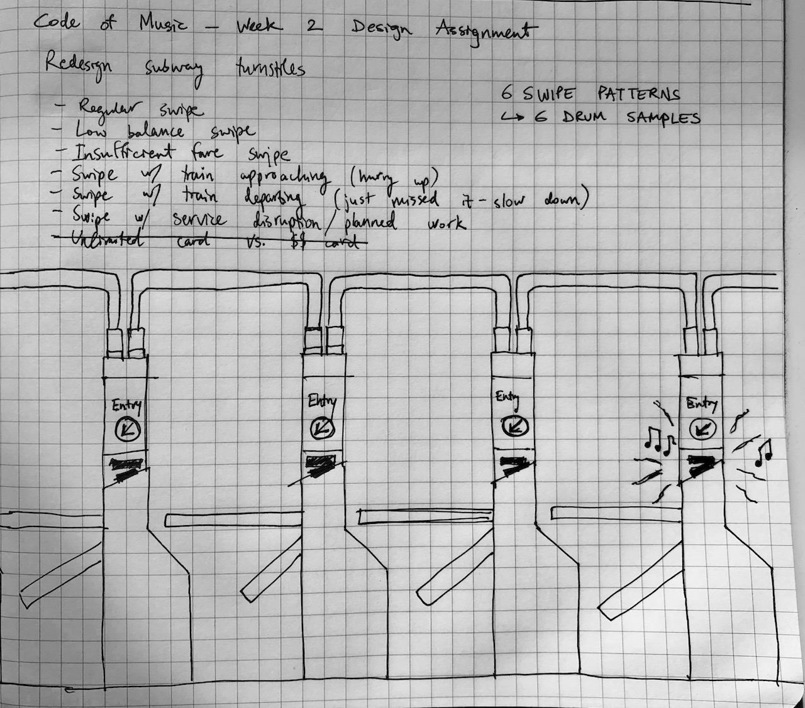
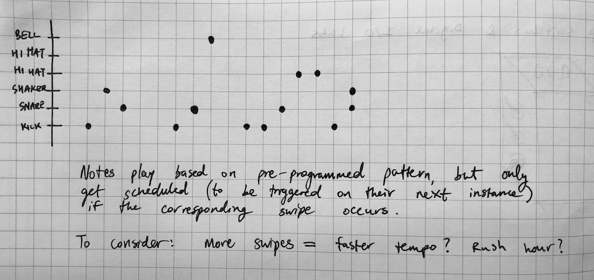

### Reading

- (Optional) [A Tale of Two Clocks - Scheduling Web Audio with Precision](https://www.html5rocks.com/en/tutorials/audio/scheduling/)

### Assignments

#### Listen

<iframe width="560" height="315" src="https://www.youtube.com/embed/B7PeGqqGiFo" frameborder="0" allow="encrypted-media" allowfullscreen></iframe>

This track slaps. It's got some syncopation right off the bat which stays in the drum mix throughout. The shaker is the first instrument you notice which is syncopated, but soon you also notice that the kick drum has one syncopated beat in its repetitive pattern.

#### Interact

[The Infinite Drum Machine](https://experiments.withgoogle.com/ai/drum-machine/view/)

- I really like this drum machine. Not only is it visually interesting to look at while your loop is playing, it's also intuitive to use. I like that it pauses playback when you start to move around one of the four sample selections (you need to be able to preview the new sound you're sampling).
- The problem they're trying to solve here is real; organizing a large library of samples can be tedious and boring, so applying machine learning seems like a good fit. There are online communities like Splice and Beatport where musicians tag various samples, and ultimately I think this additional human-generated data can help to categorize sounds even better (e.g. with information about how a sound is typically used in a particular genre, not just its musical signature).

[Chrome Music Lab - Rhythm](https://musiclab.chromeexperiments.com/Rhythm/)

- This one's pretty simple and cute. It has an approachable interface which invites you to lay down a simple drum beat. I can imagine this being nice for youth music education.

#### Design

For this assignment I took inspiration from James Murphy's [Subway Symphony project](http://gothamist.com/2014/02/24/video_james_murphy_tests_out_subway.php) which aimed to replace the unpleasant beeps of the MTA subway turnstiles with some more melodious sounds (it was [rejected by the MTA](https://pitchfork.com/news/59966-james-murphy-partners-with-heineken-for-subway-turnstile-music-project-mta-denies-it-will-happen/), but later a preview of it was installed in the new [Lowline](https://ny.curbed.com/2016/7/7/12122964/james-murphy-lowline-lab-subway-music) in LES). In much the same way, I'd like to consider a project which improves the aural experience of using the subway and utilizes swiping passengers as inputs to a musical system.

My design requires mapping different kinds of "swipes" to different sounds in a drum machine. I think these six triggers could create a good first prototype:

1. Regular swipe
2. Low balance swipe (less than 1 trip left)
3. Swipe with service disruption (planned track work currently affecting service)
4. Insufficient fare swipe
5. Swipe with train departing (slow down, you just missed it)
6. Swipe with train approaching in < 2 min (hurry up!)

If more than one of these situations apply, the latter categories take precedence.

For accessibility and usability purposes, the actual beeps at the turnstiles shouldn't be altered too much (of course, there's room for improvement in the actual tones used, and the different codes produced by the system are not easy to learn at the moment). But there's room in other parts of the subway system for speakers which produce rhythms triggered by swipes &mdash; for example, the MTA attendant's booth or the stairwell leading up or down to the platforms.

The sounds aren't triggered immediately (although this might be worth trying, I think it would be too random and the resulting rhythms wouldn't feel "musical", just noisy), but rather according to a pre-programmed drum pattern. The software could cycle through patterns on some schedule (perhaps change every 15 min) to keep things interesting. When no one is swiping, there would be no sounds triggered. When a swipe occurs, it would schedule its corresponding sound to trigger _on the next instance of that sound in the drum pattern_. Additional swipes that occur between the original swipe and when the sound actually plays would queue up additional triggers to occur later.

#### Code

[Check out my p5.js sketch for the week here](/projects/code-of-music/rhythm-sketch).
