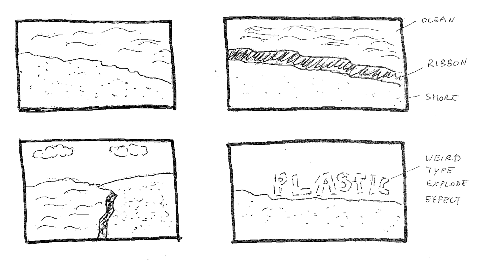

> An environmental awareness group loves your container and wants to use it to educate people about their new product, a takeout container made of plastic from algae - a totally carbon neutral option. They want the activation to be peaceful, calm, and approachable for the general public: informative, but not overwhelming.  They have a garant to find a way to distribute it (if only through documentation) to all homes in the US.

I'd like to pitch the idea of a film commercial made with Weird Type.

- It would include simple shots of the beach with visual and auditory rhythm of waves in the background.
- I'd use a few different type layouts afforded by Weird Type, including ribbon text and exploding type.
- A ribbon of text would rest in the scene along the shore line communicating the main message of the commercial (about plastic waste in our oceans).

Some ideas for the text in the ribbon:

- "Every year, # billion pounds of plastic ends up in the oceans..."
- "That plastic disintegrates and ends up all over the world in tiny particles..." <-- cue explode effect

Other ideas:

- Reverse the exploding text effect with the word "ALGAE"?
  - Is the spelling of that word too weird / unintuitive, i.e. does it need to be verbalized instead?
- Would be nice if Weird Tyep had support for colored text (not just monochromatic)
