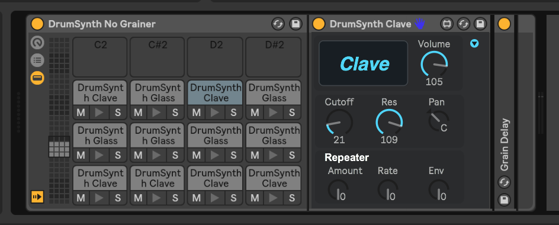
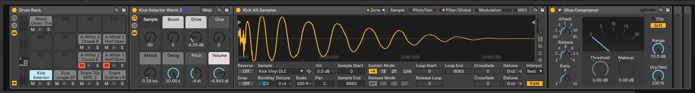
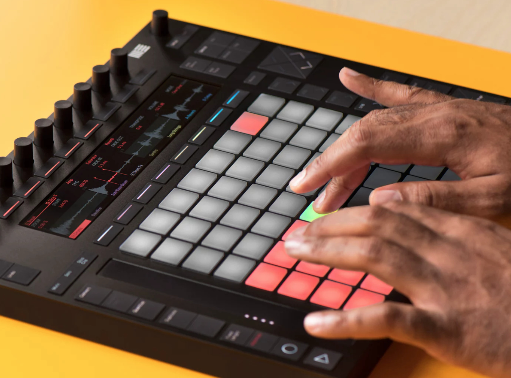
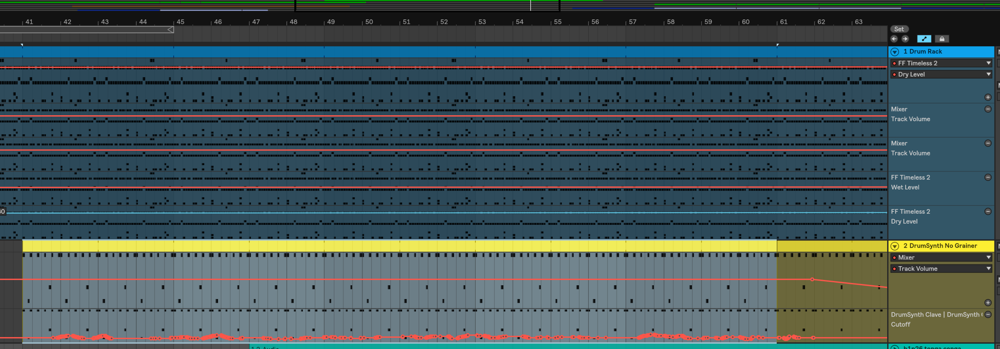

### Reading

- [_Design of Everyday Things_](http://www.nixdell.com/classes/HCI-and-Design-Spring-2017/The-Design-of-Everyday-Things-Revised-and-Expanded-Edition.pdf) (Don Norman), pages 10-36
- [_Rethinking Affordances_, An Introduction](https://schloss-post.com/an-introduction/), (Scarlet and Zeilinger)

### Assignment

> Describe a container (platform/tool/etc.) you use often to create, share, or look at content in terms of affordances, perceived affordances and perhaps too signifiers, constraints, mappings, feedback, and conceptual models.

I often use the Ableton Live's drum rack instrument to make beats for my music. This tool affords the music producer flexible and robust ways to sequence and schedule either synthesized or sampled drum sounds. The rack can hold up to 128 different sounds to be triggered (either by human interaction or on a schedule), but I usually stick to 16, which can fit on one rack screen.

Most sounds can be configured to play as a "one shot" or as a loop (if you continue triggering it with a keyboard or MIDI controller). Individual sounds in the rack can be muted or set to "solo" mode (which mutes everything which is not also in "solo" mode). Synthesized sounds come with their own bespoke synth parameters (shown above), while sampled sounds can be configured with some common sampler parameters (envelope, tuning, etc; shown below).

Each sound can have Ableton effects applied to it individually, or you can also add effects to the overall drum rack. Of course, this instrument integrates with Ableton's metronome and clock system

I usually use a MIDI controller called Ableton Push to work with this software. While the affordances, signifiers, and constraints of the software instrument are very powerful and well thought-out, the keyboard interface leaves much to be desired in terms of feedback and control mapping. The drum sequencer on the Push provides a fluid interface on its 64 pads which allow for both sequencing and finger drumming.

> Identify a piece of "good content" made for/with that container. How does it leverage the affordances of its container?

I made [a piece](https://soundcloud.com/adi-dahiya/esemplastic) earlier this year where I leveraged a lot of the drum rack's affordances. I used both sample- and synth-based drum sounds, I applied effects to drum racks overall (for example, the Glue compressor and FF Timeless reverb filter) and to individual sounds. I used Ableton automation to adjust some of the sound parameters over time in the arrangement (I programmed the automation using the Push's repeat note function and turning some of the dials while the track was playing/recording).

### Picking a container

The container I'd like to work with in this class is _Weird Type_, an AR application for iOS designed by Zach Lieberman.
The app is relatively simple; it lets you paint words in space using your iPhone camera. I think it provides some unique artistic
constraints and it combines my interests of mobile photography & typography.

Some notes from my initial idea brainstorming:

- [Weird Type](https://itunes.apple.com/us/app/weird-type/id1352785248?mt=8) AR app by Zach Lieberman
  - Not many people have made content with this app, it's relatively new and has few downloads (but ardent fans nonetheless)
  - Could potentially get access to developer through ITP network
  - I enjoy working with the iPhone camera and with typography
  - The typographic constraints (monochromatic, only one font, only standard keyboard characters) are interesting
- [Magenta.js](https://magenta.tensorflow.org/) research project with JS implementations of note-based machine learning music models
  - Steeper learning curve since I don't have machine learning experience; I'd probably spend too much time learning the technology to try and make something _good_ rather than getting creative with the tool
- [Terminal](https://en.wikipedia.org/wiki/Terminal_emulator) application
  - Inspired by spreadsheet art example shown in first class; instead of office culture, I can draw inspiration from programmer culture
  - Flexible, interactive platform - lots to work with
  - No access to developers, but there are open source terminal emulators I can hack on if necessary
