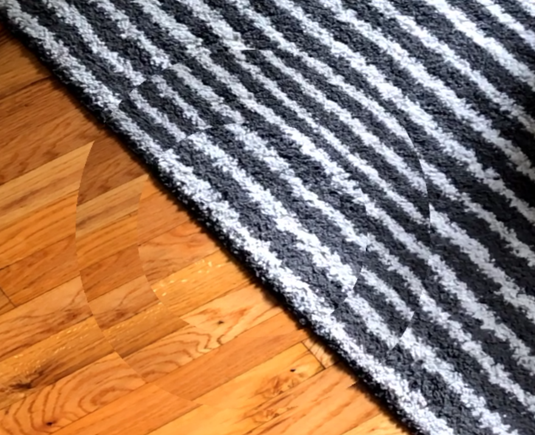
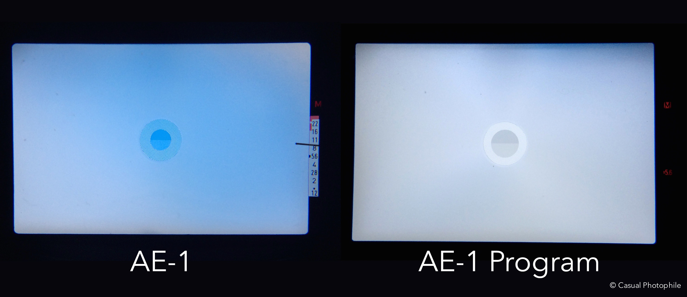

### Reading

-   [_Where Do You Get Your Ideas From?_](http://richardcolby.net/writ2000/wp-content/uploads/2017/09/le-guin-1989-where-do-ideas-come-from-OCR.pdf) (Ursula Le Guin)
-   [_Where Great Ideas Come From_](https://vimeo.com/182093266) (David Lynch)

<!-- ### Notes, responses -->

### Assignment

<iframe src="https://player.vimeo.com/video/291593464" width="640" height="295" frameborder="0" webkitallowfullscreen mozallowfullscreen allowfullscreen></iframe>
<!-- <video src="content-1.webm" controls muted width="880" height="420"></video> -->

For my first piece of content, my goal was to evoke the feeling one has of fitting puzzle pieces together as a child, with the frustration and visual dissonance that comes along with that process.

I used Weird Type's photo stamp feature and the visual backdrop of my living room floor (hardwood, IKEA rug) to create this short video. The camera moves around for a few seconds finding the right plane to work with to align the "O" to its original stamp position. Then it spends the second half of the clip honing in on that position, almost reaching it by the end (but not quite):

To me, this also evokes the visual memory of finding focus on a film camera like the Canon AE-1 Program.

What does it make you feel? Do you feel frustrated, excited, anxious, confused, or anything else?

---

If I were to take this content further, I would spend more time shooting similar videos with the same stamp but different backgrounds. I'd want the other backgrounds to have similar visual patterns with lines going through them (to mimic the pronounced effect I got with the hardwood and rug).
