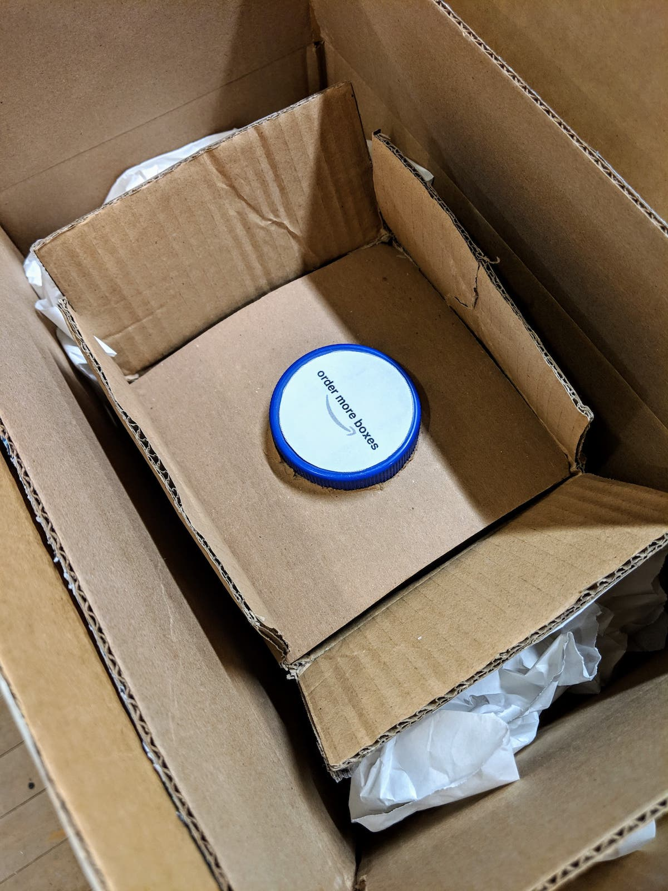
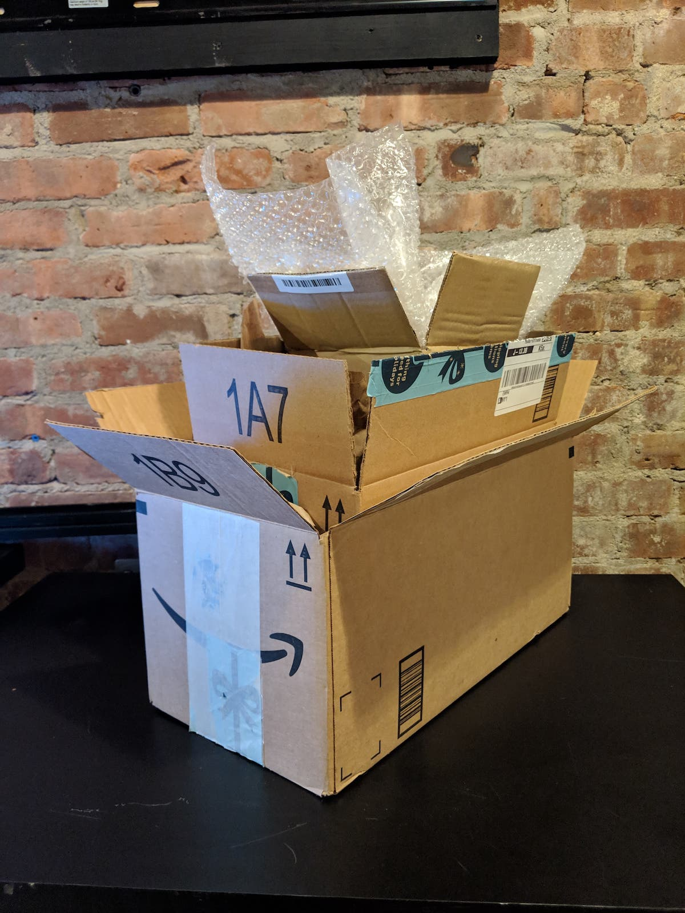

Our first assignment was simply to build a critical object. My partner (Shu-Ju Lin) and I brainstormed a bunch of topics to critique, briefly listed here:

- capitalism / wealth redistribution / the fact that billionaires exist and that's a normal thing
- Spotify as a gatekeeper for music discovery and its business model which doesn't sufficiently support small artists
- paying for "free" web services with your personal information (I did a project related to this a while back: [you are the product](https://adi.pizza/projects/2014/#you-are-the-product))
- smartphones are the new cigarettes (partly inspired by this [recent GQ article](https://www.gq.com/story/cal-newport-digital-minimalism))
- excess plastic and trash created through packaging goods, shipping them long distances ([article 1](https://www.bloomberg.com/opinion/articles/2018-09-17/amazon-amzn-boxes-are-choking-the-rest-of-us), [article 2](https://www.vice.com/en_us/article/xd573w/japans-excessive-packaging-fetish-299))
- the current supreme court gun control case in NY ([article](https://www.nytimes.com/2019/01/22/us/politics/supreme-court-guns-nyc-license.html))
- food waste created in American households

We came up with interesting concepts for a few of these topics, but ultimately decided to create a low-tech (read: not electronic) object critiquing packaging and the online shopping experience. Yes, we realized that paper and plastic trash created this way is _not_ the biggest contributor to carbon emissions or pollution, but at least for this initial assignment, we think it's ok to engage in discussion about a small(er) problem.

### Packaging & the online shopping cycle

Many of us have had the experience of receiving a package from Amazon or a similar online retailer where the packaging material significantly exceeds the volume of actual product we ordered. Plastic inside boxes inside boxes inside boxes, etc. It can feel like a [Matryoshka doll](https://en.wikipedia.org/wiki/Matryoshka_doll) toy. We created an object which highlights this situation and makes the viewer / user consider the endless cycle of packaging which is a byproduct of the shopping experience. There are three boxes and when you open the innermost one, you see a button labeled "order more boxes". Here, we took inspiration from [Amazon Dash](https://en.wikipedia.org/wiki/Amazon_Dash) buttons which are designed to bring the "one-click" shopping experience to the physical world.

Order a package, get a one-click button, repeat.

As far as the functionality of this object, we felt that it can convey its message without a fully functional prototype, since the time scale of the real interaction would be too long to appreciate in most contexts anyway. Yes, we could hook up the button to a microcontroller or Pi and have that order a new box on Amazon with one push, but that would only add marginal meaning to the experience since the user would have to wait a few days for the package to arrive. There may be ways to work around this problem and make the object more functional in other ways; perhaps we'll consider those for future projects.
