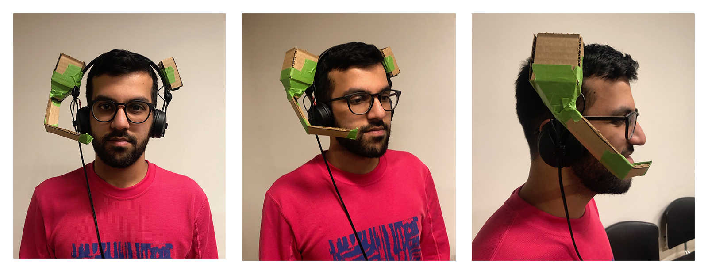

### Technology Critique: Surveillance Conditioning

In this assignment, we were prompted to create an electronic object critical of some aspect of modern technology while adhering to the following design constraints:

- Attribute: Edible
- Device: Humor
- Mood: Satisfaction

At first Stefan and I came up with a project proposal involving an edible battery charger for mobile phones, aimed at critiquing the non-recyclable & environmentally harmful components present in our electronics (motivated by reporting such as [this Motherboard piece](https://motherboard.vice.com/en_us/article/vv7p99/galaxy-note-7-explosion-environmental-impact-recycling) about the Galaxy Note 7 recall). This concept ended up feeling too gimmicky and failed to sufficiently stand up to Pedro's criticism, so we decided to pivot to a new idea.

I had been listening to some interviews with Shoshana Zuboff about her latest book, _Surveillance Capitalism_, and as Stefan and I discussed her ideas about the "human behavior modification networks" which two of the biggest tech companies (Google and Facebook) have become, we thought it would make a good target for critique. The "edible" attribute could be satisfied by linking this instance of behavior modification to classical and operant conditioning scientific experiments (lab animals get rewarded with edible treats as motivation for completing tasks or acting a certain way). Many scholars and journalists (like [Jaron Lanier](https://www.youtube.com/watch?v=qQ-PUXPVlos)) have shed light on the developments of Google & Facebook's surveillance networks which train users to continue using their services through digital rewards (e.g. the dopamine hits which correspond to social media "likes"). In this project we present a concept called __Facebook Trainer__ which calls attention to those reward & punishment systems by using more physical, analog rewards & punishments.

__Facebook Trainer__ is a device which trains users to make more money for Facebook. How do you show value and make money for this human behavior modification empire? You disclose more and more of your personal data, in varied forms. The less time you spent “plugged in” uploading & generating data, the fewer rewards you get (and you may get some punishments). The following actions will trigger rewards:

- utilizing various facebook services (WhatsApp, facebook.com, messenger, instagram)
- visiting websites which have Facebook tracking pixels and/or analytics scripts

Leaving the network will trigger a punishment. Continuing the thread of sound torture from [assignment 2](../assignment-2), we decided that the device should emit annoying tones as negative reinforcement against user actions. A bit of research into the topic of sound torture led us to use a 3000Hz pure sine tone, which, to say the least, was _sufficiently annoying_ as a deterrent.

### Prototype

In class during the prototyping workshop on Feb 25, we tried to create a looks-like and feels-like prototype of the form of the wearable dispenser. We attached some cardboard to a set of headphones and found that the form worked reasonably well. It wasn't too obtrusive to the user and provided us enough space for candy and electronics. This is also when we decided to put the microcontroller in a symmetrically located container on the device (we could have kept the electronics elsewhere, like desk next to the computer which the device is connected to, but this looked better).

Next, we gathered materials to build the real functioning object. Stefan did most of the fabrication while I worked on the Chrome extension which would track user behavior to provide inputs to the electronic system.

Here's Stefan working on the gate dispensing mechanism and overcoming the initial problems we had where the M&Ms would get stuck pushing against each other when the gate was open:

<iframe src="https://player.vimeo.com/video/321322867?loop=1&title=0&byline=0&portrait=0" width="360" height="640" frameborder="0" webkitallowfullscreen mozallowfullscreen allowfullscreen></iframe>

### Final object

In this documentation video you can see Stefan wearing the __Facebook Trainer__ device and browsing the web with our Chrome extension enabled. He is rewarded for actions which keep him within the bounds of the Facebook surveillance network and punished for leaving it.

<iframe src="https://player.vimeo.com/video/321148854?loop=1&title=0&byline=0&portrait=0" width="640" height="360" frameborder="0" webkitallowfullscreen mozallowfullscreen allowfullscreen></iframe>

You can find the code for the Chrome extension and the microcontroller in [this repository](https://github.com/adidahiya/surveillance-conditioning). All the user tracking logic is in background.js, as well as the sound torture punishment (created with Tone.js). Right now it is configured to dispense candy rewards every 30s while you remain in the surveillance network and emit annoying tones of increasing volume when you leave it.

