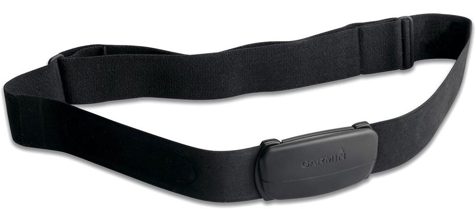
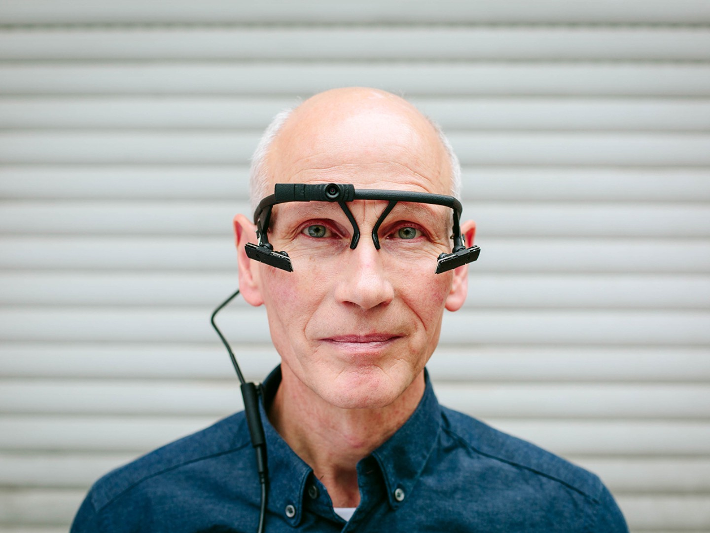

### Aesthetics, Prosthetics, Body Politics

#### Initial research

I went through a lot of research and concept exploration for this assignment. I felt particularly intrigued by Madeline Schwartzman's [See Yourself Sensing talk](https://www.youtube.com/watch?v=LqGou61hw-s), which asked questions about how our brains expand into the space around us and how we connect our bodies to architecture. It explored using hair as a construction material, body distortions, trees + way finding, things which remain in dimensional reduction (e.g. 3D -> 2D), sensors in your pills, "uncovering ourselves", homunculus, and many other ideas. I also looked at [Testo Junkie: Sex, Drugs, and Biopolitics](https://www.e-flux.com/journal/44/60141/testo-junkie-sex-drugs-and-biopolitics/), [Field's Quasar](https://www.field.io/project/quasar/), [Speculating Futures](https://speculatingfutures.club/), and Sophia Brueckner's [talk about sci-fi prototyping / critical optimism](http://www.sophiabrueckner.com/scifi.html).

First I started thinking about the affordances of a heart rate monitor (like the one picture above, which I have used for personal tracking during [bike rides](https://www.strava.com/athletes/9673005)). I wondered what would happen if I made myself more aware of my heart rate in real-time during day-to-day activities, either as private data, or with some public indicator ("heart on my sleeve", etc). I ran into technical issues while trying to access the data from this hardware, so I decided to switch topics.

#### Eye tracking

Next, I looked at eye tracking as a means of sensing and controlling bodies. From my background, this technology was most commonly referenced in terms of UX research to figure out how people use software on digital screens. Further research revealed its [many uses in various industries](https://www.tobiipro.com/fields-of-use/). I was particularly intrigued by its potential uses in ["professional performance"](https://www.tobiipro.com/fields-of-use/professional-performance/). By surveiling what bodies are looking at in the process of their work, the management class of a company gains a creepy amount of power over the activities of the laborer. I was curious to explore this power dynamic and push it into the absurd in order to spark critical discourse about body surveillance.

With this idea in mind, I surveyed the tech available to me to prototype with. I came across this interesting open-source piece of hardware / software made by [Pupil Labs](https://www.pupil-labs.com/). After spending a lot of time going through various calibration processes, I was able to get it to track my eyes fairly accurately. These videos are screen recordings created while using the Pupil Capture application:

<iframe src="https://player.vimeo.com/video/336941343" width="920" height="356" frameborder="0" webkitallowfullscreen mozallowfullscreen allowfullscreen></iframe>

<iframe src="https://player.vimeo.com/video/336941647" width="920" height="497" frameborder="0" webkitallowfullscreen mozallowfullscreen allowfullscreen></iframe>

From here, I set out to get the data stream out of this software into my own. At first, I tried building a Pupil plugin, so that I could write code in Python running directly in the Pupil Capture app, but this failed and wasn't very performant. I realized that I could just get [the data out of ZeroMQ](https://docs.pupil-labs.com/#interprocess-and-network-communication), so then read up on the basics of [ZeroMQ's sockets and message patterns](http://zguide.zeromq.org/php:chapter2). I did eventually manage to get this data streaming; the code of my efforts [lives here](https://github.com/adidahiya/critical-objects/tree/master/pupil-trainer).

Unfortunately, this is as far as I got in working with the technology in this project, as I was soon consumed by other ITP projects. I wanted to take this information about user gaze and create some kind of personal trainer, a little bit like the [Facebook Trainer from assignment 3](../assignment-3), with reference to productivity tools (like the StayFocused Chrome extension). From here, the critical object produced would use our design framework as follows:

- Topic: body surveillance
- Attribute: wearable
- Device: self-control
- Mood: absurdity

The trainer could act as an extension of something like iOS Screen Time, which limits the amount of time you spend in certain kinds of applications. It could deliver negative auditory feedback when someone picked up their phone too often to check for notifications/emails, when they didn't look someone in the eye during a conversation, and/or when it perceived them to be multi-tasking too much.
