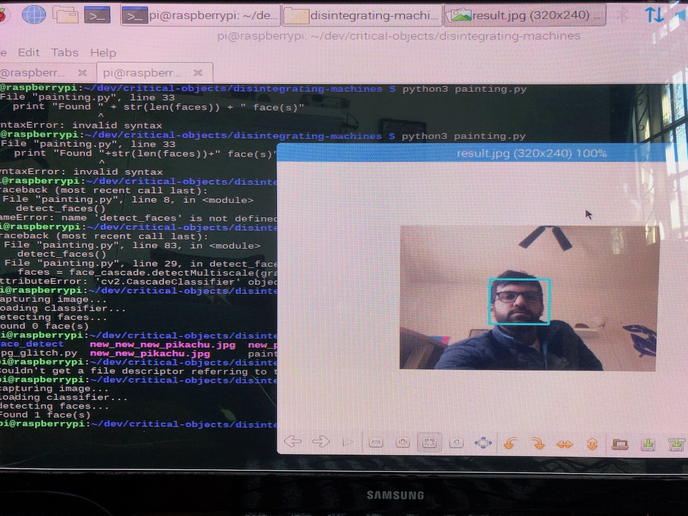
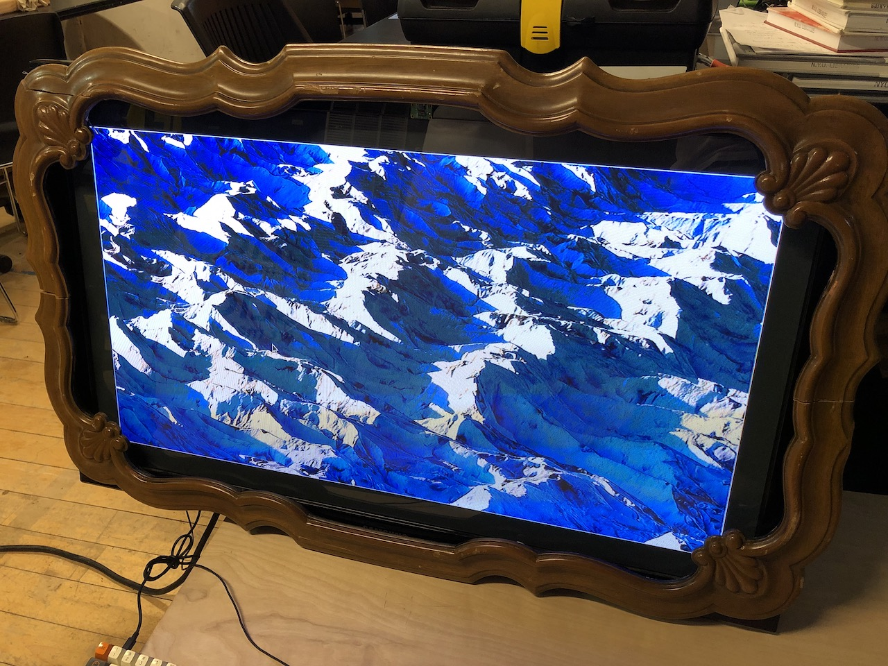

### Disintegrating Machines

For my midterm project, I explored the idea of _disintegrating machines_, primarily prompted by responses to [Banksy's October 2018 self-shredding paiinting](https://www.instagram.com/p/Bokt2sEhlsu/). I collected a handful of references in [this Are.na board](https://www.are.na/adi-dahiya/disintegrating-machines).

I wanted to create a digital "painting" which becomes corrupted when people are not looking at it. The object would use a Raspberry Pi and camera with facial detection to accomplish this. This was my first time using a Pi, so it took a while to get the scaffolding set up.

I used a photograph of a glacier I had taken a few years ago and applied a JPEG glitching algorithm repeatedly for every interval when there was no one looking at the picture frame. The idea was to critique the concept of buying precious art for lots of money and then leaving it in storage somewhere.

> video coming soon, I've reached my Vimeo upload limit for now

Code for this project lives [here](https://github.com/adidahiya/critical-objects/tree/master/disintegrating-machines).

In the end, I think this project was lacking visceral, physical impact. In its ideal formulation, I would hope for it to be as visceral as this object by Thijs Rijkers:

<iframe src="https://player.vimeo.com/video/56871178" width="640" height="360" frameborder="0" webkitallowfullscreen mozallowfullscreen allowfullscreen></iframe>
