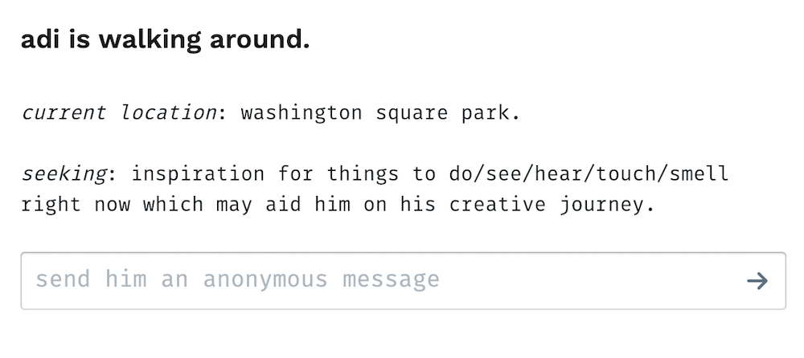

### Walking rituals for creatives

My first meditation explores the ritual act of walking as a creative tool. Walking around helps me (and many others) think better when faced with creative blocks. It allows us to make new connections, process/digest our ideas, develop an internal dialogue, and get inspired by serendipitous events in the world. There is a well-established ritualized practice of walking meditation which I first read about in _The Wisdom of Yoga_ last year. Walking meditation aims to bring mindfulness to the practitioner; however, for this assignment, my goals are a little different...

I have imagined and prototyped a technology-enabled extension to the "creative walk" ritual which allows my friends to send me anonymous messages as guidance or inspiration during the walk. This idea is inspired by event scores and conceptual performance art (which I researched a bit last semester for [Content and its Discontents](../../content-and-its-discontents/ar-study)). As the performer of the ritual, in addition to processing the sights, sounds, and smells of the world around me, I can also use the information sent to me through an online web form which becomes available once I "start" a walk.

In this prototype, I trigger the ritual and start the walk by checking into Washington Square Park on Foursquare. My friends who visit the [ritual's interactive web page](/projects/electronic-rituals/walking-ritual) then see that "Adi is currently walking around" and are prompted to send an anonymous message. This sends me a text via the Twilio API and I can respond (in the real world, not via message) as I wish.

Screenshot of the web form here (in case I take it down later):

### Process

I set up a Twilio API account and [a Netlify Lambda function](https://www.netlify.com/docs/functions/) on my Gatsby static website. Here's a screenshot testing the SMS-sending function with Postman and getting a real SMS in iMessage ([basic code here](https://github.com/adidahiya/website/blob/a657573607e6532ccf3c6d9be6d03feecb7eb687/server/functions/sendAdiMessage.js)):

I also set up a Foursquare API account and wrote server function to get my latest check-in, but had some issues with authentication which I am sure I could work out if I spent a few more hours on debugging. I prioritized enacting the minimum viable version of the ritual over getting this technical part working.

The logistics of the first enactment of this ritual were pretty rushed; I sent an email to 20 friends with a link to the [interactive page](/projects/electronic-rituals/walking-ritual) when I started the walk. I told them to think of it as "a performance with an event score partially determined by you, my friends" to help them along.

My view of walking into Washington Square Park on Feb 13, 2019 looked like this:

<iframe src="https://player.vimeo.com/video/317114111?loop=1&title=0&byline=0&portrait=0" width="640" height="360" frameborder="0" webkitallowfullscreen mozallowfullscreen allowfullscreen></iframe>

I only got two interactions during this first enactment. One person told me to look at a tree and another told me to walk in a circle. The first one was a little interesting since I had been looking down at my feet while walking, mostly to avoid stepping in puddles (yesterday's snow was thawing). Looking up is a good change in perspective.

### Reflections

- Most of this electronic ritual could be done with broadcast platforms like Instagram Stories. I could post a poll and take my followers' suggestions on what to do during my creative walk.
- I deliberately designed the electronic interaction to be anonymous in order to promote more interesting suggestions from my friends. This is not possible with Instagram. I could have made the whole thing happen over SMS, but then my Twilio app would know the phone numbers of those sending messages and I couldn't guarantee my friends' anonymity (I could secretly be storing their numbers and looking them up). On the other hand, anonymity of course has the potential for abuse. If my link was shared broadly, it would be easy for someone to spam me and run down my Twilio account balance.
- This ritual needs a better broadcast mechanism. Perhaps my system could text my friends with a link to the web page when it detects that I check into Washington Square Park. But then I'd also need to think about other location triggers... I go on "creative walks" near my apartment in Brooklyn, too.
