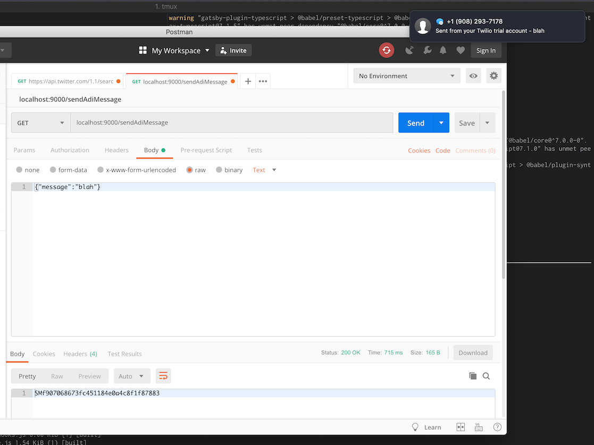

### Walking rituals for creatives

My first meditation explores the ritual act of walking as a creative tool. Walking around helps me (and many others) think better when faced with creative blocks. It allows us to make new connections, process/digest our ideas, develop an internal dialogue, and get inspired by serendipitous events in the world.

I have imagined and prototyped a technology-enabled extension to this ritual which allows my friends to send me anonymous messages as guidance or inspiration on my creative walks. This idea is inspired by event scores and conceptual performance art (which I researched a bit last semester for _Content and its Discontents_). As the performer of the ritual, in addition to processing the sights, sounds, and smells of the world around me, I can also use the information sent to me through an online web form which becomes available once I "start" a walk.

In this prototype, I trigger the ritual and start the walk by checking into Washington Square Park on Foursquare. Users to visit the [walking ritual web page](/projects/electronic-rituals/walking-ritual) will then see that "Adi is currently walking around" and are prompted to send an anonymous message. This sends me a text via the Twilio API and I can respond (in the real world, not via message) as I wish.

### Process

Setting up a Twilio API account and Netlify Lambda function, testing the function with Postman and getting a real SMS in iMessage:

I also set up a Foursquare API account and wrote the Netlify Lambda function, but had some issues with authentication which I am sure I could work out if I spent a few more hours on debugging. I prioritized enacting the minimum viable version of the ritual over getting this technical part working.
