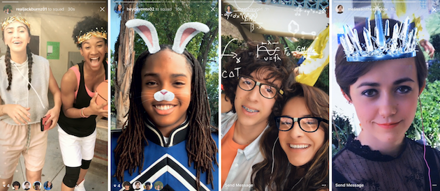
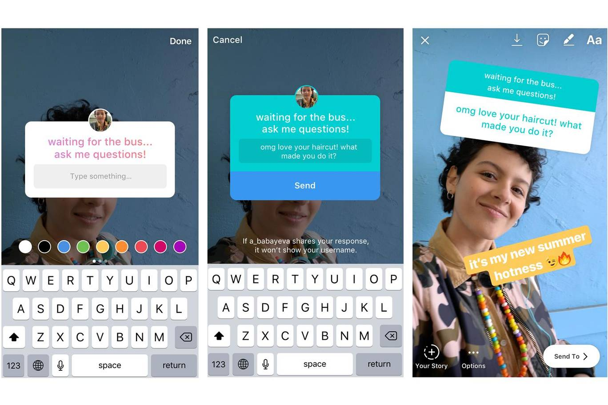
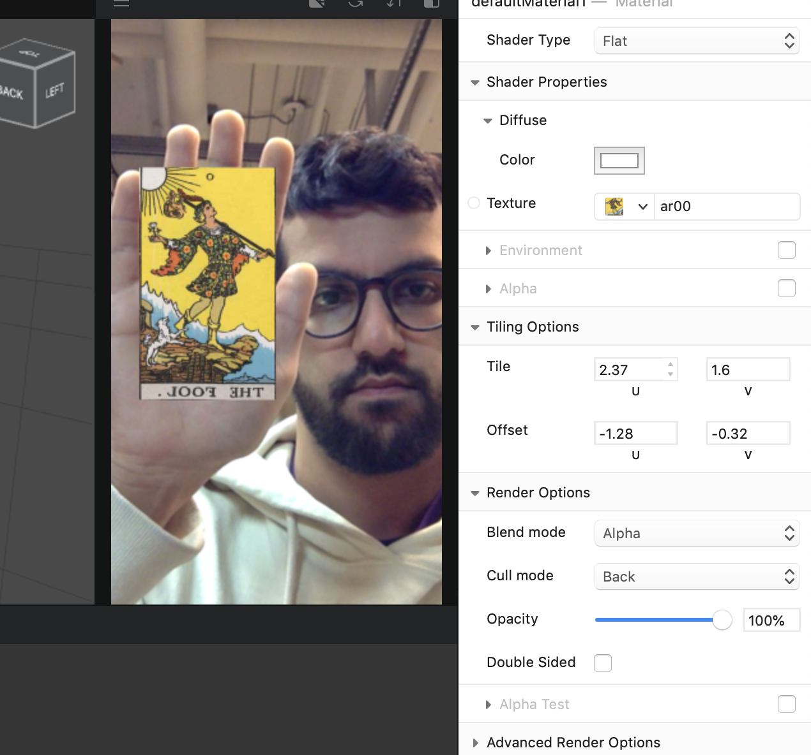
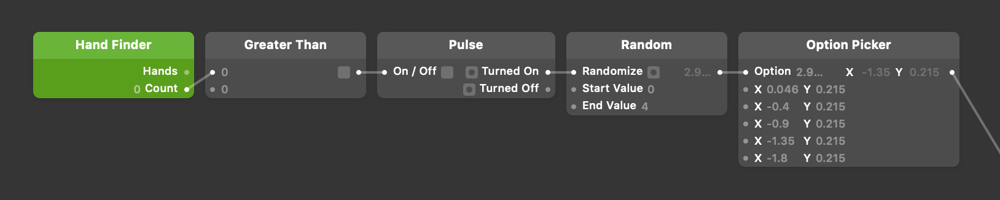
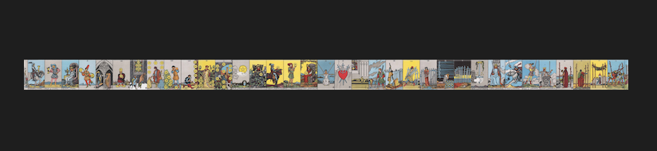
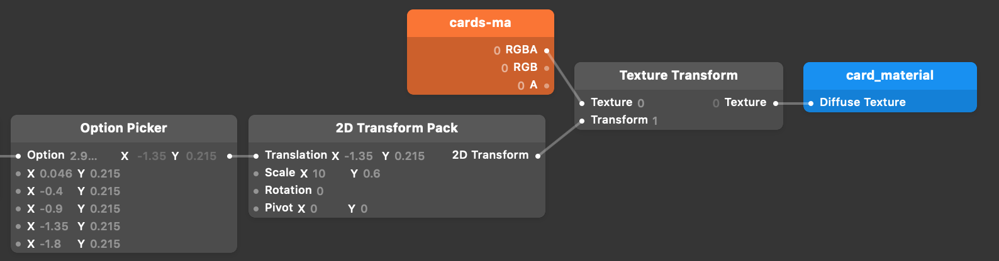

### Social media life streaming oracle deck

When asked to consider how digital media can complicate / diminish / augment the processes of an oracle deck reading, I started thinking about accessibility and reach of broadcasting social media platforms like Instagram. Millions of people use Instagram Stories to share updates about & live stream their lives to their friends, family, and cyber acquaintances. Some also use Stories to ask questions of and solicit ideas / feedback from their followers. In this meditation I imagined what it would be like to conduct a divinatory reading through Instagram Stories with the use of a custom AR filter.

### The platform

In May 2018, [Instagram introduced](https://instagram-press.com/blog/2018/05/01/new-ways-to-share-and-connect-on-instagram/) its Camera Effects Platform, which was later [rebranded](https://www.mobilemarketer.com/news/facebook-rebrands-camera-effects-platform-expands-program-to-instagram/539066/) to [Spark AR](https://www.sparkar.com/ar-studio/) and expanded to include Facebook & Messenger. These interactive AR effects can be applied during video and photo capture in these apps.

<small>[Image source](http://www.iphonehacks.com/2017/05/instagram-rolls-ar-face-filters.html)</small>

Instagram stories also have a feature to superimpose interactive 2D content on top of photos & videos in the form of stickers. The "question" sticker allows users to do just that: ask a question, get responses from followers, and share those responses anonymously back to the story channel.

<small>[Image source](https://www.standard.co.uk/tech/instagram-story-questions-what-are-they-how-to-do-a3884456.html)</small>

By combining these two features, we can start to get the basics of a divinatory ritual.

### The AR experience

This was my first time creating any kind of AR experience. I had explored the affordances of a specific AR app in [_Content and its Discontents_ last semester](../content-and-its-discontents) and I've used a few of the AR filters on Instagram Stories (but not extensively). I went through a few of the basic tutorials in Spark AR Studio and I found it to be pretty accessible. Luckily I didn't need any complex 3D models to build the minimum viable version of my idea.

The reading goes like this:

1. Use the selfie camera on your phone to show yourself in the frame.
2. Start recording a video.
3. Raise your hand once to draw a random card from the virtual deck.
4. Remove your hand from the frame (or move it in a way so that it is no longer recognized as a hand in the image for a moment).
5. Repeat steps 3-4 until you have drawn 5 cards.
6. Stop recording the video.
7. Solicit feedback by either:
    - Writing a question or a general solicitation for advice on top of the video story using the text feature (requires DM responses to be enabled for Stories)
    - Using a question sticker to do the same

Spark AR comes with a hand tracker out of the box, so it was easy to throw a null object into the 3D scene to place the card image. I downloaded all the card scan images from [The Pictorial Key to the Tarot](http://www.sacred-texts.com/tarot/pkt/index.htm) (with this [little bash script I wrote](https://gist.github.com/adidahiya/957210094ded44ecf7c159a9de487275)) and imported the first one (_The Fool_, of course!) as a flat texture.

As you can see, I had to play around with the tiling parameters to get it to show up just right on the card 3D model. This is messy and could have been cleaned up if I made my own 3D model for the card, but for now I just used one I found in the Sketchfab AR library.

Next I introduced randomness to the card draw in the Patch Editor. Every time the number of hands in the frame goes from zero -> greater than zero, I trigger a pulse to a random number generator.

I ran into a problem here where I found it impossible to script the source of of a texture's image. Texture assets are special and pretty static in the Spark AR environment because the IDE tries to do a lot of optimization and compression of assets so that they will download quickly on mobile devices. I couldn't have a bunch of different textures for the different cards and apply them to my 3D card object, so I resorted to using image sprites. The plan was to use a 2D transform on the texture and parameterize the X & Y translation coordinates of the texture to make it look like different cards are being drawn. At first, I created a huge sprite of all 78 cards in the traditional tarot deck laid out horizontally.

This ended up looking pretty awful because Spark AR Studio _downsizes all assets to a 1024 pixel bounding box_! So my 23,400 pixel wide image was getting excessively downsampled. If I spent more time with the custom script editor (which allows developers to write JavaScript and run it in the AR patch), I probably could have engineered a better solution to this problem, but for this meditation I ended up compromising to deliver the proof of concept. Instead of including all the cards in the texture sprite, I only included the major arcana. This image still got downsampled, but not as much, so you can sort of make out the cards being drawn.

<iframe src="https://giphy.com/embed/1d5WHPQqXgu2uqWclJ" width="480" height="376" frameBorder="0" class="giphy-embed" allowFullScreen></iframe>

### Conclusion

You can see the results of my meditation in the gif above. I think with a bit of polishing, this could actually be published as a real Instagram Story filter. The main things I would change are:

-   Improve the texture image resolution so it is more readable
-   Fix the orientation of the texture image so it's not mirrored horizontally
-   Add some lighting effects to make the selfie image feel more removed from regular (#nofilter) life, more like a ritual
