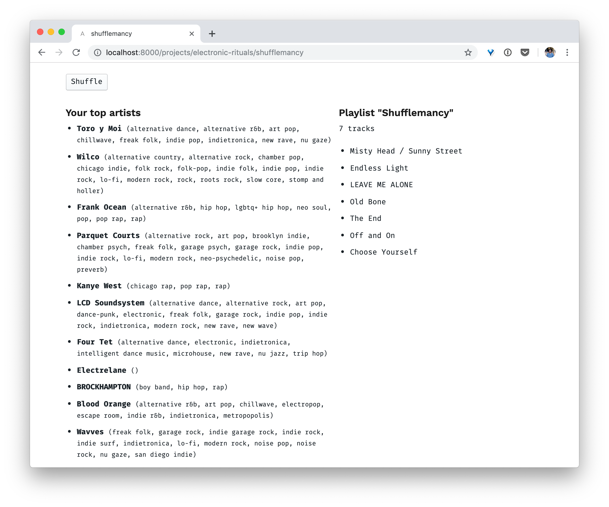

### Divining tunes

Inspired by the term _shufflemancy_ I found in the Wikipedia [list of divination techniques](https://en.wikipedia.org/wiki/Methods_of_divination), I sought out to prophesize a Spotify user's musical fate by analyzing their music listening history.

> Work in progress

Code for this little web app lives [here](https://github.com/adidahiya/website/blob/develop/src/pages/projects/electronic-rituals/shufflemancy.tsx).
