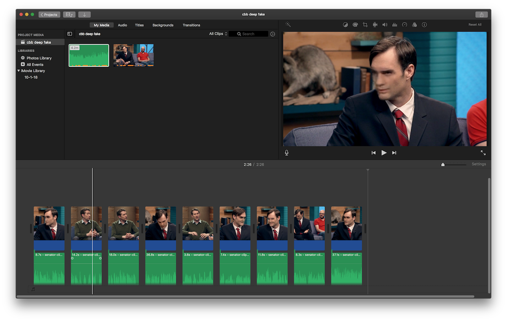

### Deep fake progress

I was only able to screen capture the Netflix version of the CBB clip at 14fps (probably due to my CPU bandwidth), so that's the rate of my target clip. This is important in running the `ffmpeg` demuxer at the end:

```
ffmpeg -f image2
    -framerate 14
    -pattern_type glob
    -i '*.jpg'
    -vcodec libx264
    -crf 15
    -start_number 67
    -pix_fmt yuv420p
    output.mp4
```

The "Convert" step of FakeApp didn't run as well as I'd hoped with the multiple faces present in the CBB clip. It was really only able to replace Will Forte's face properly in close up shots during the interview. This meant that I had to do a lot of editing on the final video in iMovie to create a reasonable result.



### Final edited video

<iframe src="https://player.vimeo.com/video/292783980" width="640" height="480" frameborder="0" webkitallowfullscreen mozallowfullscreen allowfullscreen></iframe>
