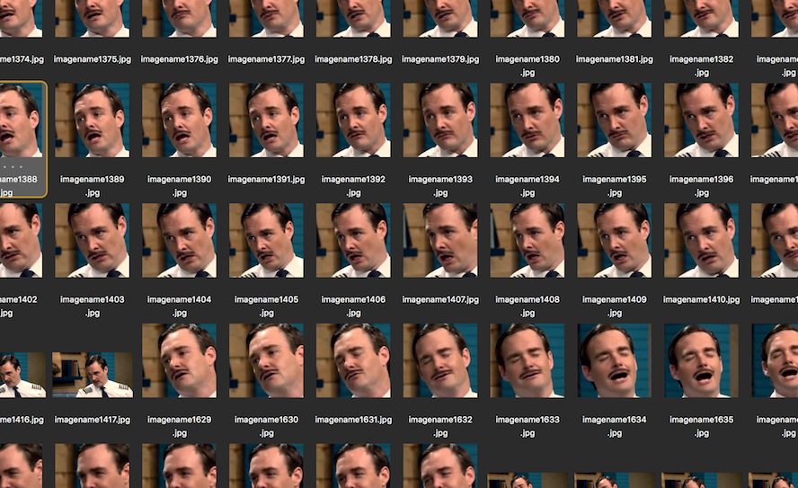
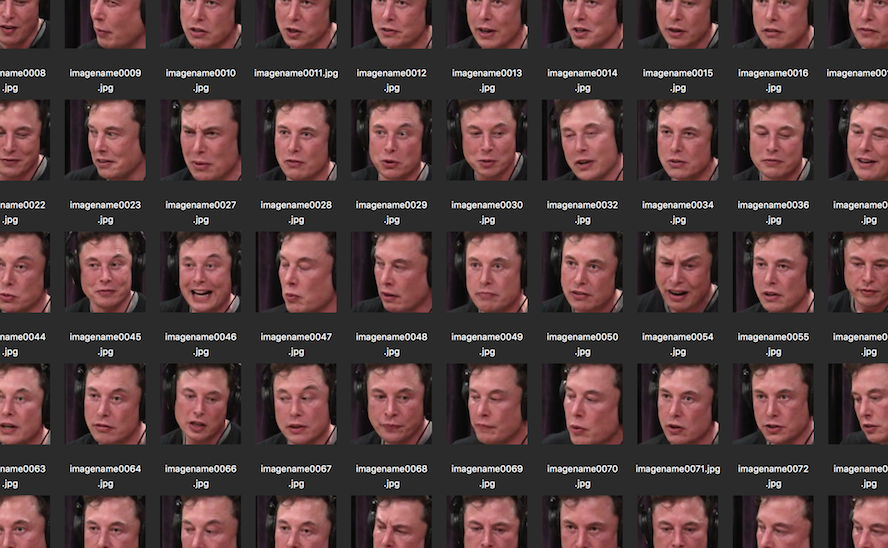

### Reading

- [Alex Jones Will Never Stop Being Alex Jones](https://www.buzzfeednews.com/article/charliewarzel/alex-jones-will-never-stop-being-alex-jones#.hiq9ZabEL)
- [Pizzagate: From rumor, to hashtag, to gunfirein D.C.](https://www.washingtonpost.com/local/pizzagate-from-rumor-to-hashtag-to-gunfire-in-dc/2016/12/06/4c7def50-bbd4-11e6-94ac-3d324840106c_story.html?utm_term=.968a5cf86e4b)
- [#QAnon, the scarily pro-Trump conspiracy theory, explained](https://www.vox.com/policy-and-politics/2018/8/1/17253444/qanon-trump-conspiracy-theory-reddit)
- [The Debunking Handbook](https://skepticalscience.com/docs/Debunking_Handbook.pdf)

### Notes, responses

- Part of QAnon's power lies in the flexibility of its narrative&mdash;Q's coded messages allow for interpretation of events in ways that confirm existing beliefs in other conspiracies ("false flag shootings, Jewish bankers controlling the world, or the Illuminati", etc).
- Debunking efforts can backfire because of:
  - __Familiarity__: people can forget the details and end up only remembering the myth, because the information sounds familiar
  - __Overkill__: processing many (rebuttal) arguments is more cognitively taxing than processing a simple myth, so people might prefer the latter
  - __Worldview__: confirmation & disconfirmation bias can be strong, so it's better to target debuking outreach "towards the undecided majority rather than the unswayable minority." Also, try not to be so harsh as to produce psychological resistance&mdash;combine worldview-threatening messages with self-affirmation.
- People often prefer incorrect mental models over incomplete ones, so you need to fill in the gaps appropriately when debunking a myth.

### Assignment

> __Prepare training data for your first deepfakes clip__. Two sets of ~400 images, one for each face. The faces should be isolated and any “bad” images (blurry, cropped incorrectly, anything obstructing the face) should be removed from the set. Use youtube-dl, ffmpeg, autocrop, and face_recognition tools.

I'd like to try working with a clip from the first episode of Comedy Bang! Bang! where Will Forte plays a airline pilot who landed a plane in a mall parking lot because he was stalking his ex-girlfriend:

<iframe width="560" height="315" src="https://www.youtube-nocookie.com/embed/6NVa8eEUWVI?rel=0" frameborder="0" allow="autoplay; encrypted-media" allowfullscreen></iframe>

I'd like to swap Will's face for Elon Musk's. For the latter, I can get plenty of training images from this recent podcast interview Musk did on the Joe Rogan Experience:

<iframe width="560" height="315" src="https://www.youtube-nocookie.com/embed/ycPr5-27vSI?rel=0" frameborder="0" allow="autoplay; encrypted-media" allowfullscreen></iframe>

Here's a glimpse at my initial set of training images (I'll probably need to do some color correction and other tweaks):

