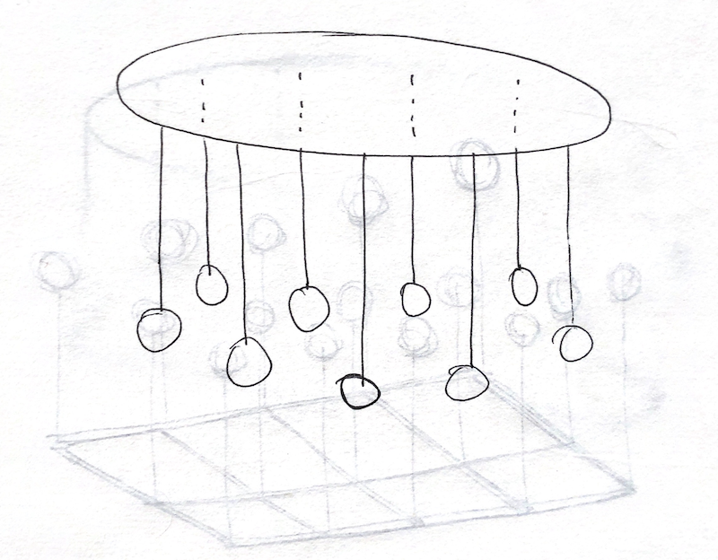
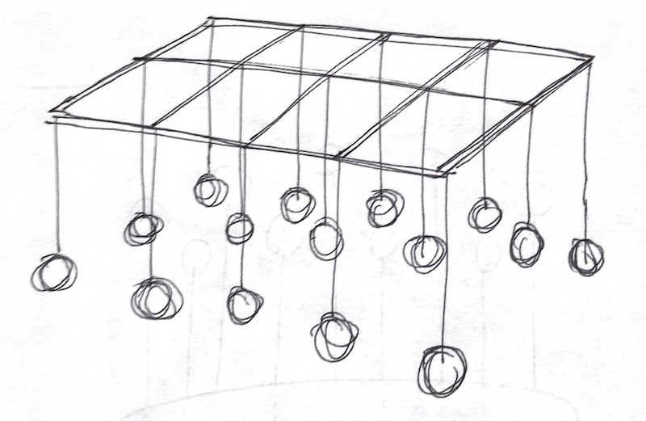

## Initial ideas

I proposed a kinetic light sculpture for a combined project with _Designing for Digital Fabrication_ largerly inspired by the work of [Squidsoup](https://www.squidsoup.org/projects/), who I had discovered through their installation for a Four Tet live performance.

I was also inspired by Dave & Gabe's _CASCADE_ project, a 3D audio and volumetric lighting sculpture for a Holly Herndon song:

<iframe src="https://player.vimeo.com/video/356067766?loop=1&title=0&byline=0&portrait=0" width="640" height="360" frameborder="0" allow="autoplay; fullscreen" allowfullscreen></iframe>

You can see some more early references in [this are.na channel](https://www.are.na/adi-dahiya/kinetic-light-sculpture).

I made some of my own sketches based on this general concept, at first with the floating orbs, and then later with other shapes involving LED pixel strips:

Initial feedback on these sketches suggested that the orbs were a bit clichéd / overdone, so I started thinking about the circular ring a bit more. I ordered some flexible aluminum channel from Amazon ([product link](https://www.amazon.com/gp/product/B07Z4LCL46)) to see if I could create a twisting structure which bends into different shapes while suspended.

I also became drawn to this similar piece by Christopher Bauder called _CIRCULAR_:

<iframe src="https://player.vimeo.com/video/232650101?loop=1&color=ffffff&title=0&byline=0&portrait=0" width="640" height="360" frameborder="0" allow="autoplay; fullscreen" allowfullscreen></iframe>

At this point I feel that the technical ideas, especially with motors and winches / pulleys involved, is pretty ambitious for a solo final project, but I'm moderately optimistic that I can at least build some part of this system as a proof of concept.
