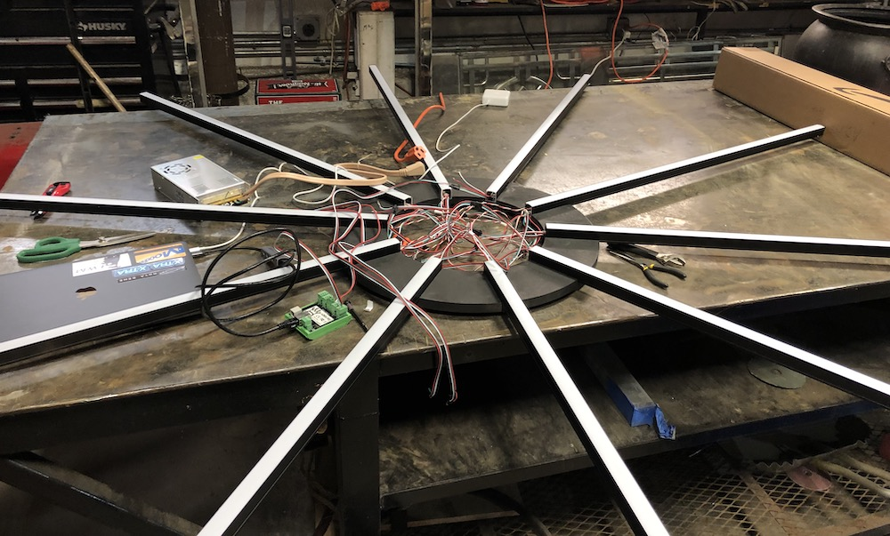
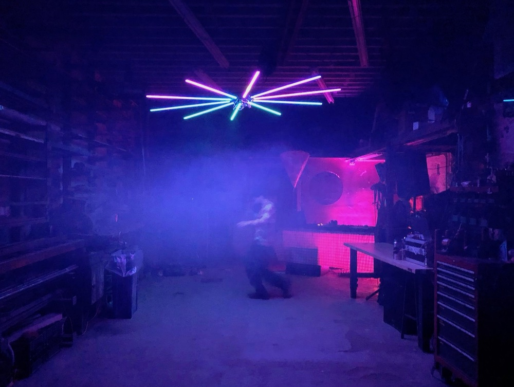
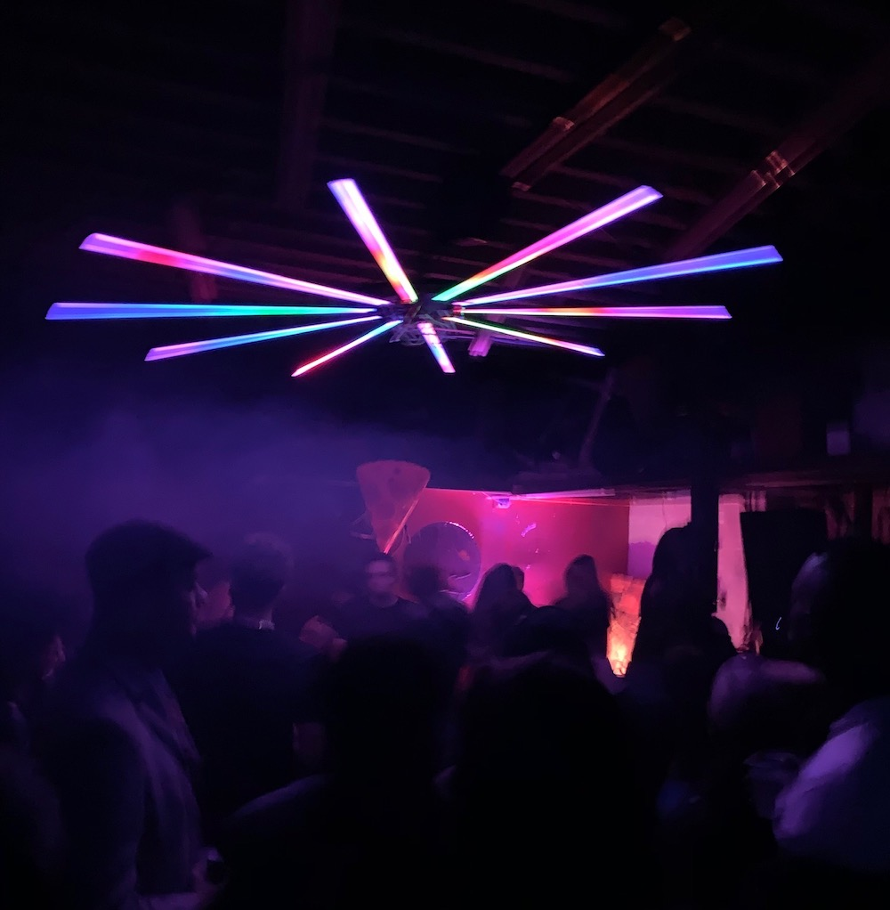
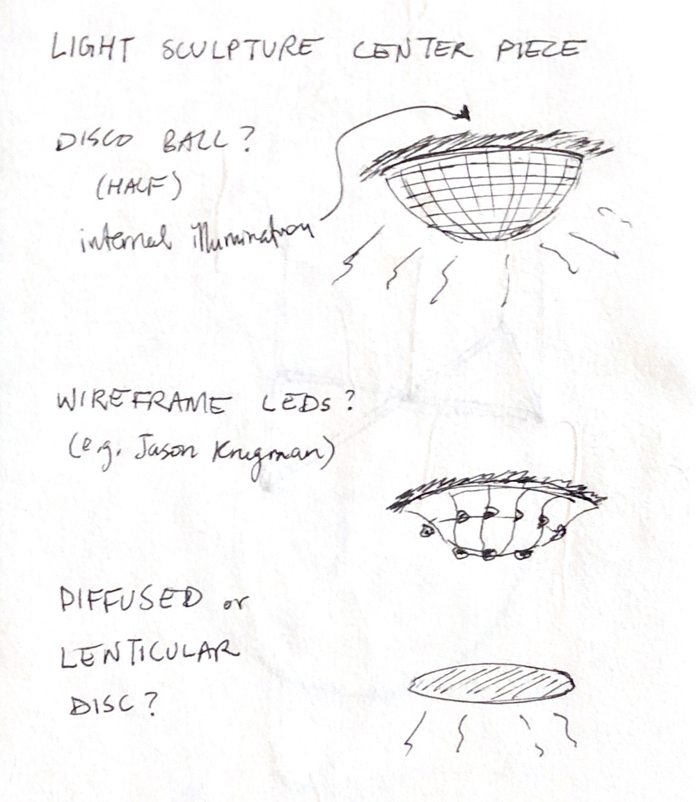

## Iteration

While I was working on this project, I was also building a light installation for a warehouse party I organized on Nov 23rd. It was also desigend as a suspended, animated light sculpture, but without moving parts. I was quite happy with the result, and it served us well for the whole night.

The structure is a hub-and-spoke shape with a central wooden ring cut on a CNC machine and ten 1-meter-long aluminum channels holding LED strips attached to it. The power supply and DMX pixel controller were attached to the ring and the whole thing was hung like a chandelier.

Here's a video of the lighting patterns in action during the party. Some of the patterns are audio reactive using audio spectrum information coming from the mixer. I used Madmapper for pixel mapping and basic visuals, as well as Max (via Syphon) for some custom noise-based patterns.

<iframe src="https://player.vimeo.com/video/376219523?loop=1&color=ffffff&title=0&byline=0&portrait=0" style="position:absolute;top:0;left:0;width:100%;height:100%;" frameborder="0" allow="autoplay; fullscreen" allowfullscreen></iframe>

After building this piece and working through its practical considerations, I became interested in iterating on it further and making it more polished, both in terms of fabrication and lighting design. A few things I want to work on:

- hiding the wiring by integrating it into the central ring (more complicated CAD / CNC design)
- widening the central ring, creating an additional lighting structure in the center (perhaps _not_ using LED strips, as a challenge to myself, since I've only used LED strips in this class so far)
  - some initial ideas here involve a mesh of LEDs similar to Jason Krugman's sculptural work
  - see sketch below
- interactive lighting patterns which allow viewers to see themselves affecting the piece, probably through camera or Kinect input
  - I think this will make the piece present better in a non-party setting, like the one in I will be showing during the final presentation / critique. I can play some ambient music and allow viewers to interact with the piece one or two at a time.

