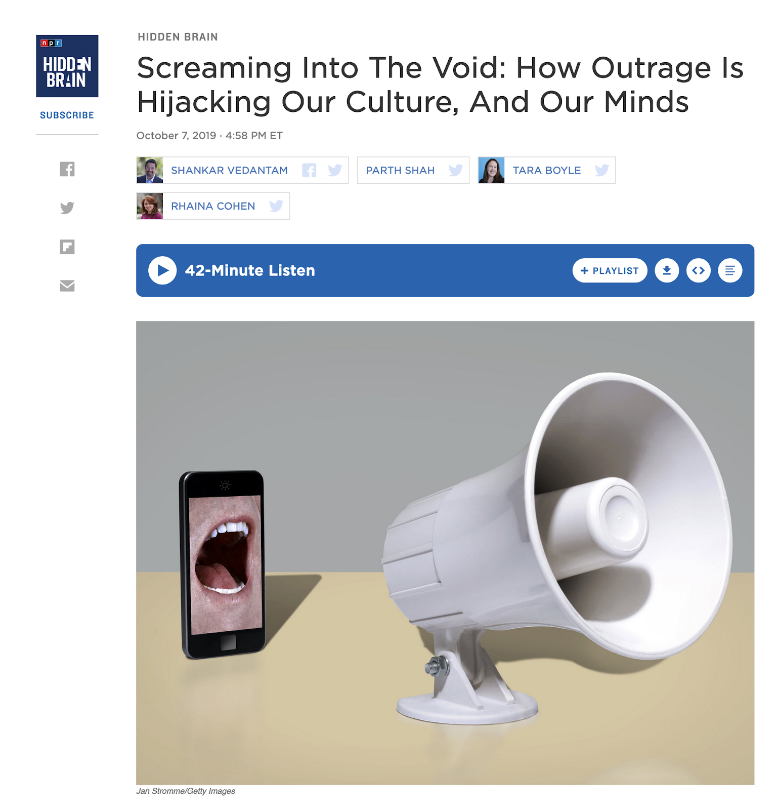
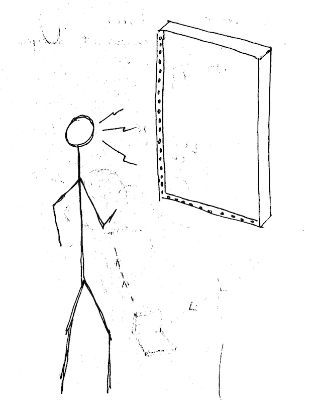
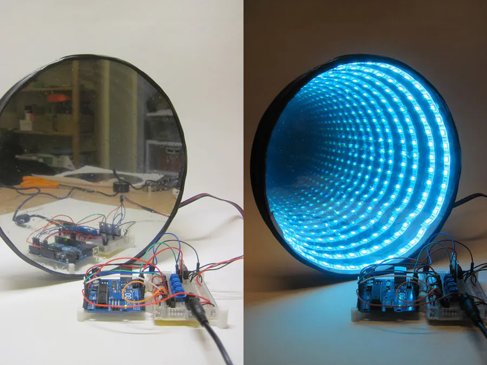
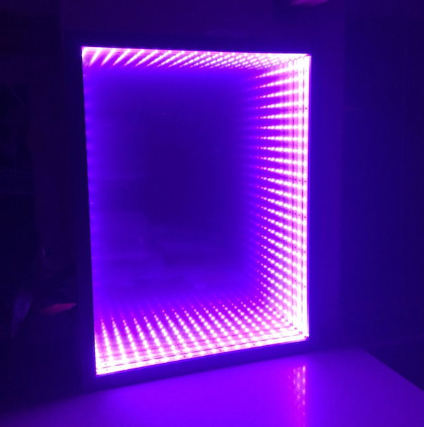
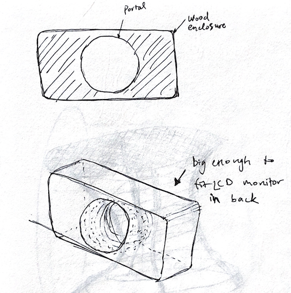
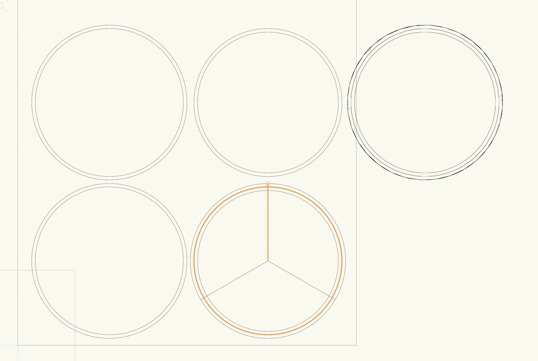

## Concept: outrage culture

Largely inspired by [this podcast episode of Hidden Brain](https://www.npr.org/2019/10/04/767186846/screaming-into-the-void-how-outrage-is-hijacking-our-culture-and-our-minds), I proposed a project titled "Screaming into the Void" which addresses our current politically-charged culture of internet-based outrage.

## Form

Here's the original crude sketch of the form. A person can walk up to a wall-mounted "infinity mirror" which formally acts as a portal, a reference to the void where this outrage is channeled.

## Interaction

The interaction loop would go something like this:

1. Approach mirror, position yourself so you see into the "portal"
2. Talk into the mirror, trying different words and phrases until you get a visual response
3. When moral and/or emotional content is detected by the device, it lights up red (changes color from its default state) to signify some kind of "success" state

## References

## Conceptual progress, part 1

Some feedback / ideas / questions after presenting the initial idea:

-   consider whether the device should incite hate speech or deter it... if it does incite it, be very careful and deal with the consequences
-   consider recording the last person's words / screaming into the device to play it back, an embodiment of the echo chamber effect
-   put an LCD monitor behind the mirror and show relevant tweets, making a more direct connection with the internet content this work is trying to reference
-   if it's a portal, where is the portal taking you?
-   what emotion does this interaction evoke? awe (typically associated with infinity mirrors) or anger?
-   if the work is about viral sharing of content, how does that get expressed, if at all?

## Prototype 1

I wired up some LEDs between two-way mirrors. I tried showing some tweets on an LCD monitor behind the mirror, but I didn't like the aesthetic this produced. It ended up feeling like a cheesy AR filter effect (specifically, LED Starburst on Instagram). So I decided to ditch the screen and just focus on the mirror & lights.

<iframe src="https://player.vimeo.com/video/372958886?loop=1&title=0&byline=0&portrait=0" style="position:absolute;top:0;left:0;width:100%;height:100%;" frameborder="0" allow="autoplay; fullscreen" allowfullscreen></iframe>

I started designing an enclosure, first with the LCD monitor...

Then later just a circular enclosure similar to the first reference image shown above. Vectorworks drawings prepping to CNC 1/2" plywood...

