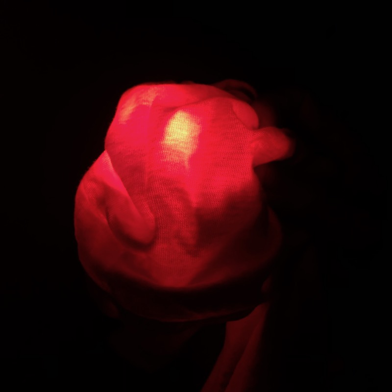
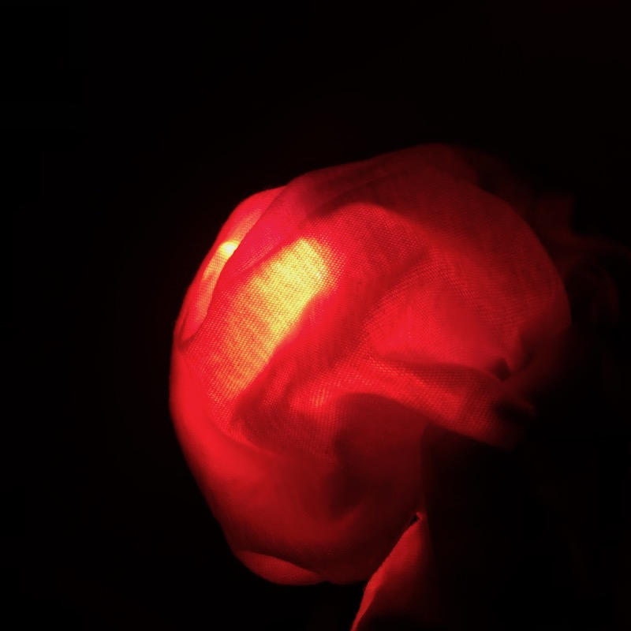
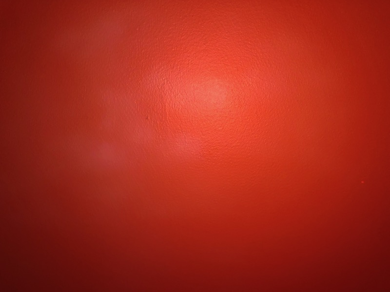

## Light Observation

This is a photo of a warehouse wall and the sky above it taken on September 6, 2019 10:44 PM at [The 1896](https://goo.gl/maps/mJbwNhgxdh5Yu1jj7) in Bushwick, Brooklyn. I was standing in the outdoor area of a concert / rave where there were purple and red lights pointed at these warehouse walls. As soon as I stepped outside, the sky looked very green, even though I knew it was gray from the clouds that night. This is confirmed in the photo; you can't see the green, but rest assured that's how my eyes perceived it at the time.

The photo illustrates how our perception of colors can be framed and influenced by the environment. My eyes had adjusted to the purple tint of the LED lights both indoors and outdoors on this wall, so neutral colors like the gray of the sky appeared green.

I'm curious how I can use knowledge of this effect to create a durational light effect where gradual changes lead the observer to forget that their eyes are adjusting to a new environment. I remember James Turrell's [_Perfectly Clear_ installation at Mass MoCA](https://massmoca.org/event/james-turrell/) exhibiting this phenomenon; after looking in the main direction of the piece (towards the seamless wall), the lights in the anteroom appeared much warmer than they initially were before the durational piece started.

## Production Assignment

In this assignment I experimented with cloth as a light diffusion material. I have seen a lot of light work using paper or plastic to diffuse light, but fabrics are less common. I was curious to see how the folds in a piece of cloth would create highlights and shadows when lit from behind, rather then in front as it usually is when we imagine the material.

I was assigned a red-orange color, `rgb(242, 106, 60)`.

I present two scenes here. The first is of the white light source (a small Ikea table lamp) surrounded by orange cloth, kind of draped over it. The cloth is arranged so that there is space between it and the LED light, which increases the diffusion.

<iframe src="https://player.vimeo.com/video/359459419" width="640" height="360" frameborder="0" webkitallowfullscreen mozallowfullscreen allowfullscreen></iframe>

The second scene is of a blank wall lit with light coming diffused through the fabric. Here, if you look very closely, you can notice the texture of the fabric affecting the way light falls on the wall, as if there are blurry dots of white poking through the fabric. Yes, it's quite subtle and hard to photograph.

<iframe src="https://player.vimeo.com/video/359459472" width="640" height="360" frameborder="0" webkitallowfullscreen mozallowfullscreen allowfullscreen></iframe>
