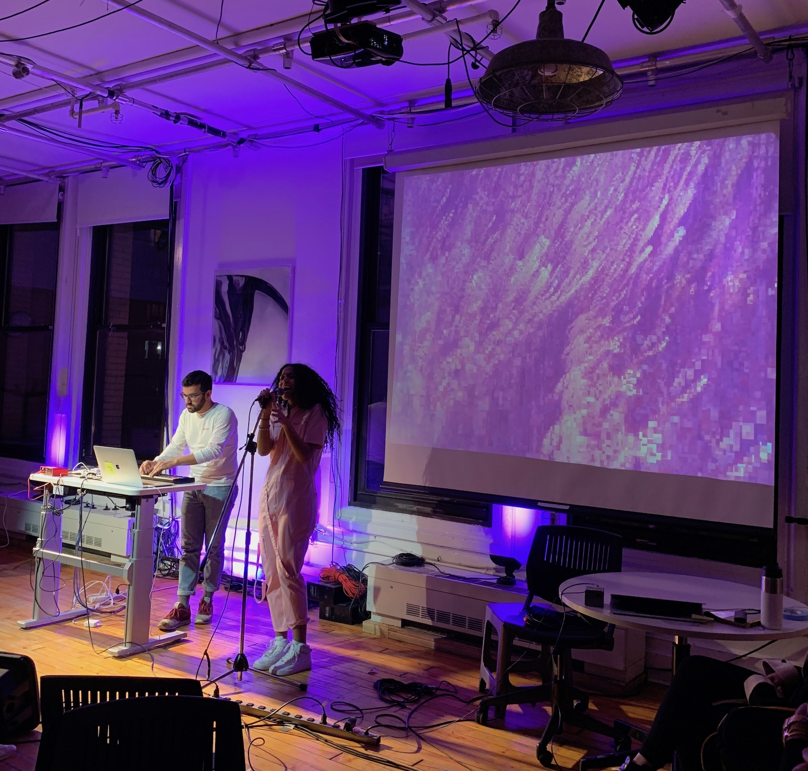

### First performance

For the first performance of my video playback system last week, I manipulated a handful of abstract videos from my collection with feedback, zoom, and chroma key effects. In browsing through the jit.op operators, I found the bitwise left shift operator to produce interesting new colors out of the source video and introduce a pleasing glitch aesthetic. Linking a few knobs to my MIDI controller gave me a lot to play with as I looped the videos and mixed between them. Here's some rehearsal screen capture:

<iframe src="https://player.vimeo.com/video/320426987?loop=1&title=0&byline=0&portrait=0" width="640" height="360" frameborder="0" webkitallowfullscreen mozallowfullscreen allowfullscreen></iframe>

I set up the presentation view of my Max patch to show the 8 MIDI-mapped dials (controlling various xfade mixers and effect attributes) and a color picker (controlling the chroma key object):

<iframe src="https://player.vimeo.com/video/320613861?loop=1&title=0&byline=0&portrait=0" width="640" height="360" frameborder="0" webkitallowfullscreen mozallowfullscreen allowfullscreen></iframe>

In my performance during class, I was able to show some of the work I had rehearsed in the above videos, but near the end I had some issues... it felt like my laptop was slowing down due to the CPU load, but upon further reflection I think I might have had ezdac~ turned off, which prevented the zoom+chroma effect from working (zoom amount was connected to a cycle~).

Fortunately, I had another chance to perform with this video playback system the next day (March 1) at the 1+1=3 event. I performed with [Sofia D'Angelo](https://soundcloud.com/sofiadangelo27) and we came up with some pairings for the underlying videos I would use for her 3 tracks. I rehearsed some more and implemented a simple fix for the ezdac~ problem so that it wouldn't happen again (I connected the master metronome toggle to ezdac~ as well). I was a little nervous about performing in front of a larger audience, but it was an overall success.

Some things I learned here:

- Use multiple floating windows during the performance to monitor yourself; you don't need a pwindow
- Use presets loaded with the videos for different tracks so that you can transition between them quicker (I had to spend a few seconds picking the next videos in the dropdown menus between tracks)
- Ensure sufficient contrast on the projected image! There was too much stage light for the visuals to pop like I wanted them too, and everything kind of got washed with purple light...

