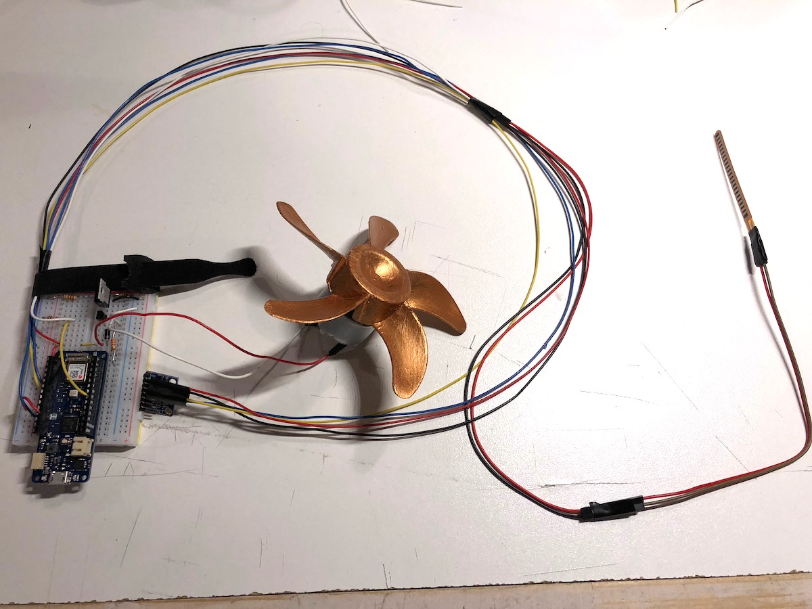
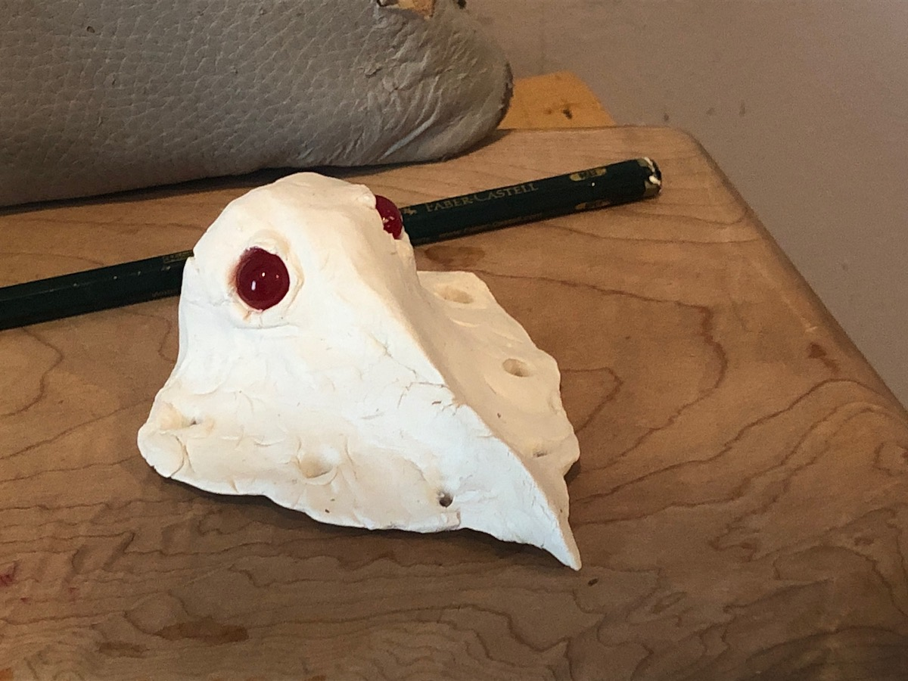
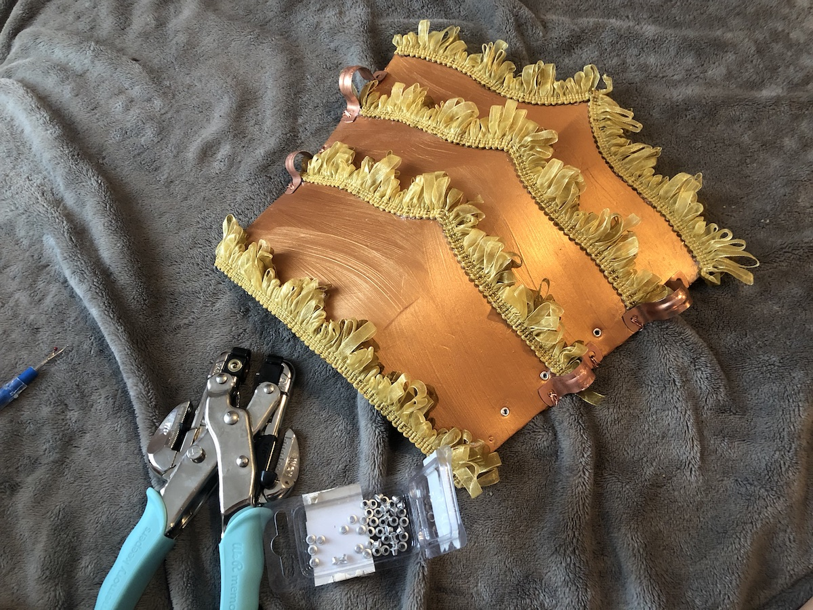

### Ideation

The main idea for this project came about when discussing Halloween costumes. Gabriella is a groomsperson in an upcoming wedding where the attire has a Steampunk theme, so we decided to make a Steampunk-style arm with mechanical elements. [Check out this mood board to see inspiration for the design from the internet](https://www.are.na/adi-dahiya/steampunk-gadget-mood-board).

Based on these ideas, we wanted to make the arm control some blinking lights, a spinning fan, and, just for fun (+ serial communication), some distorted radio-transmission sounds playing on a nearby laptop.

### Prototyping

The main interactions we decided to use involve the following I/O:

-   Flex sensor controls the fan (via DC motor)
-   Accelerometer controls lights (via direct digital signals) and music playing in a web browser (via serial communication)

We prototyped these interactions on an Arduino Uno with jumper cables and a few online tutorials:

-   [DC motors](https://learn.adafruit.com/adafruit-arduino-lesson-13-dc-motors/breadboard-layout)
-   [ADXL345 accelerometer](http://codeyoung.blogspot.com/2009/11/adxl345-accelerometer-breakout-board.html)

### Production

After Gabriella got the basic code for the flex sensor, motor, and accelerometer working on her Arduino Uno, I transferred the circuit to my breadboard and translated the code for my MKR 1010 and MPU6050 accelerometer module. I wanted to use smaller components so they could be concealed more easily in the wearable device. During this step, I replaced the jumper cables with more compact and sturdy wiring. We originally had the flex sensor readings mapped to a range of motor speed outputs, but I noticed that this didn't really have an appreciable physical effect on the fan operation, so I opted to just make it a binary switch that triggered once the sensor was flexed past a certain amount:

<iframe src="https://player.vimeo.com/video/296754898?loop=1&title=0&byline=0&portrait=0" width="640" height="360" frameborder="0" webkitallowfullscreen mozallowfullscreen allowfullscreen></iframe>

Instead of `p5.sound`, I opted to use `Tone.js` to produce sounds in the web browser (I've been using this library in [Code of Music](../../code-of-music) and it's more powerful than p5). I created a basic sketch that plays a constant drone from a synth and changes pitch according to the accelerometer X gyro values. I used a slightly different accelerometer module, the MPU6050, and followed [this tutorial](http://www.electronicwings.com/arduino/mpu6050-interfacing-with-arduino-uno) to get it working:

<iframe src="https://player.vimeo.com/video/296754939?loop=1&title=0&byline=0&portrait=0" width="640" height="360" frameborder="0" webkitallowfullscreen mozallowfullscreen allowfullscreen></iframe>

One of the goals of this project was to make the device fully portable and powered by a 9V battery. We tried to get this circuit working where the 9V battery powered many different components, but after many attempts, we gave this up and ended up powering the circuit through the USB port on the MKR 1010. Most of the problems were around supplying enough power to each component in the circuit. With more time, we would definitely revisit this part of the project and tackle this issue again.

> circuit diagram

Here's a progress shot as we started cleaning up the wiring:

You'll notice the accelerometer wires and flex sensor wires are long and taped together since they will travel the length of the forearm and into the glove. The motor/fan wiring is short since that will be mounted close to the electronics. In retrospect, it might've been smarter to take apart an ethernet cable for the wiring since that construction would have provided better flexibility.

On the fabrication side, Gabriella had molded a bird skull to mount on the glove and attached some fabric trim to the copper-painted foam pieces she created for the arm:

> more details coming soon!
