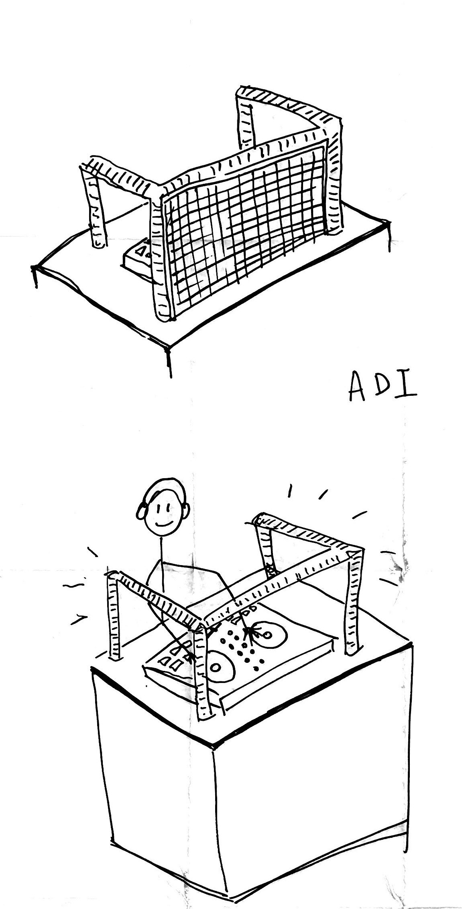
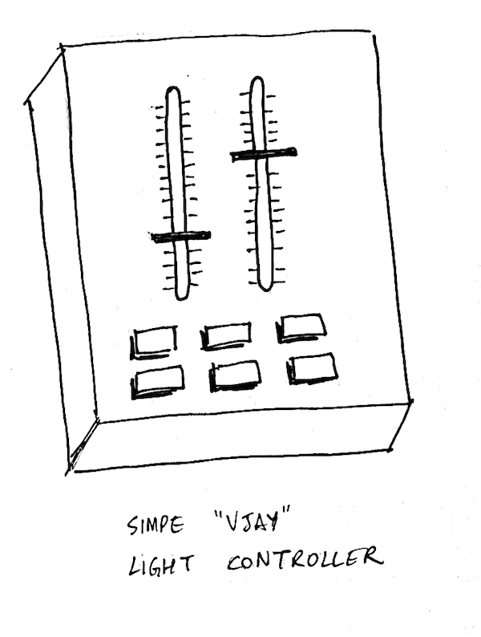
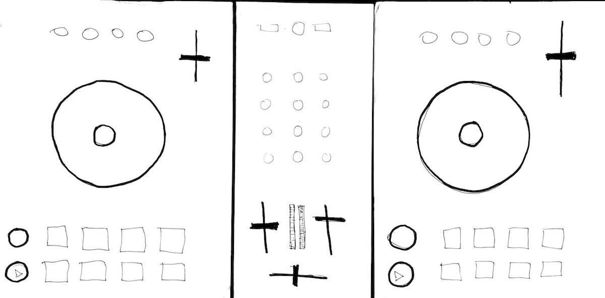
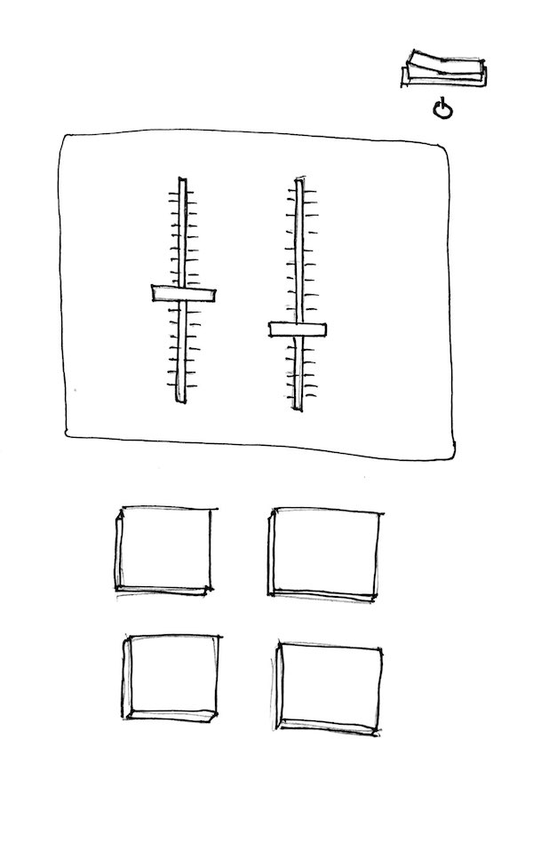

## Adjustments to project proposal

Here's the sketch of the proposed device which I used when presenting the idea in class:

After receiving feedback on my [initial proposal](../week-9-final-project), I realized I needed to make the project more interactive, focusing on more rich and clearly-mapped inputs to produce various visual outputs for the lighting display. I decided to design a lighting controller inspired by existing DJ and MIDI controllers.

This is the first design iteration of the physical interface for the device. The buttons at the bottom would trigger different lighting pre-programmed patterns where only one could be active at a time. These patterns would have their movement speed linked to the BPM of the currently playing track somehow (the phase would be 1x or 0.5x or 0.25x of the BPM). The two sliders / faders would control the complexity of the lighting pattern&mdash;for example, they could control how often the RGB colors change. For high-energy tracks, a DJ might want to turn these faders all the way up, while for more ambient tracks, they could turn them down to reflect a calmer, more settled atmosphere. There are two faders because I imagine the lighting structure split into two zones, one for the front "panel" and another for the sides.

## Play testing

I ran a play test in class with some paper mockups. I brought in my DJ controller and placed it in front of my laptop to show the context of the device I am planning to make. I drew some LEDs on paper around a cardboard box to show the scaffolding of the lighting device:

To avoid overwhelming play testers with the complexity of the DJ controller, I sketched out a simplified version of its interface on paper and placed this on top of the controller:

Finally, here's the paper mockup of the lighting controller, the actual device which I play tested by having users pretend to press its buttons / move its faders:

I had to clearly explain to every tester that this device is not meant to be used by everyone, but rather it's designed for DJs who are familiar with similar controllers already. It was a little tough to pull out feedback from some classmates, but I did receive some questions / concerns which I hadn't thought of:

-   what happens if you press multiple buttons at the bottom of this controller?
-   what happens if you slide the faders before triggering a light pattern?
-   what about using less of a square box and more fun geometric shapes?
