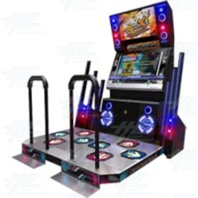
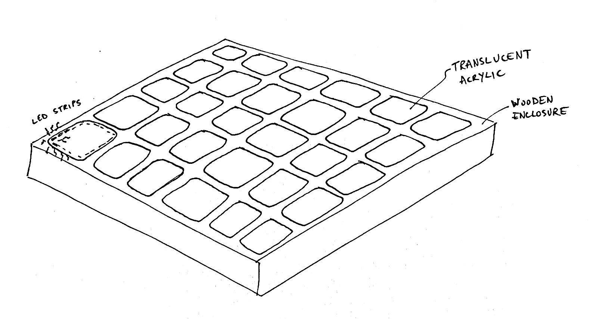
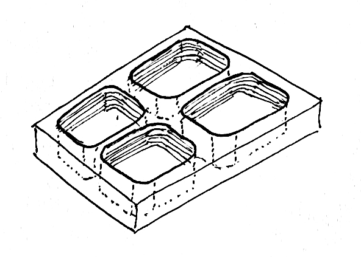
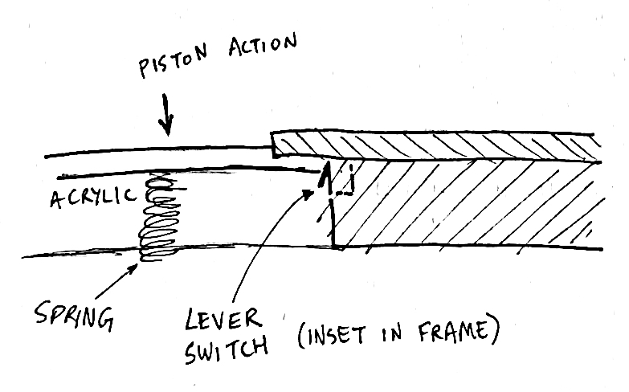

## Dance floor experiences

I've been noodling around with a completely different idea for my final project. It's still related to dance music experiences, but this time more focused on the actual _dancing_ aspect. I have become enamored with wooden dance floors over the past year; I think the physical feedback they provide by transferring other dancers' energy and the energy of the sound system's subwoofer(s) is really amazing. While thinking about these kind of floors, I started to wonder if I could make a dance floor which is even more interactive, perhaps with LED lighting.

At this point I would be remiss not to mention a well-known interactive dance floor found in many arcade contexts: Dance Dance Revolution (DDR).

These machines are fun and I think worth exploring in potential projects; new ones cost on the order of $10,000 so there's almost certainly room to undercut the cost of such devices. Also, the 90s-era design could use an update. However, I don't want to go in the direction of a full-on game experience right now. I'd rather make a device which leaves more room for people to focus on the music being played.

Here's my initial sketch for an interactive dance floor device:

Acrylic tiles fit snugly into the frame to create a piston-like action for them to depress as users step on them.

Here's a closer look at the structure, showing the cavity which the acrylic tiles would sink into:

Here's a side view of the inside of the floor (slightly off-scale because the wood frame shouldn't be as wide as the tiles):

At first I thought I might use pneumatics (e.g. [programmable air's impact sensor](https://vimeo.com/268358944)) or light sensors to detect the depression of the floor tiles. However, I think a lever switch on the side of the tile cavity along with a large spring would be a better approach:

## Interaction loop
