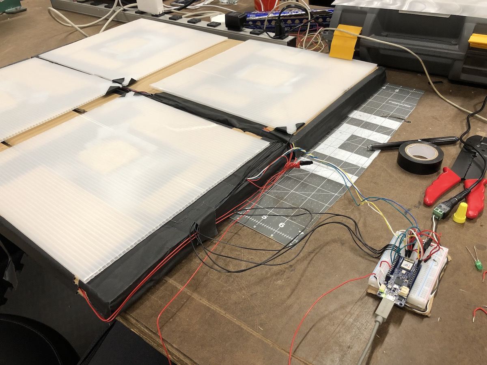

## Sequencer software

I started building out the sequencer software. I mocked up parts of the interface in HTML/CSS, but I don't intend to use these in the final device. The transport timeline will be built into the floor controller with some LED strips.

I hit a pretty large roadblock with audio timing issues when building the software prototype (the same issues in my [techno-landscape project](/projects/code-of-music/techno-landscape)). I realized that p5.sound was interacting poorly with tone.js on the page (side effects are awful! p5.sound includes parts of tone.js and tries to modify audio context globals when you import it). After removing it, I was able to build something coherent:

<iframe src="https://player.vimeo.com/video/304055758?loop=1&title=0&byline=0&portrait=0" width="640" height="633" frameborder="0" webkitallowfullscreen mozallowfullscreen allowfullscreen></iframe>

## Dance floor tiles

I built a cardboard prototype with aluminum plate contact switches. These were finicky to get working reliably; I'll have to come up with a more robust mechanism to attach wire to aluminum for the final fabrication. In this prototype I added LEDs to each tile which lit up when the corresponding tile's switch was closed. The final device will have brighter, more colorful LED lighting inside each tile (this is the main reason I need to build the tiles at approximately this height; I need to fit LED strips inside and ensure they won't be damaged by users stomping on the controller).

<iframe src="https://player.vimeo.com/video/304268474?loop=1&title=0&byline=0&portrait=0" width="640" height="360" frameborder="0" webkitallowfullscreen mozallowfullscreen allowfullscreen></iframe>

<iframe src="https://player.vimeo.com/video/304268489?loop=1&title=0&byline=0&portrait=0" width="640" height="360" frameborder="0" webkitallowfullscreen mozallowfullscreen allowfullscreen></iframe>

## Next steps

I need to think more deeply about how I will make this a good Code of Music final project. There are a lot of decisions to make about the sequencer, like:

- how to adjust tempo
- if the number of steps can be adjusted
- are accents possible?
- can users create cross-rhythms?
- where do the sounds come from and can they be changed?
- will there be quantization and/or swing?
