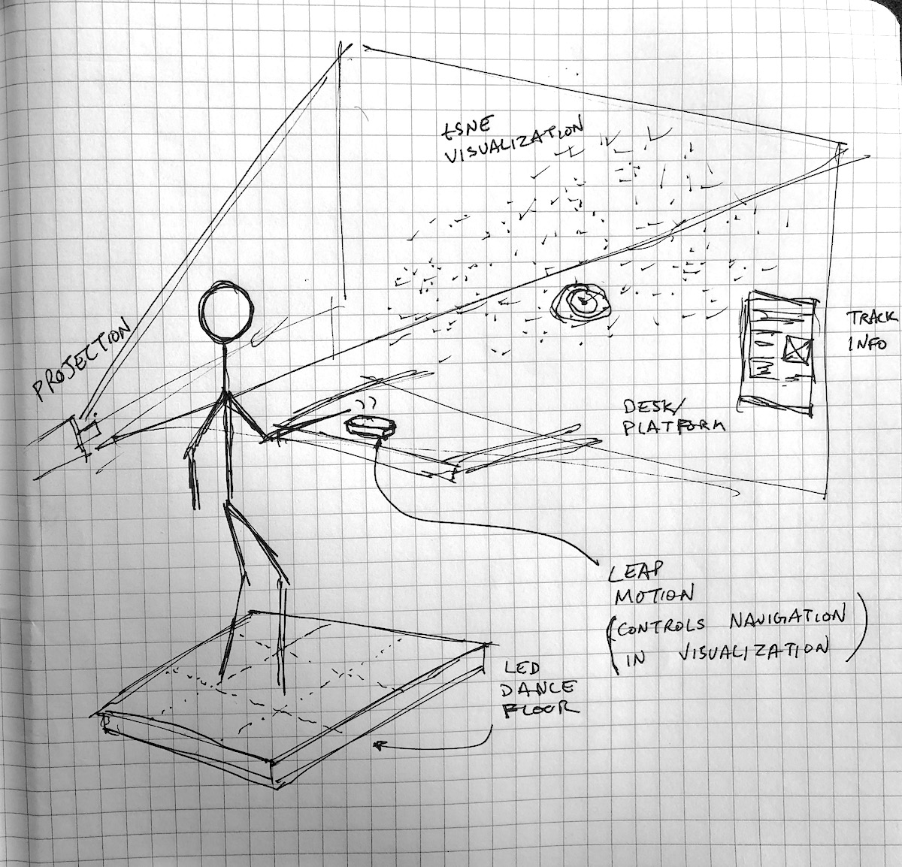
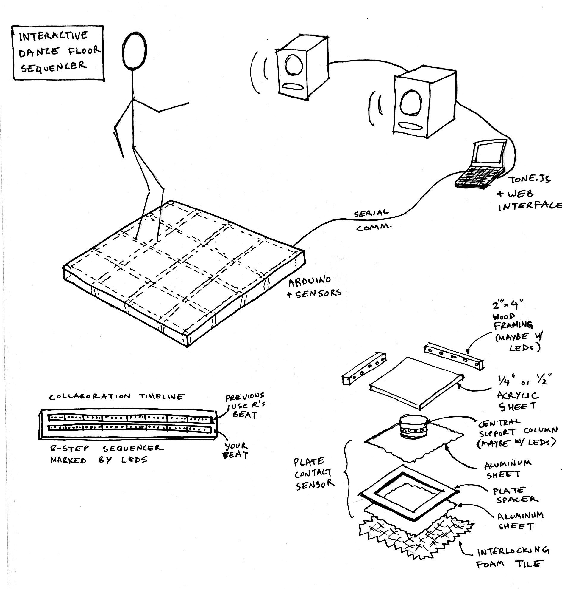

## Dance floor sequencer

After some encouraging feedback in class, I've decided to proceed with the [interactive dance floor project](./week-11-final-dance-floor). I'm also interested in combining this project with my Code of Music final. At a high level, the first iteration of this concept involved beat detection as a user danced to the tracks played during a DJ set and an adjustment of tempo / track in reaction to changes in dancing tempo.

I made some new sketches trying to to incorporate a Leap Motion controller and an interactive [t-SNE](https://lvdmaaten.github.io/tsne/) visualization of tracks based on musical similarity, but this seemed like a stretch, so I'm shelving that part for now:

After thinking more about the collaborative aspect of this project (more on that below), I decided to change the musical interaction to involve a step sequencer rather than a DJ set. I was also getting a little stuck on the BPM tapping interaction concept, anyway...

The [Akai MPC](https://en.wikipedia.org/wiki/Akai_MPC) set the standard for sampling sequencers when it came out, and its 16-pad layout is still the dominant design in most production software & hardware. I figure this layout is the natural place to start for a square dance floor.

Some key ideas illustrated in the above sketch:

-   The floor contains a microcontroller, sensors for the sequencer "pads", and LED strip lighting. It sends and receives data from a laptop using async serial communication. The laptop is running a web interface which plays sounds using the tone.js library.
-   Each of the 16 tiles uses a plate contact sensor. This sensor involves two flat pieces of aluminum foil which come in contact as the user steps on that tile, completing a sub-circuit. These 16 sensor readings go into a 16-channel multiplexer before they go into the microcontroller.
-   The collaboration timeline is an additional physical interface which indicates the status of the current sequence as well as timing information for the sequence played by the previous user of the device.

## User collaboration

This device is designed for an installation setting where users interact with it one-by-one. When a user starts the interaction, they get to hear the beat played by the previous user. The timeline advances and the tiles light up to show the user which samples were triggered. Then, the user can proceed to play their own beat on top of the existing beat, or start from scratch.

There are still a few things left to figure out here:

-   After a beat is programmed, does it keep looping? How does it stop?
-   How does a user choose to play on top of an existing beat (duet) or start from scratch (solo)?
-   Can the tempo be changed? If so, how?
-   Can the sample bank be changed? If so, how?
