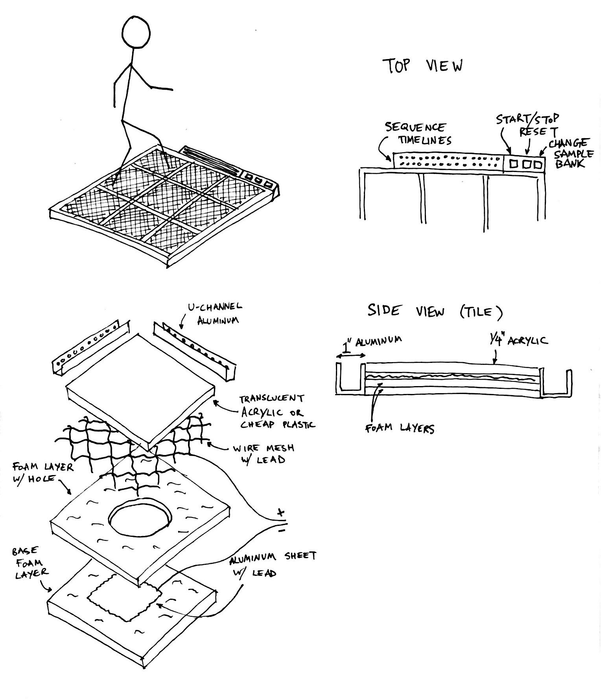

The project has a new formalized name, [_Dance Floor MPC_](/slices/dance-floor-mpc).

## Hardware design

I sketched out my latest ideas for the hardware design using what I've learned so far:



## LEDs

I plugged in my LEDs for the first time today and managed to get them synced up to the Tone.js transport using serial communication:

<iframe src="https://player.vimeo.com/video/304778019?loop=1&title=0&byline=0&portrait=0" width="640" height="480" frameborder="0" webkitallowfullscreen mozallowfullscreen allowfullscreen></iframe>

I'm using the [FastLED library](https://github.com/FastLED/FastLED) here. On the Arduino side, the code to get this working looks like this:

```
#define TRANSPORT_STEP_DATA_PREFIX "transportStep:"

String data = Serial.readStringUntil('\n');

void loop() {
    if (Serial.available() > 0) {
        if (data.startsWith(TRANSPORT_STEP_DATA_PREFIX)) {
            // "transportStep:32"
            char* stepString = &data[strlen(TRANSPORT_STEP_DATA_PREFIX)];
            currentTimelineStep = atoi(stepString);
            clearTimelineLeds();
            lightTimelineStepLeds(currentTimelineStep);
        }
    }

    // other stuff
}

void clearTimelineLeds() {
    for (int i = 0; i < TIMELINE_NUM_LEDS; i++) {
        timelineLeds[i] = CRGB::Black;
    }
}

void lightTimelineStepLeds(int i) {
    timelineLeds[currentTimelineStep] = CRGB::Gray;
    timelineLeds[currentTimelineStep + 1] = CRGB::Gray;
    timelineLeds[currentTimelineStep + (TIMELINE_NUM_LEDS / 2)] = CRGB::Gray;
    timelineLeds[currentTimelineStep + (TIMELINE_NUM_LEDS / 2) + 1] = CRGB::Gray;
    FastLED.show();
}
```
