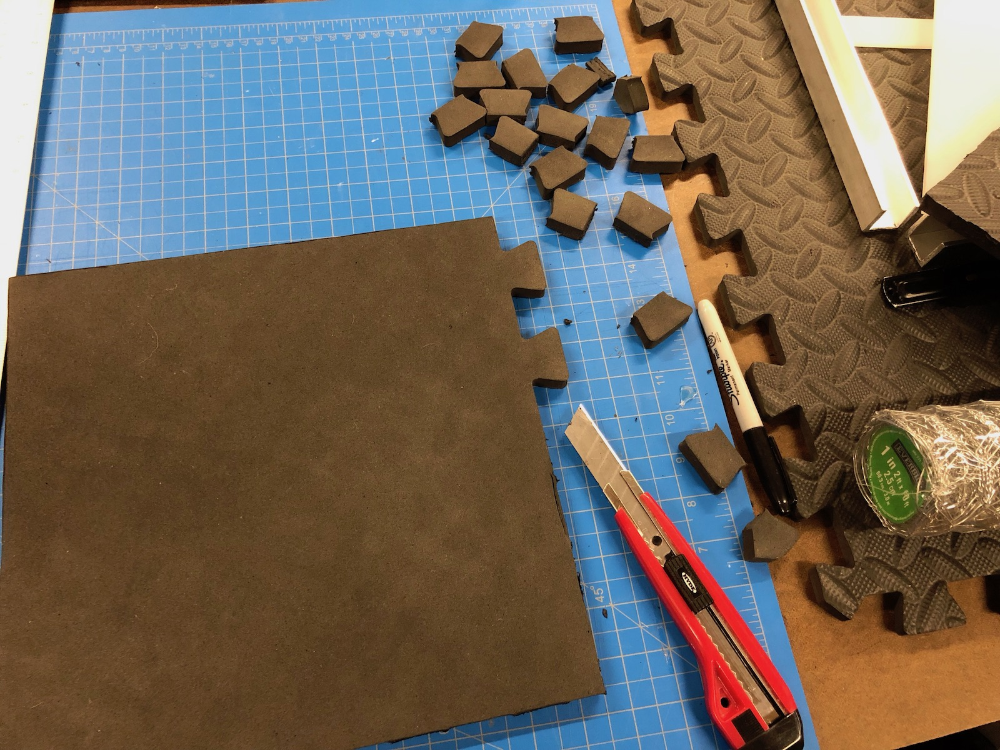
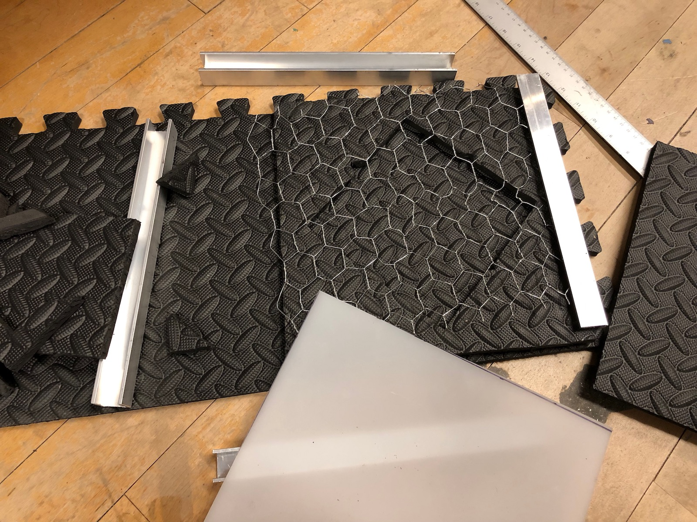
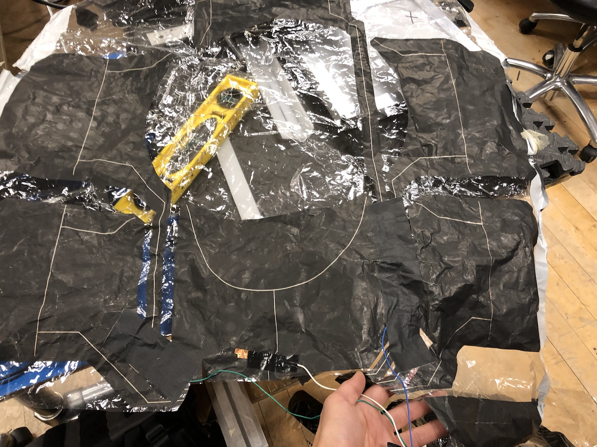
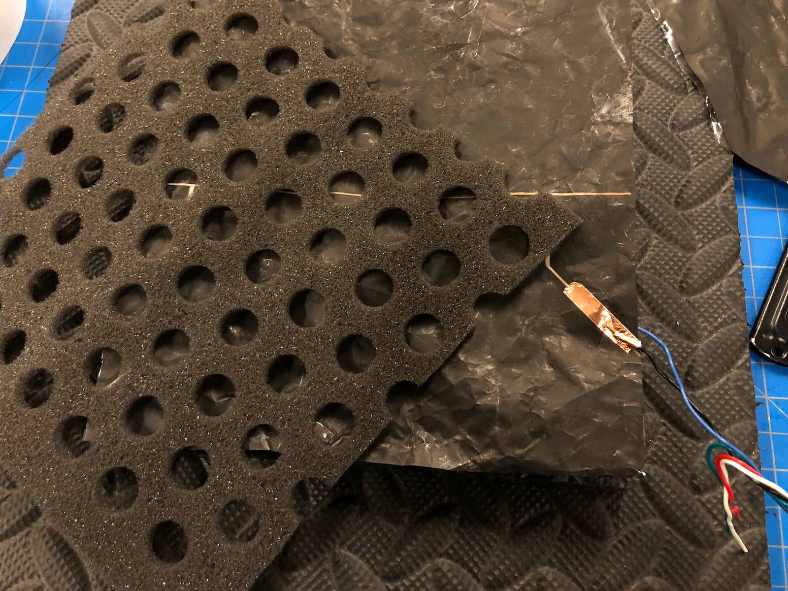
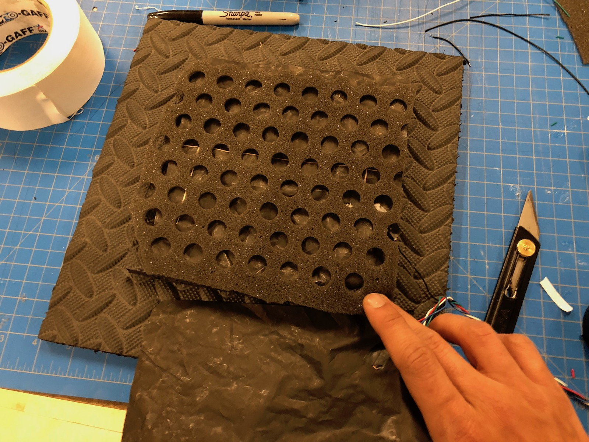
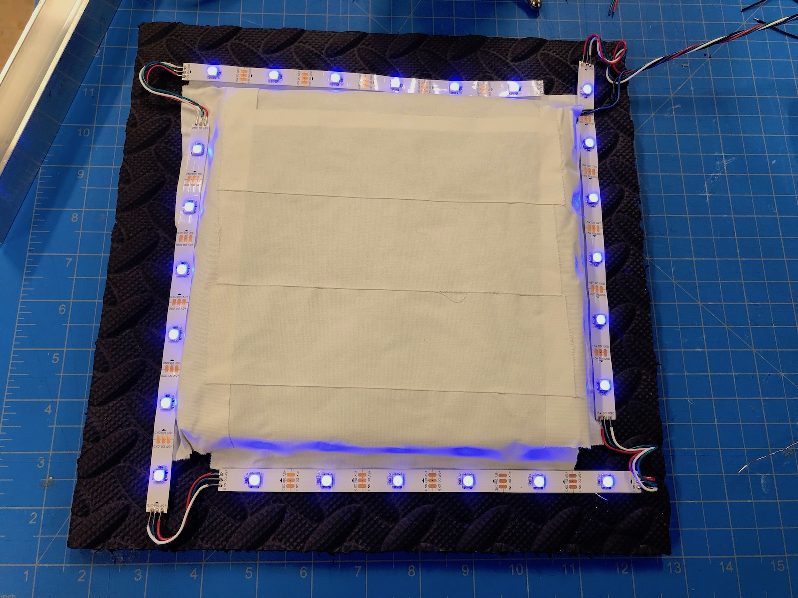
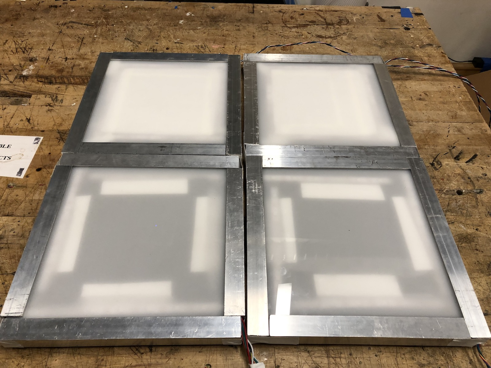

## Fabrication update

Dropping some images and videos of the build progress here for now, will fill in more details about these steps later. A key development this weekend was that I was able to salvage parts (velostat and thin foam) from a DDR controller I found in the ITP junk shelf (what are the odds!) to build my new tiles. I have built four sturdy tiles and will continue to add more as time allows. They are fairly modular, but each tile needs empirical calibration to find the right pressure-to-resistance ratio .

<iframe src="https://player.vimeo.com/video/305359958?loop=1&title=0&byline=0&portrait=0" style="position:absolute;top:0;left:0;width:100%;height:100%;" frameborder="0" webkitallowfullscreen mozallowfullscreen allowfullscreen></iframe>

<iframe src="https://player.vimeo.com/video/305360043?loop=1&title=0&byline=0&portrait=0" style="position:absolute;top:0;left:0;width:100%;height:100%;" frameborder="0" webkitallowfullscreen mozallowfullscreen allowfullscreen></iframe>

