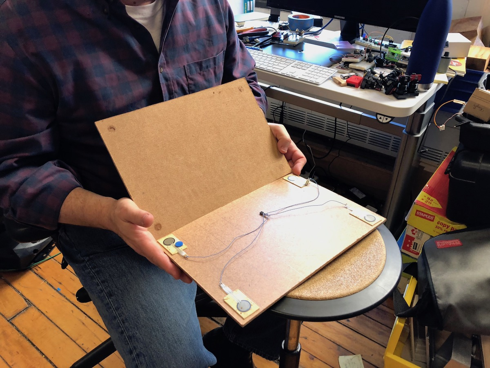
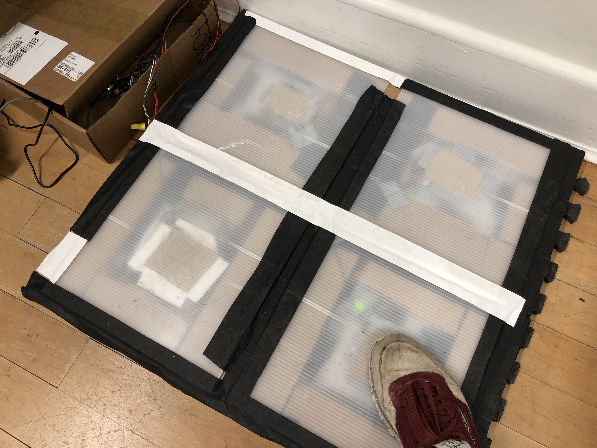

## Fabrication

After some preliminary user testing in [Code of Music](../../code-of-music/dance-floor-sequencer-testing) yesterday, I started to realize that creating robust and rugged floor tile switches would be crucial to the success of this project. The switches broke down by the end of the testing session, but despite that I still got some good feedback on the software which I was able to incorporate today.

I talked with Ben Light about fabrication of the final device today and he underscored the importance of focusing on making really good tile switches that will keep working after many users step on the device. We sketched out some designs involving foam pads and a frame made from aluminum U-channels (which would house the LEDs as well, to avoid the danger of them being crushed). I thought about various ideas to improve the switch mechanism, including this one where I use four parallel contact sensors at the corners of a pad instead of one in the center:

I will go buy some hardware and start building new tiles in earnest tomorrow.

## Software improvements

I also spent time improving the sequencer software today. The UI I'm building is useful for mocking out the physical inputs for now, and it will also be useful later in the final product to aid in debugging. Here's another progress video of the software:

<iframe src="https://player.vimeo.com/video/304525853?loop=1&title=0&byline=0&portrait=0" width="640" height="392" frameborder="0" webkitallowfullscreen mozallowfullscreen allowfullscreen></iframe>

At this point I've improved the timing of user-initiated sequence recording to be more responsive, refined the storage of sequences, added different pad colors which are reflected in the timeline, and added some shortcuts to fill in the current sequence with common patterns like 4-on-the-floor kick drum and hi-hat 16ths. I'm likely going to keep a 4-on-the-floor kick drum pattern on by default when presenting this device to users since I think it provides a good base to start recording rhythms on top of (in this case I'll probably remove the kick from the available pads and substitute it for something).

Another video of the latest state of the UI is included later in this post...

## Refining the hardware prototype

In preparation for tomorrow's user testing in Physical Computing, I made the switch and LED connections more robust (the LEDs were shorting sometimes during my Monday testing, and that would reset the microcontroller). You can see they're more responsive here, I can stand and jump on the tiles:

<iframe src="https://player.vimeo.com/video/304527287?loop=1&title=0&byline=0&portrait=0" width="640" height="360" frameborder="0" webkitallowfullscreen mozallowfullscreen allowfullscreen></iframe>

I recorded some more testing to produce a video for the winter show application:

<iframe src="https://player.vimeo.com/video/304532875?loop=1&title=0&byline=0&portrait=0" style="position:absolute;top:0;left:0;width:100%;height:100%;" frameborder="0" webkitallowfullscreen mozallowfullscreen allowfullscreen></iframe>

One of the major changes I made tonight was to use a different data structure in sending data from the Arduino. Instead of sending each pad hit every time a switch was triggered, I now send a string representation of the pad state changes. Each character in the string corresponds to a pad index, 0 = no change, 1 = pad activated, 2 = pad deactivated. For example, if a user lifted their foot from pad 0 and triggered pad 1 concurrently, the serial data sent would be `"2100"`. This helps me schedule updates better on the JavaScript side.

