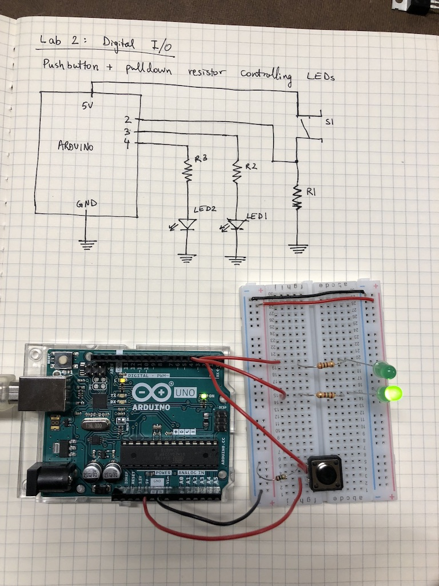

### [Lab 2](https://itp.nyu.edu/physcomp/labs/labs-arduino-digital-and-analog/digital-input-and-output-with-an-arduino/) documentation

A simple circuit to flip the state of two LEDs when a pushbutton is pressed. One of the LEDs is on by default (before interaction), while the other one is off.

<iframe src="https://player.vimeo.com/video/291971060" width="640" height="480" frameborder="0" webkitallowfullscreen mozallowfullscreen allowfullscreen></iframe>

This circuit uses a 10M ohm pulldown resistor (sorry, forgot to label on the diagram) connected to the pushbutton switch and two 150 ohm resistors for the LEDs.




### Code

```c
void setup() {
  pinMode(2, INPUT);
  pinMode(3, OUTPUT);
  pinMode(4, OUTPUT);
}

void loop() {
  if (digitalRead(2) == HIGH) {
    digitalWrite(3, HIGH);
    digitalWrite(4, LOW);
  } else {
    digitalWrite(3, LOW);
    digitalWrite(4, HIGH);
  }
}
```

