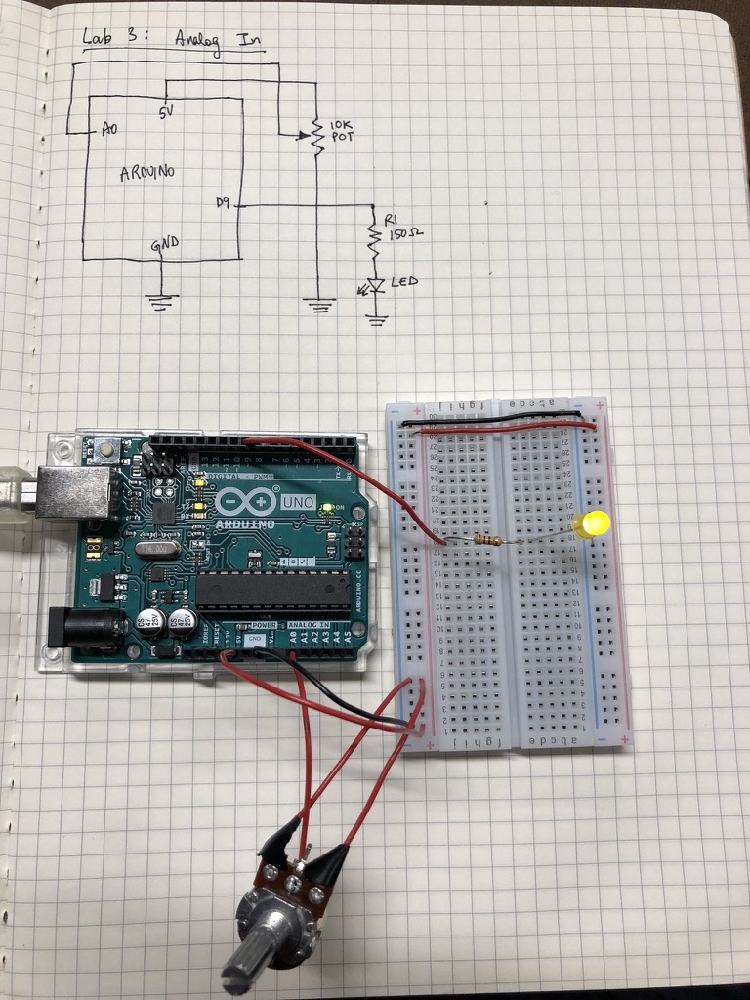

### [Lab 3](https://itp.nyu.edu/physcomp/labs/labs-arduino-digital-and-analog/analog-in-with-an-arduino/) documentation

<iframe src="https://player.vimeo.com/video/291979246" width="640" height="360" frameborder="0" webkitallowfullscreen mozallowfullscreen allowfullscreen></iframe>



### Code

```c
const int ledPin = 9;
int analogValue = 0;
int brightness = 0;

void setup() {
    // initialize serial communications at 9600 bps:
    Serial.begin(9600);
    // declare the led pin as an output:
    pinMode(ledPin, OUTPUT);
}

void loop() {
    analogValue = analogRead(A0);
    brightness = analogValue / 4;
    analogWrite(ledPin, brightness);
    Serial.println(brightness);
}
```

