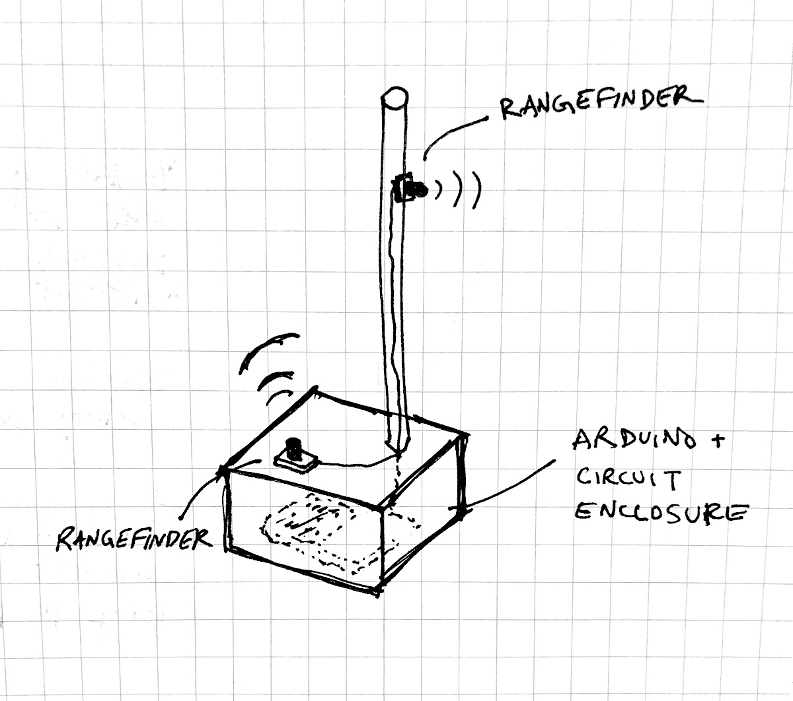
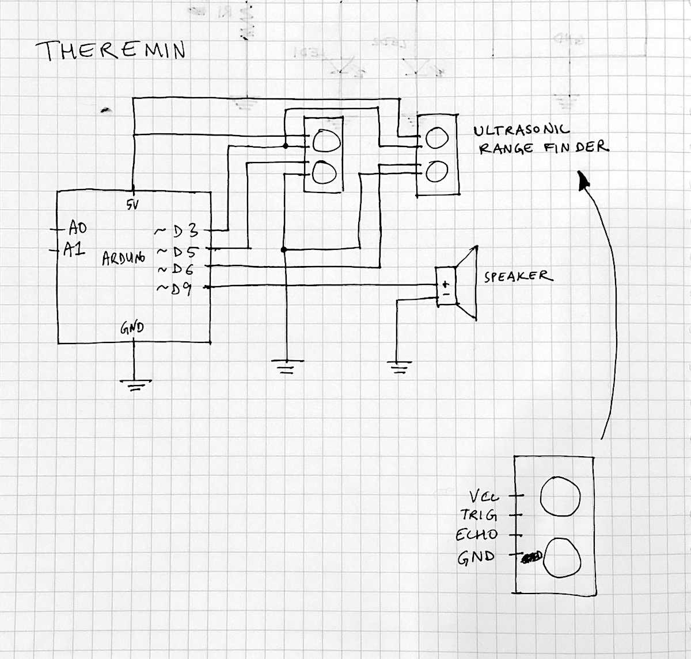
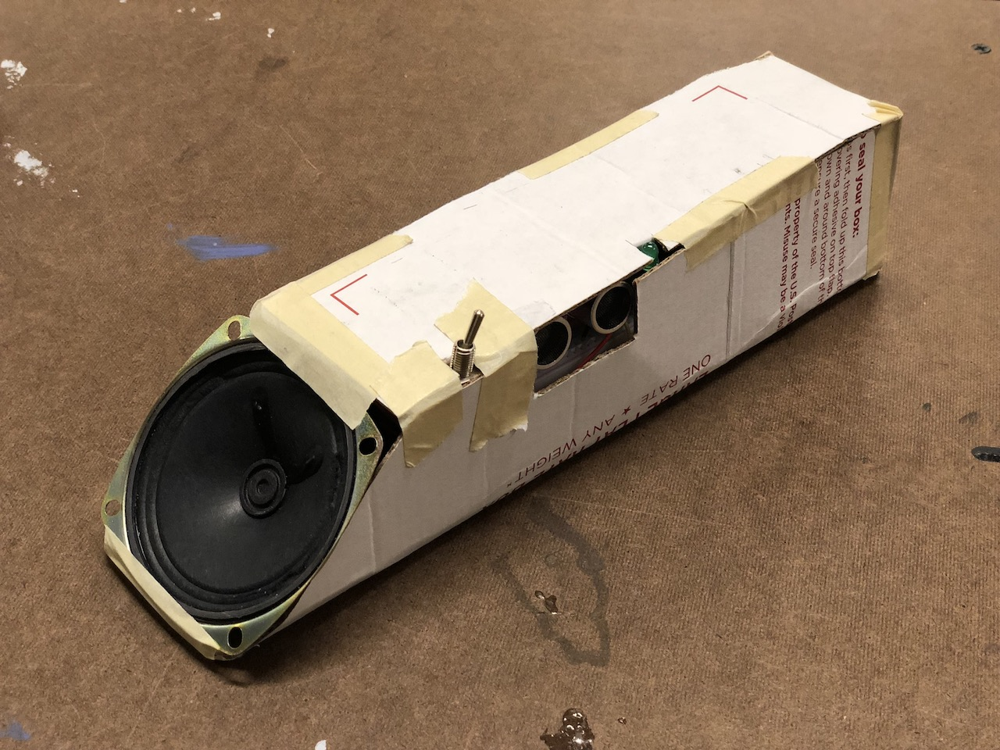
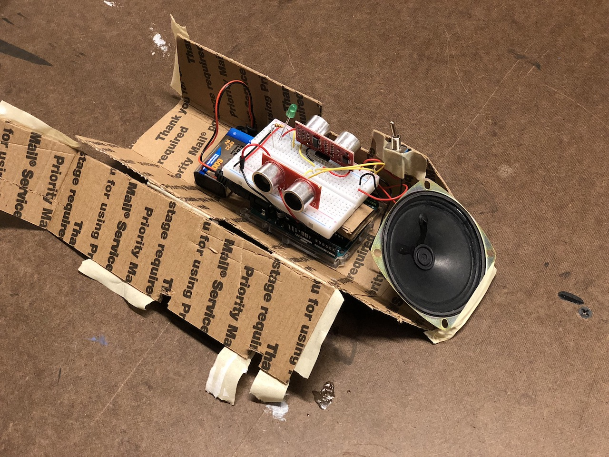
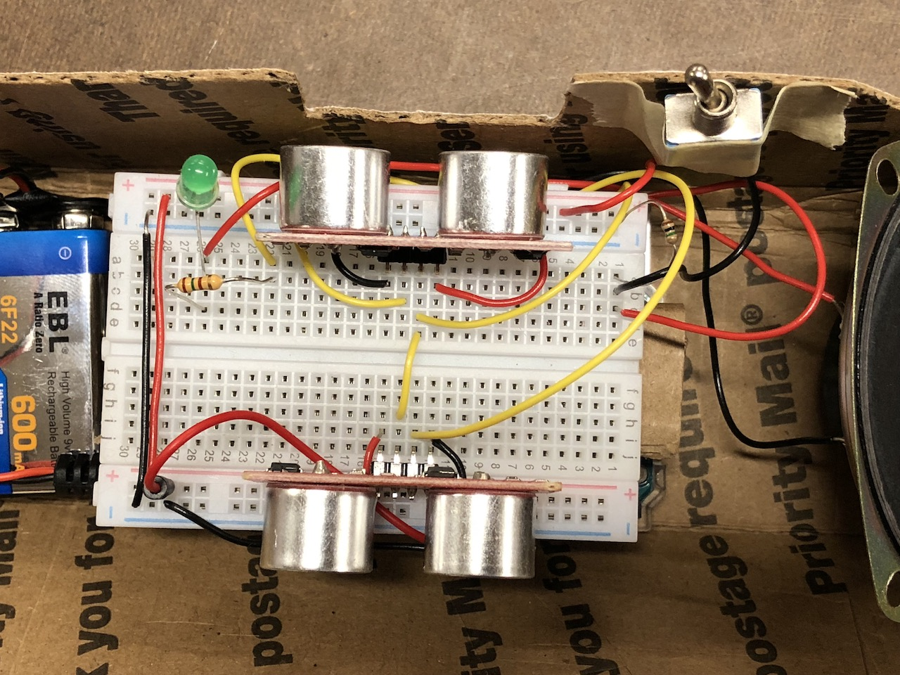
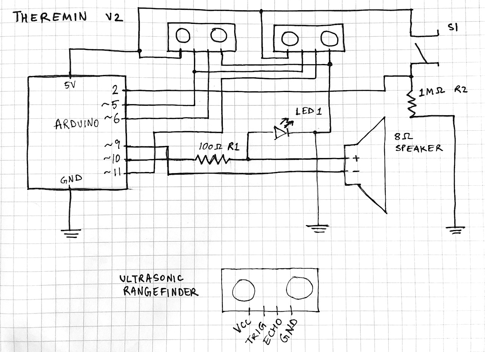

### Idea

So far, we've covered the following in the class labs:

-   Series and parallel circuits
-   LEDs, resistors, variable resistors
-   Arduino digital I/O
-   Arduino analog I/O
-   Audio output with a piezo speaker
-   Servo motor control

While browsing the ER parts list, I noticed some IR & ultrasonic distance sensors.
So, came up with a plan to make a simple [theremin](https://en.wikipedia.org/wiki/Theremin) using these sensors and a speaker.

Here's my initial quick sketch of the device:



And here's my initial circuit diagram (digital input from the rangefinders and digital output to the speaker):



### Execution

While building the theremin, I decided to change its design to be more compact and portable.
It was pretty simple to hook up a 9V battery to the Arduino to allow the device to be portable after uploading my code via the USB cable.
After I got the basic instrument features working, I added a switch to toggle the instrument on / off (the Arduino and the overall circuit still stay on all the time, though, since there is no switch for the battery voltage going into the microcontroller).
I also added an LED in parallel with the speaker to give rudimentary visual feedback on the operation of the theremin.
The LED pulse & brightness changes with the same pattern as the speaker.
Finally, I created a basic cardboard enclosure for the circuit, battery, and speaker.





Here is are some short video clips of it in use:

<iframe src="https://player.vimeo.com/video/293751378" width="640" height="360" frameborder="0" webkitallowfullscreen mozallowfullscreen allowfullscreen></iframe>

<iframe src="https://player.vimeo.com/video/293751401" width="640" height="360" frameborder="0" webkitallowfullscreen mozallowfullscreen allowfullscreen></iframe>

The final circuit diagram ended up looking like this:



Using the rangefinders was relatively straightforward after consulting [this tutorial](http://www.circuitbasics.com/how-to-set-up-an-ultrasonic-range-finder-on-an-arduino/). You initiate the sensor by sending a 2 microsecond "pulse" (switch from HIGH&rarr;LOW signal) on the Trigger pin. In my circuit, I wanted to activate both sensors simultaneously, so I used the same output pin for both rangefinders. Distance readings come back on the Echo pin of the sensor and can be read with the built-in function `pulseIn()`.

One tricky part of this project was achieving tone and volume modulation of the speaker. Arduino's built-in functions for `tone()` don't support volume modulation, so I found a small library that manages to do this called [toneAC](https://bitbucket.org/teckel12/arduino-toneac/wiki/Home). This library requires use of digital pins 9 and 10 on the Arduino UNO, which explains part of the circuit layout. The API of the library is pretty simple (I used 3 out of the 4 argument options):

```c
toneAC(frequency, volume, length);
```

### Code

```c
#include <toneAC.h>

int trigPin = 5;
int echo1Pin = 6;
int echo2Pin = 11;
int switchPin = 2;

void setup() {
    Serial.begin(9600);
    pinMode(trigPin, OUTPUT);
    pinMode(echo1Pin, INPUT);
    pinMode(echo2Pin, INPUT);
    pinMode(switchPin, INPUT);
}

void loop() {
    float duration1, distance1, duration2, distance2;

    // send a 2 microsecond pulse to start the rangefinders
    digitalWrite(trigPin, LOW);
    delayMicroseconds(2);
    digitalWrite(trigPin, HIGH);
    delayMicroseconds(10);
    digitalWrite(trigPin, LOW);

    // read from the rangefinders
    duration1 = pulseIn(echo1Pin, HIGH);
    duration2 = pulseIn(echo2Pin, HIGH);

    // map range 1 to tone frequency
    float toneFrequency = map(duration1, 100, 250, 100, 4000);
    // map range 2 to tone volume
    float toneVolume = map(duration2, 1200, 100, 0, 10);

    // occasionally print sensor values & mapped variables
    if (millis() % 3 == 0) {
        Serial.print("d1/d2: ");
        Serial.print(duration1);
        Serial.print(", ");
        Serial.print(duration2);
        Serial.print("  ....   freq/vol: ");
        Serial.print(toneFrequency);
        Serial.print(", ");
        Serial.print(toneVolume);
        Serial.println("");
    }

    if (digitalRead(switchPin) == HIGH) {
      toneAC(toneFrequency, toneVolume, 50);
      delay(1);
    }
}
```

### Future improvements

I used a very basic algorithm for generating tones in this project. In the future, I would like to experiment with other approaches besides a simple `map()`&mdash;I think the instrument could produce a more stable and nice sound if it was more tolerant of small changes in its detected range in each rangefinder. I could achieve this by manually mapping a fixed set of distance ranges to a predetermined range of notes on the chromatic scale.
