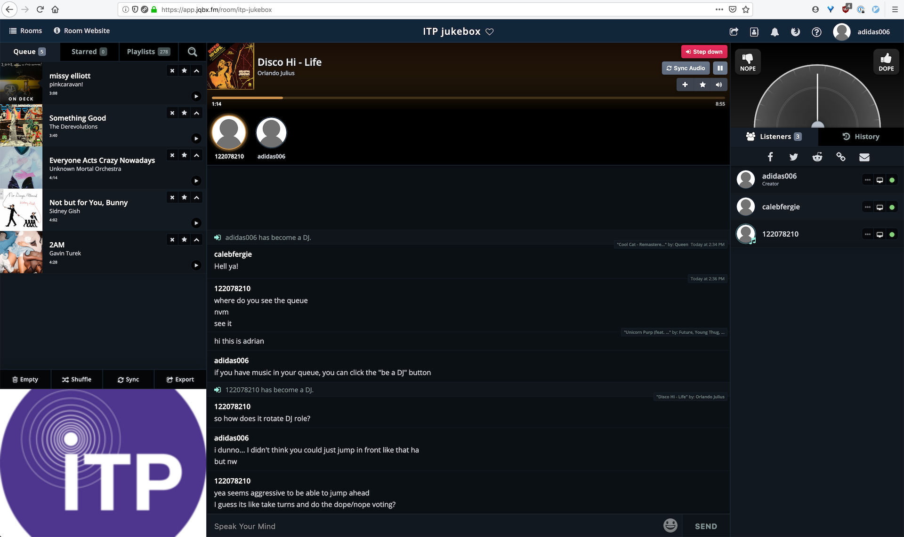

### ITP Jukebox

For my public space on the internet, I wanted to create a social space for sharing music like [turntable.fm](https://en.wikipedia.org/wiki/Turntable.fm) (RIP). Although this service was shut down in 2013, I was lucky to find another web service which has since come online to offer similar features, [JQBX](https://www.jqbx.fm/). JQBX allows you to create public or private rooms where users can take turns
as virtual DJs with music streaming from their Spotify account.

The room I created for ITP is here: [https://app.jqbx.fm/room/itp-jukebox](https://app.jqbx.fm/room/itp-jukebox)

I invited a few people to join through the unofficial ITP slack community. I would say it's _mostly_ public, but still has the barrier of entry of requiring Spotify login. It's easy to get a free trial of Spotify, but some people may have already run through their 30 day trial, which is a constraint that can be overcome but requires tedious workarounds.
