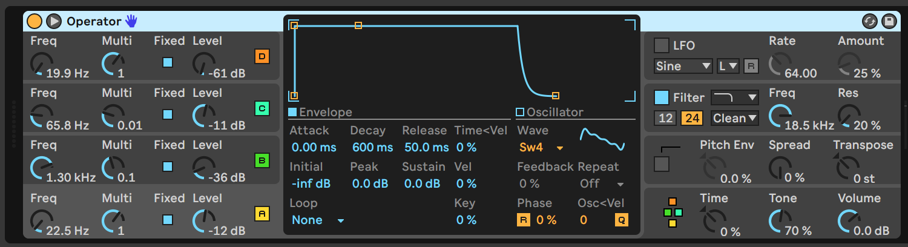
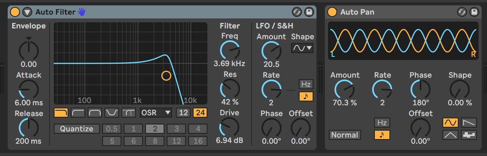
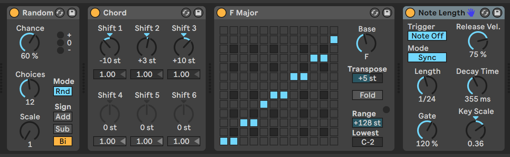
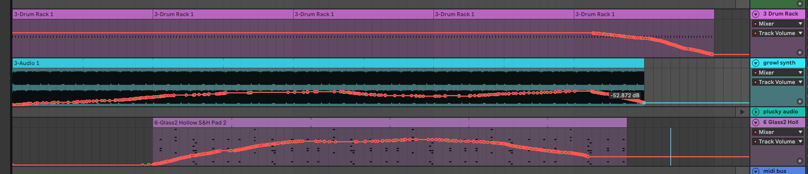

### Stereophonic composition

I created a stereo piece for headphones for this assignment. I've been wanting to explore stereo panning since I've rarely used it in my other Ableton compositions. The installation setup is fairly simple, you just listen with standard stereo headphones.

<iframe width="100%" height="166" scrolling="no" frameborder="no" allow="autoplay" src="https://w.soundcloud.com/player/?url=https%3A//api.soundcloud.com/tracks/597540594&color=%23ff5500&auto_play=false&hide_related=true&show_comments=false&show_user=true&show_reposts=false&show_teaser=false"></iframe>

There are 3 tracks, each with different panning effects. I played around with FM synthesis in the Opeator instrument to create a growl sound which formed the basis of the track. I wanted this instrument to create a slightly foreboding, ominous mood (I've been listening to Aphex Twin's Selected Ambient Works Vol 2 lately). In addition, I think it sonically mimics the physical experience of a helicopter passing by repeatedly.

After this growl track, I added a plucky synth track using the Collision instrument, but this didn't make it into the final track.

I added synth pad with a chorus-like reverb & panning effect. This is where the generative part of the composition comes in&mdash;although the recording above is only a couple minutes long, it could go on much longer in a live performance. I used the MIDI routing & effect tricks I learned from [this Ableton tutorial](https://www.ableton.com/en/blog/generate-endless-musical-ideas-lives-midi-devices/) to create the MIDI score for the pad synth chords. The randomness in this effects chain allows the track to create a constantly changing melody.

The final score for the piece isn't super interesting compared to the examples we looked at last class, but here it is:

