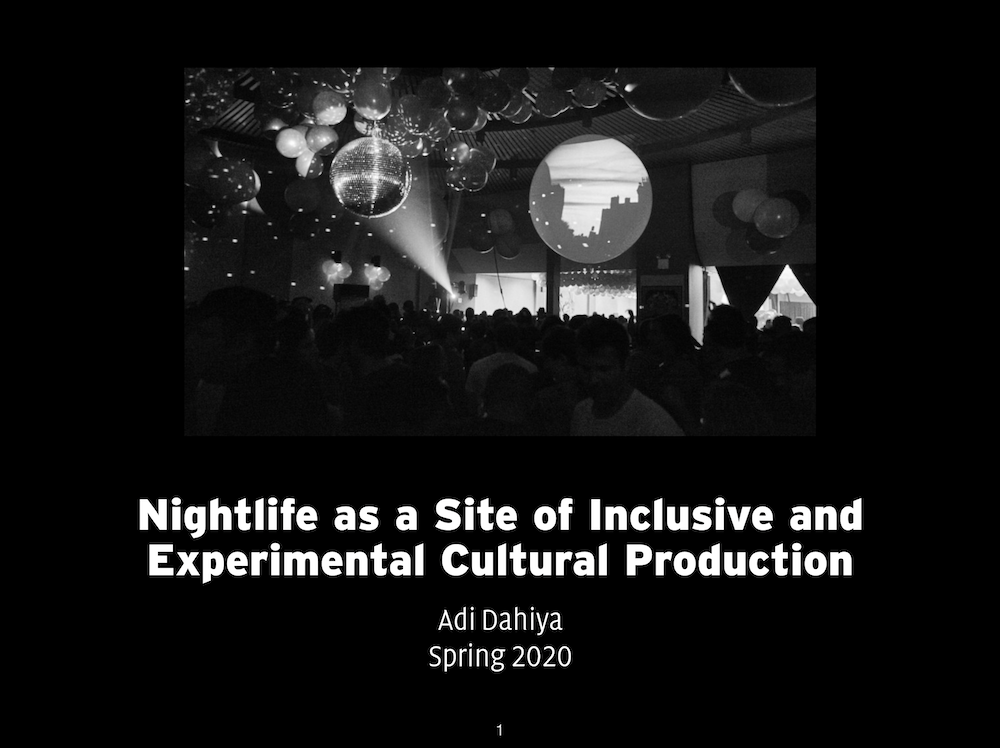

I presented my thesis project again, this time adding the word "experimental" here in the title. One part seeks to explore nightclubs as spaces for innovative, experimental art forms. The other part is a socially-engaged project to empower people to build the kinds of experiences they want to see in nightlife.

I'm interested in many aspects of club culture:

- Spaces for freedom, anonymity, and "production of new selves"
- "Dance-floor democracy" vs. membership and exclusivity vs. "underground" scenes
- Inclusive, safe spaces for marginalized communities
- Art objects at the rave
- Nightclubs as multidisciplinary meeting points for creative people
- Curation of multidisciplinary programming including DJs, live bands, and visual art
- Aesthetic comfort zones and the presentation of new, challenging club music
- Lighting, space, and architectural design
