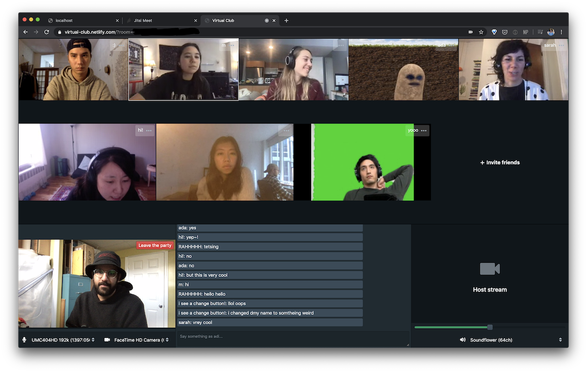

### Dance parties are other people

Designing experiences to promote a specific kind of club culture:

-   strong focus on music
-   dancing _alone in a crowd_ or _with other people_ to discover new self expressions and new versions of the self

### Virtual club culture

Which aspects of the party can we translate to a virtual club environment?

-   See friends & strangers dancing
-   Flexible social grouping
-   Visual stimulation
-   Text/audio communication between club patrons

