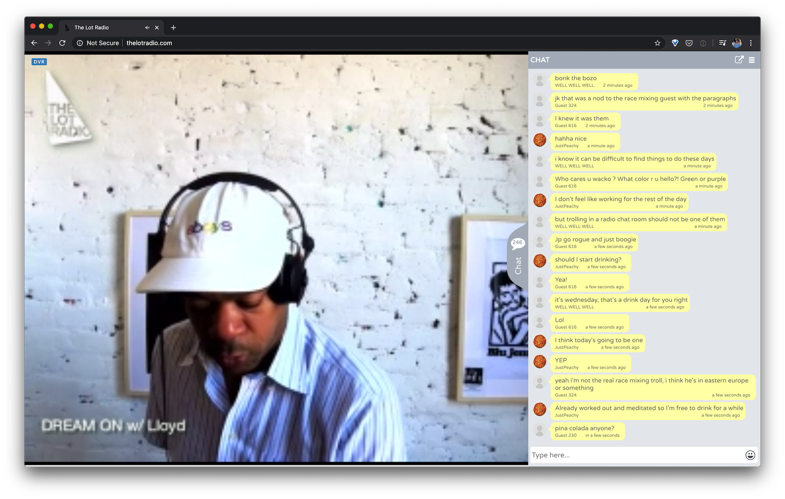
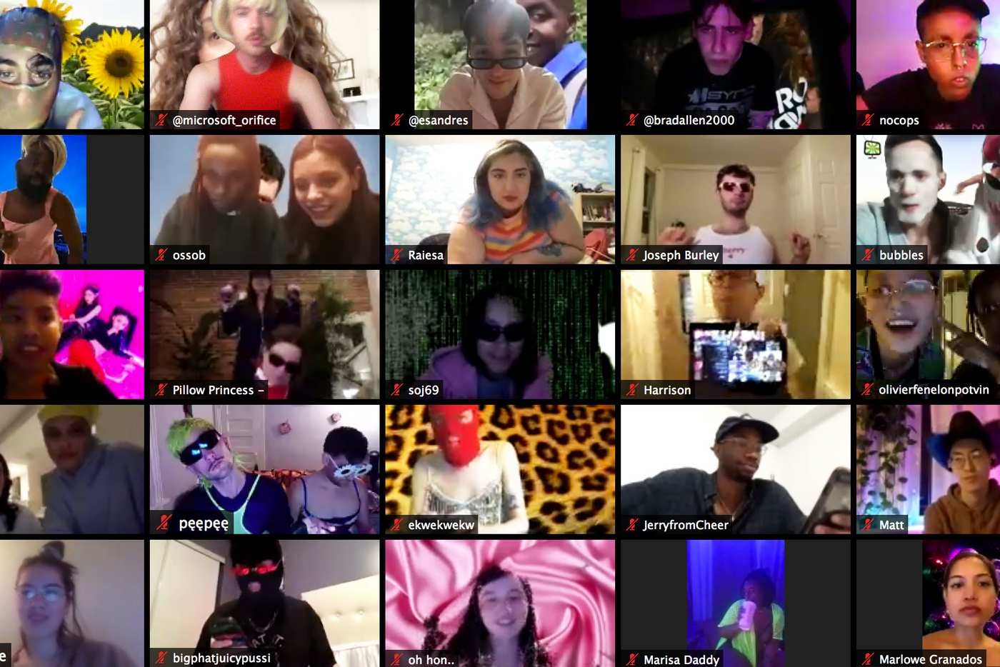
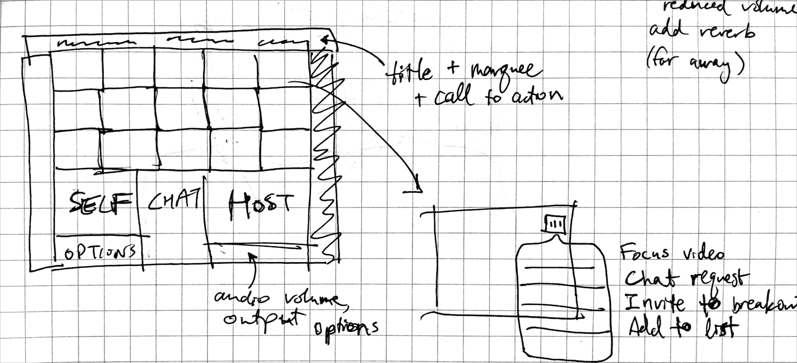
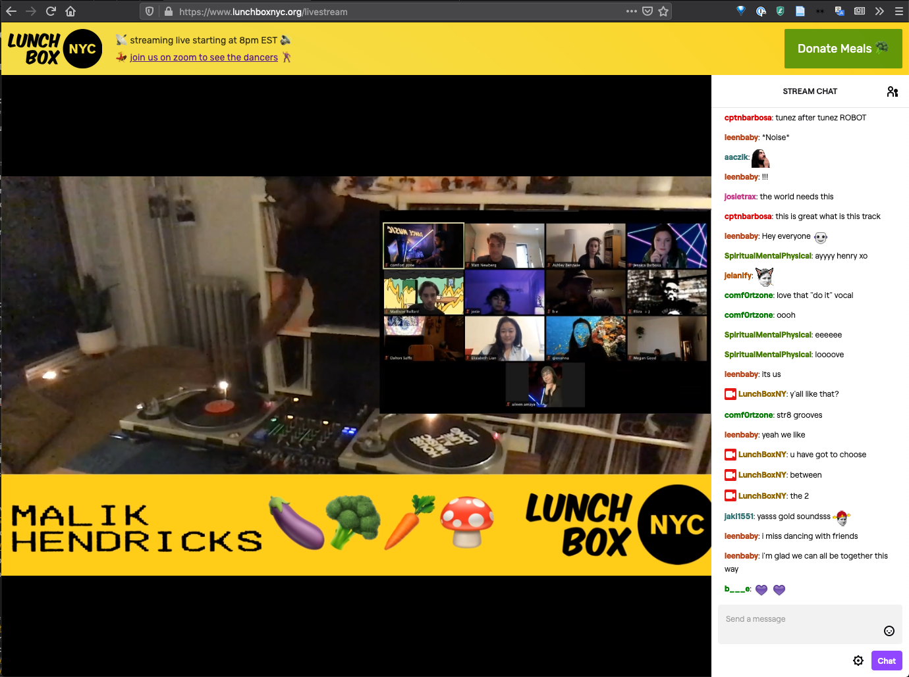
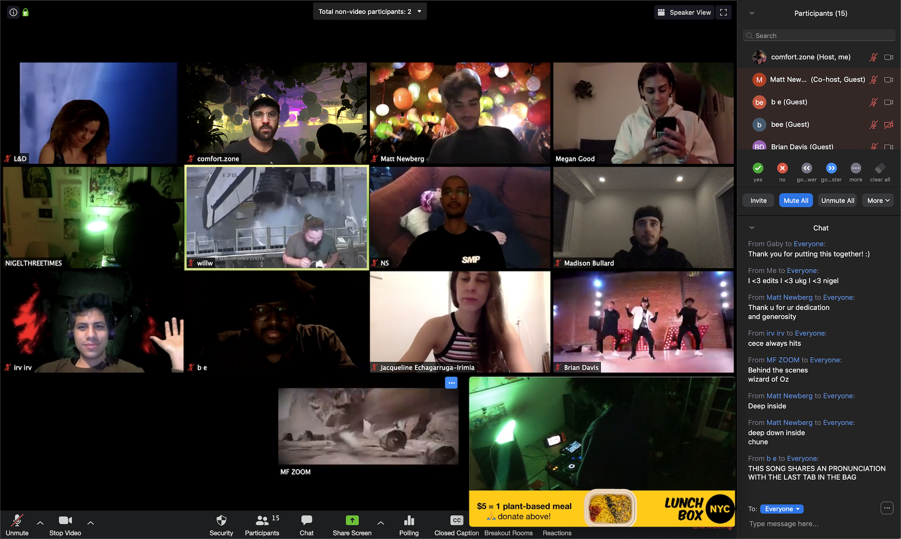

### Thesis is almost over... but this project is just getting started

A lot of development happened since my last substantial [blog post](../week-10-pivot). The feedback and interest I've gotten in the project has been encouraging, and I generally feel motivated to create something people could really enjoy using during this period of isolation. I also feel like I'm in a competition to be the first to market in solving this product need... judging by the [rumblings](http://250bpm.com/blog:158) I see on tech blogs about the deficiencies of existing tools/platforms. Time to get to work.

### Listening vs. Dancing

I've been updating my [are.na channel](https://www.are.na/adi-dahiya/virtual-club-culture) with references and news about the latest in internet party culture. One distinction I want to make up front is a delineation between **listening parties** and **dance parties**.

**Listening parties** have been around for a while on the internet, before the pandemic. Listening parties:

-   have a low barrier to entry. you can tune in and leave it on in the background while you do something else at your computer.
-   don't encourage much physical movement, especially if you focus on the chat room. sending messages requires your arms to be static at the keyboard.
-   have either live music (e.g. Twitch streams) or prerecorded music (like Virtually Nowadays, at the time of this writing).
-   sometimes have a visual accompaniment created by a video artist.

The most common form of this in my immediate music community occurs on [The Lot Radio website](http://www.thelotradio.com/), which features a DJ livestream (usually in The Lot's physical studio) and an accessible chat room:

Since the closure of their physical venue, [Nowadays](https://nowadays.nyc/events/) has been using the same setup for their online programmming. [Boiler Room](https://boilerroom.tv/) is another popular example of this category of event. Any time a group of people chooses to tune into the same internet radio station and has some shared channel of communication during the event, this can be considered a listening party.

**Dance parties** on the internet are a newer phenomenon, driven entirely by the global practice of social distancing due to COVID-19. They are a subset of listening parties. Internet dance parties:

-   _provide visibility of other participants through video conferencing_. this encourages more immersive socializing and many of the behaviors you would find in a physical dance party, such as:
    -   dancing
    -   outfits / costumes
-   feature "live" music (performed either by a DJ or a musician).

The most popular platform for this style of event has been [Zoom Meetings](https://zoom.us/), the most notable example of which is [Club Quarantine](https://www.thecut.com/2020/03/club-quarantine-is-zooms-hottest-new-queer-club.html):

### Design Goals

**My thesis project focuses on dance parties, not listening parties**. It draws inspiration from a specific kind of club culture (one where the focus is on music; dancing drives the space, rather than sex) and attempts to transmit festive energies through telecommunications mediums.

I wrote out an initial list of must-have features for an internet dance party platform as follows:

-   high quality audio stream. the music must not skip or have distortions. this is important for dancers to get in a groove and move their bodies.
-   visibility of other dancers through webcam video streams. this doesn't scale up easily for lots of people (20+), so you need a way to break the party into smaller groups and focus on your friends.
-   visual stimulation, signifying that you are at a party somehow.
-   public text chat room

"Nice to have" features:

-   private text chat rooms
-   highlight specific video streams for everyone, like go-go dancers, or just someone who looks cool. similar to Zoom's "spotlight video" feature
-   livestream VJ
-   multiple party "rooms"
    -   dance floor has only DJ audio stream
    -   other rooms allow participants to voice chat each other
-   discovery of different parties through some kind of indexing/aggregation feature

### First prototype

#### UI mockup

I sketched out a quick UI mockup featuring 4 main features:

1. video conference streams
2. self video view
3. public chat room
4. host video view

I figured the "host" video view could be used to show the performer(s) and spotlight dancers. In the first iteration, though, I just plugged a livestream embed in there as a cheap way to get high quality audio and ease the transition for users coming from existing platforms like Twitch and YouTube.

#### Technical considerations

Out of the available open source options for video conferencing, I found [Jitsi Meet](https://jitsi.org/jitsi-meet/) to be the most attractive. It basically worked out of the box; after a couple days of hacking with [lib-jitsi-meet](https://github.com/jitsi/lib-jitsi-meet), I had the basics of a custom video conferencing UI.

> More on tech details in another blog post...

From the above mockup and use of the free meet.jit.si service as a conferencing back end, I built like this first prototype:

At this point I had convinced myself that this project is technically feasible. The next goal was to make the web application stable enough for use in a real party environment.

### Hosting parties

Since the beginning of April, I had been helping run a virtual party and fundraiser called [Lunchbox NYC](https://www.lunchboxnyc.org/) with my friend Matt. We were curating DJs and hosting streaming parties every Saturday night. This gave me a place to observe what it's like to host a party with some existing platforms like Zoom.

We used [Lightstream](https://golightstream.com/) to mix together DJ audio and broadcast to Twitch. I built a web page to embed the Twitch stream on lunchboxnyc.org so I could have some control over the UX and promote the fundraiser. Some of the key takeaways from the hosting experience on April 11 were:

-   virtual backgrounds are important. people like to be able to get creative with them and display some personality. they also encourage more people to turn on their video in a conference, when they don't have to worry about the backdrop of their room
-   spotlighting participants' videos is fun and engaging. we used it in two ways: (1) to prompt (sometimes unaware) people to bust a move and (2) to highlight a noteworthy moment or visual going on in one of the video streams

### Second prototype

With some additional virtual party hosting experience under my belt, I got back to building. I got the basics of a "virtual background" feature working by masking a user's body with [bodypix](https://github.com/tensorflow/tfjs-models/tree/master/body-pix):

`video({ title = "Virtual background prototype", src = "/video/virtual-background-1.mp4", autoplay = true, width = "100%", height = "auto", muted = true, loop = true })`

Then I added a flexible, responsive grid layout system for video streams:

`video({ title = "Responsive video grid", src = "/video/responsive-grid-1.mp4", autoplay = true, width = "100%", height = "auto", muted = true, loop = true })`

Also a "portrait" orientation for videos (zoomed in and cropped to the center of the frame) and a feature to select virtual backgrounds:

`video({ title = "Portrait video and virtual background", src = "/video/portrait-and-vbackground.mp4", autoplay = true, width = "100%", height = "auto", muted = true, loop = true })`

Lastly, I added private chat rooms with a request / block system. With all these features I was ready to do a proper user test during the April 18 LunchboxNYC stream...
