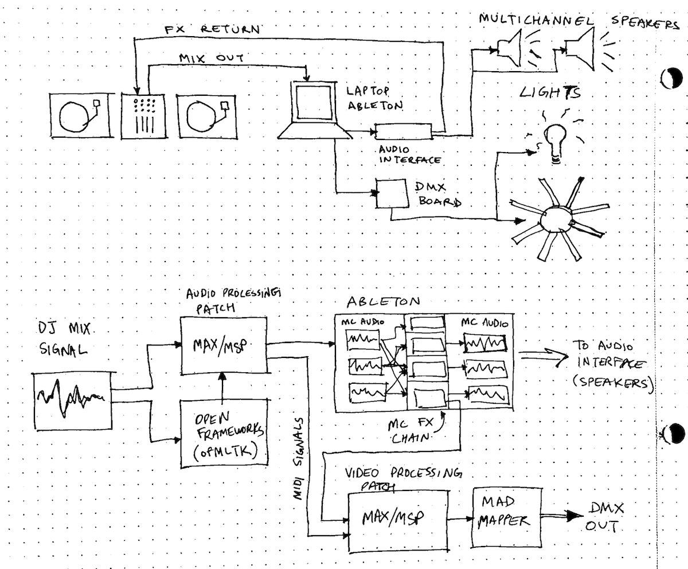

Since the beginning of the semester, I have started to narrow the focus of my thesis project to be better suited for the time and setting of this course.

The main decision I've made is to no longer attempt a socially-engaged project to empower club-goers to build their own nightlife experiences. In practice, this would have looked like a series of workshops and meetups and the involvement of those attendees in the production of one or more parties during the semester. I still think this is a good goal, but I think I can continue to work on this idea after this thesis course.

What this leaves in the project is an open-ended exploration of nightlife as a space for innovative, experimental art forms, the documentation and success of which is created through parties.

For the first "prototype" assignment, I decided to focus on the technical aspects of an audioreactive lighting system I might use at a party. It involves audio and video processing to control DMX output to my custom LED fixture:

<iframe src="https://player.vimeo.com/video/395818910" width="640" height="360" frameborder="0" allow="autoplay; fullscreen" allowfullscreen></iframe>
