As I continue to boil down my thesis concept, I now understand it as a series of interventions in club culture with an emphasis on _spatial_ design for dance music events. Rather than trying to innovate in multiple areas for every event (social inclusion, community building, accessibility, sound design, lighting design, etc), I will try to experiment with one or two aspects for each one.

Over the last two weeks, I have been involved in producing two parties, 999-PIES and .Nothing.

### 999-PIES (February 15)

This is the second event in the 999-PIES party series, which takes place at various DIY venues (the first one was on Nov 23 at a metal fabrication shop in Ridgewood). We leaned into the pizza theme by bringing a pizza pop-up and playing Italo disco and house music (which turns out to be an underserved niche that people want to go out and listen to). I designed the flyer, promoted the party, and designed a custom LED lighting setup to accent the DJ booth. The venue we used (Magick City) had much of its own lighting built-in, but I chose to keep most of those lights turned off, only using the disco ball lights at certain climactic moments.

[The event was an "RA pick"](https://www.residentadvisor.net/events/1382893) (a mildly coveted distinction in the defacto ticketing platform for dance music events in NYC) and had a great turnout. The pizza pop-up concept was a success and made for a memorable, unique nightclub experience.

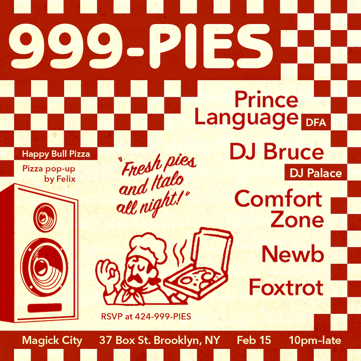
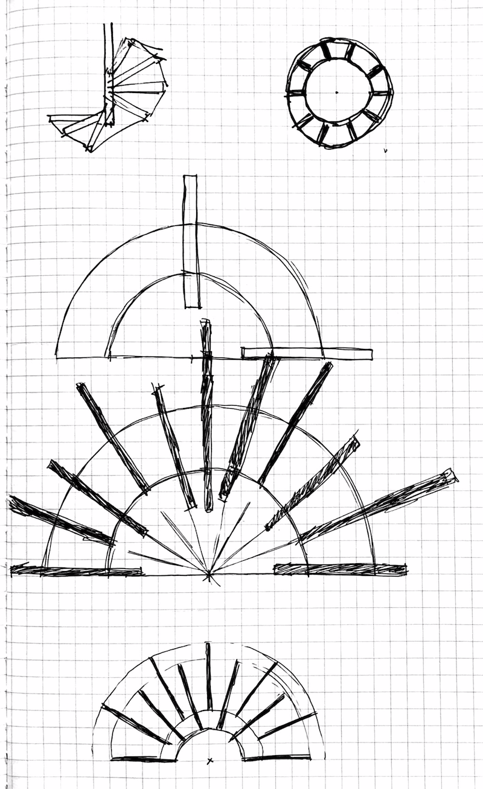
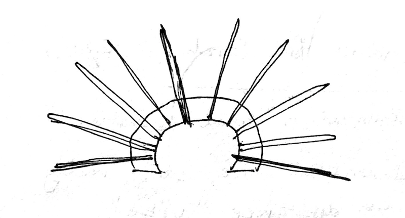
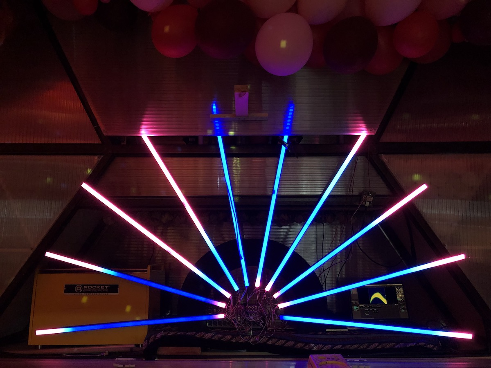
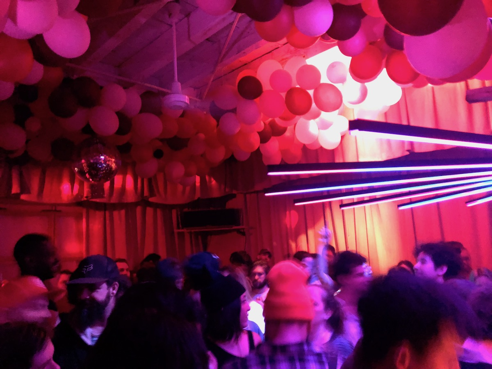
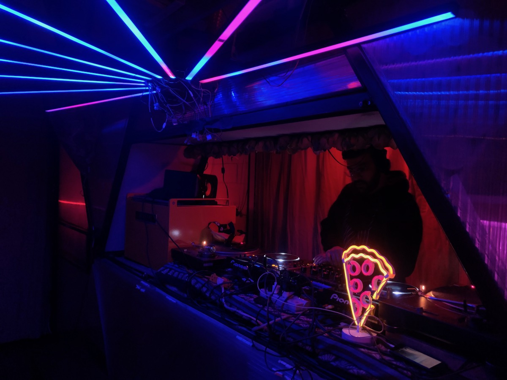

### .Nothing (February 22)

.Nothing ("dot nothing") is a party organized by my friends Finley and Alec. For [this event (titled "Undergrowth")](https://www.residentadvisor.net/events/1380006), I focused on designing lighting specific to the venue (Ivy House) and got to spend more time operating the lighting patterns throughought the event (as opposed to 999-PIES, where I was busy making sure other aspects of the event were running smoothly).

I felt that my lighting setup was quite succesful despite is simplicity, and it worked with the architecture of the room. I worked with some new equipment (strobes and haze machine) and the general feedback from partygoers was quite positive. The music at this event was definitely on the more experimental side of club music, and my lighting really helped to create the right vibe where people could dance to tracks which were otherwise difficult to dance to, at times. I think this worked because the rhythms of my lighting patterns were not always 1:1 with the musical rhythms, and this provided an alternative stimulus for dancers to react to.

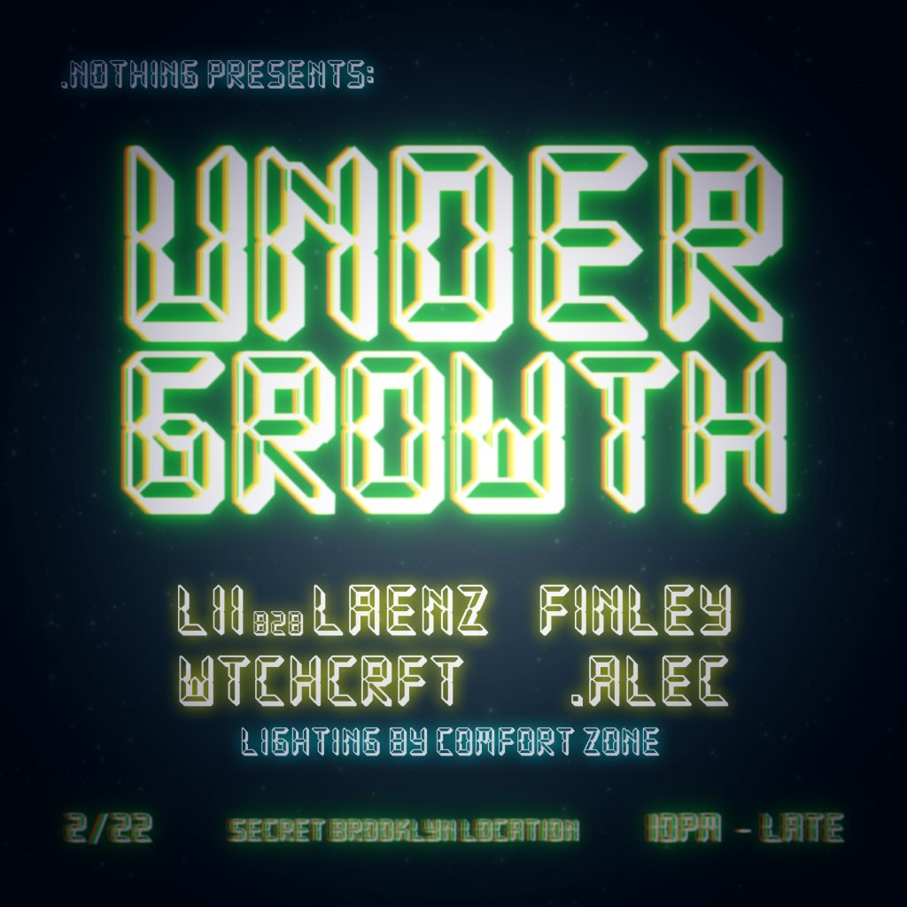
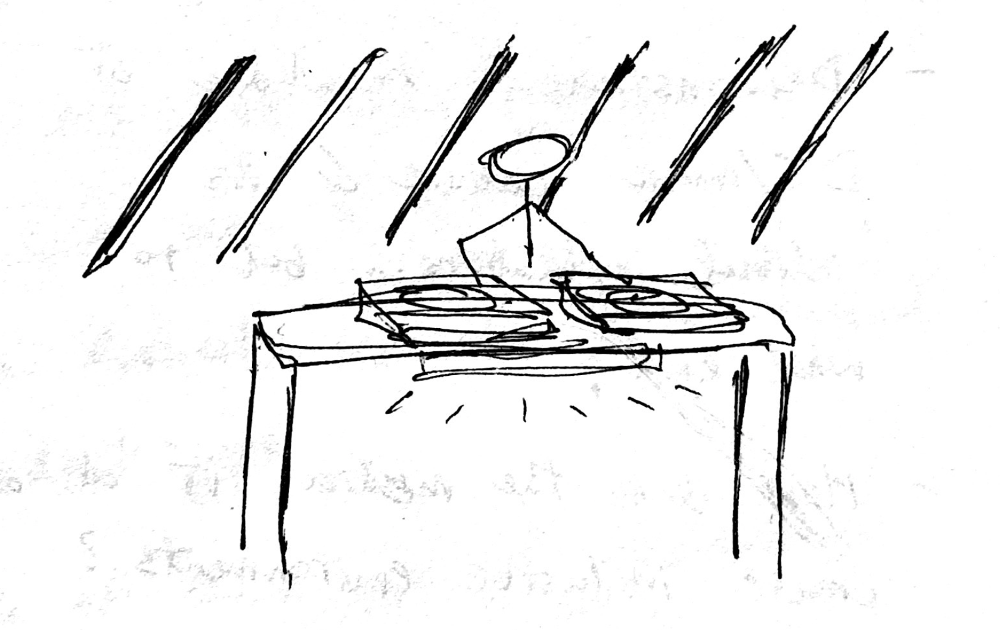
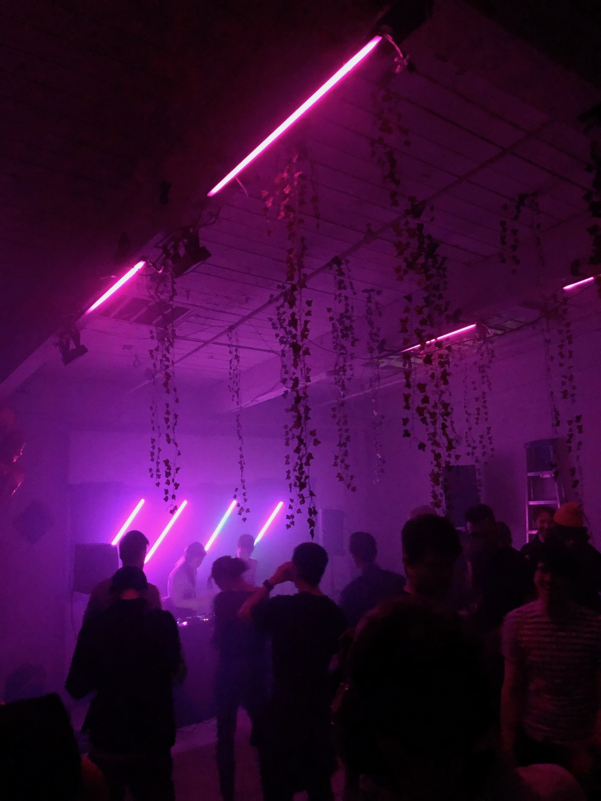
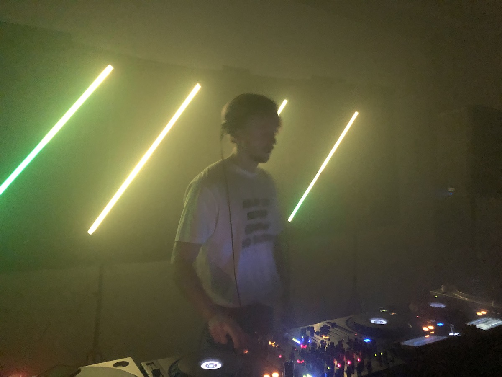
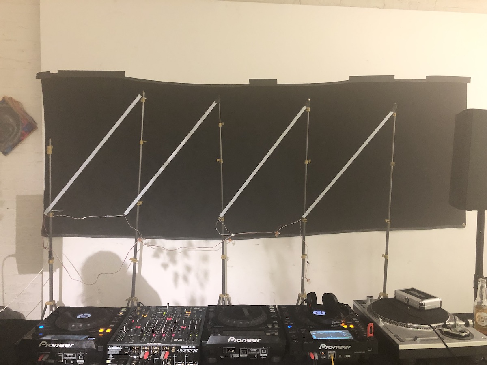

Videos coming soon!
