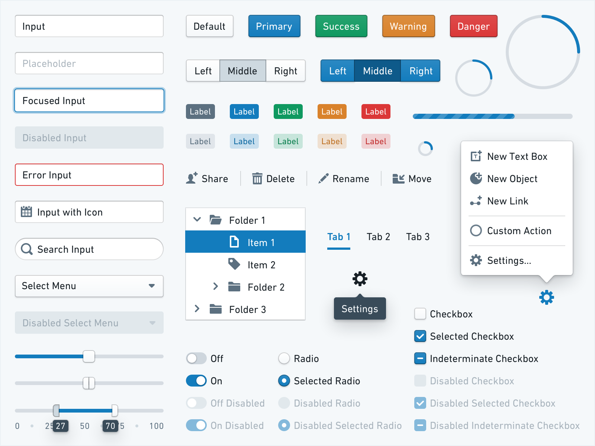
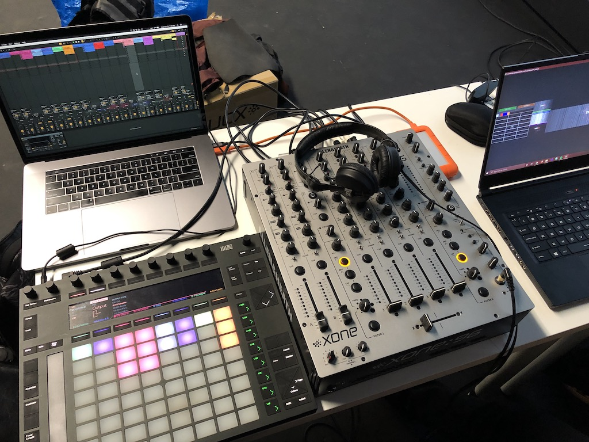
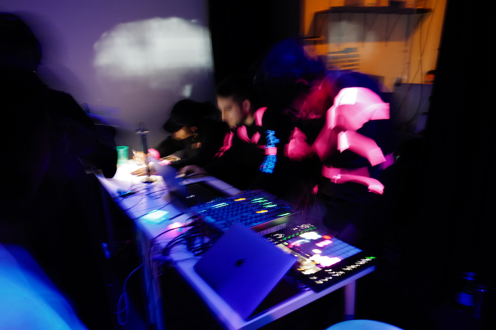

### Background

Software Engineering, Design Systems

&rarr; [Blueprint](/projects/blueprint)

### Dance Floor MPC

Physical Computing

&rarr; [Documentation](/slices/dance-floor-mpc/)

### DJing and music production

&rarr; [100 days blog](/blog/itp/100-days-of-making/day-1/)

<iframe width="100%" height="450" scrolling="no" frameborder="no" allow="autoplay" src="https://w.soundcloud.com/player/?url=https%3A//api.soundcloud.com/playlists/697712136&color=%23ff5500&auto_play=false&hide_related=true&show_comments=false&show_user=true&show_reposts=false&show_teaser=false"></iframe>

### Abstract audiovisual performance

&rarr; LIPP Final project

<iframe src="https://player.vimeo.com/video/359388066?loop=1&title=0&byline=0&portrait=0" width="640" height="640" frameborder="0" allow="autoplay; fullscreen" allowfullscreen></iframe>

<iframe src="https://player.vimeo.com/video/359391655?loop=1&title=0&byline=0&portrait=0" width="640" height="640" frameborder="0" allow="autoplay; fullscreen" allowfullscreen></iframe>

### Spatial audio

&rarr; 40 channel performance

### Sound visualization

&rarr; Wavetable synth visualizer

&rarr; Spatial synesthesia

[Dropbox folder](https://www.dropbox.com/sh/fsny8e7gjkapqd9/AABdNLloNNOrXhp3u1P2dnCWa?dl=0)

### Club culture

