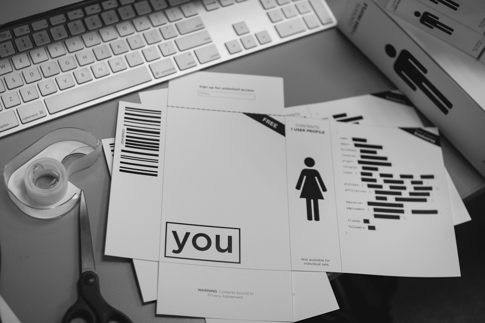
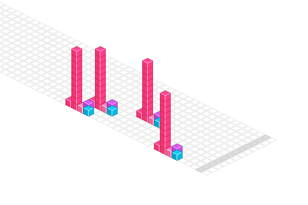
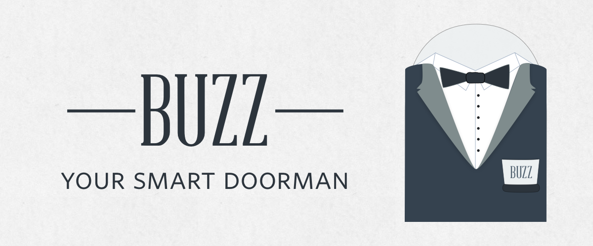
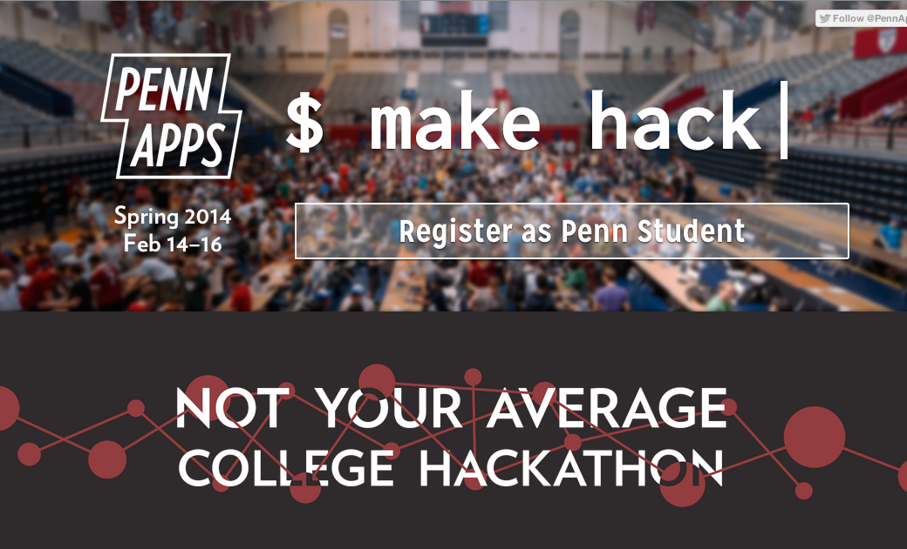
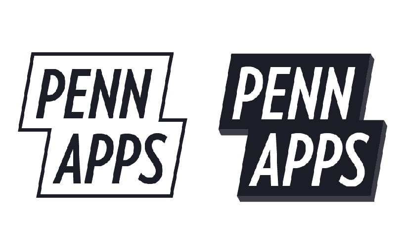

Below, you'll find my work in information visualization, typography, graphic design, physical computing, branding, and various experiments completed during undergrad studies at UPenn.

-   [Mapping Musical Genres](#mapping-musical-genres)
-   [Branding the Contemporary Fringe](#branding-the-contemporary-fringe)
-   [You Are The Product](#you-are-the-product)
-   [Electronic Synthesis Visualizer](#electronic-synthesis-visualizer)
-   [Tweet Topic Correlation Between US Counties](#tweet-correlation)
-   [Scrobble Goggles](#scrobble-goggles)
-   [Buzz, Your Smart Doorman](#buzz)
-   [Losing My Edge](#losing-my-edge)
-   [PennApps Hackathon](#pennapps)
-   [Nostrand](#nostrand)
-   [Levine](#levine)
-   [Creative Process Book](#creative-process-book)

---

<h3 id="mapping-musical-genres">Mapping Musical Genres</h3>

<a href="./mapping-music-genres/poster.pdf">60" &times; 40" print</a> &mdash; Spring 2014

Multi-dimensional graph-based visualization representing the development of and influences between major musical genres from 1940&mdash;2000 (built using data from [The Echo Nest](http://the.echonest.com/) APIs).

---

<h3 id="branding-the-contemporary-fringe">Branding the Contemporary Fringe</h3>

<iframe src="https://player.vimeo.com/video/79072259" width="640" height="360" frameborder="0" webkitallowfullscreen mozallowfullscreen allowfullscreen></iframe>

[Interactive application](http://www.adidahiya.com/design/edge) &mdash; Fall 2013

An experimental project which attempts to brand the contemporary fringe of art & design through a 2D visualization which reacts to user input via webcam.

---

<h3 id="you-are-the-product">You Are The Product</h3>

[Website](http://www.adidahiya.com/design/typog) &mdash; Fall 2013

A typography-driven project which takes a critical look at the economics of popular free web services–such as Google, Facebook, and Twitter–which invert the traditional product consumption relationship.

---

<h3 id="electronic-synthesis-visualizer">Electronic Synthesis Visualizer</h3>

[Interactive application</a> &mdash; Spring 2014](http://www.adidahiya.com/synth-vis)

A simple browser-based synthesizer that visualizes subtractive synthesis over time. Users can play notes using their keyboard and see ADSR envelopes move across the isometric 3D canvas.

---

<h3 id="tweet-correlation">Tweet Topic Correlation Between US Counties</h3>

[Interactive application](http://www.adidahiya.com/wwbp-counties) &mdash; Spring 2014

A force-directed graph visualization which draws attention to particularly unique correlations of topics tweeted in different U.S. counties.

Data source: Penn's [World Well-Being Project](http://wwbp.org/).

---

<h3 id="scrobble-goggles">Scrobble Goggles</h3>

[iOS application](https://github.com/adidahiya/scrobble-goggles) &mdash; Fall 2013

Take a photo of an album with your iOS device and use the Google Goggles API to match it. Then, scrobble the tracks from that album to Last.fm.

---

<h3 id="buzz">Buzz, Your Smart Doorman</h3>

<a href="./buzz/sell-sheet.pdf">Concept, prototype & marketing materials</a> &mdash; Spring 2014

A “smart” doorbell which sends you an SMS when a visitor arrives.

---

<h3 id="losing-my-edge">Losing My Edge</h3>

<a href="./losing-my-edge/losing-my-edge.pdf">5" &times; 7" letterpress print</a> &mdash; Fall 2012

A graphical interpretation of a text using only typography. I used the lyrics from the LCD Soundsystem song _Losing My Edge_.

---

<h3 id="pennapps">PennApps Hackathon</h3>

[Website](http://2014s.pennapps.com/) &mdash; Fall 2013

Logo design, website, branding, and creative direction for one of the largest student hackathons in the U.S.

---

<h3 id="nostrand">Nostrand</h3>

<a href="./vinyl-sleeve/vinyl-sleeve.pdf">12" vinyl cover art</a> &mdash; Fall 2012

A vinyl cover designed to visually evoke the sounds of the song _Nostrand_ by Ratatat.

---

<h3 id="levine">Levine</h3>

Custom typeface &amp; sample sheet &mdash; Fall 2012

A custom typeface designed from a photograph I took of a building on UPenn's campus.

---

<h3 id="creative-process-book">Creative Process Book</h3>

<a href="./process-book/process-book.pdf">Booklet</a> &mdash; Fall 2012

A process book containing sketches and concepts for some early graphic design projects. Images are compressed to reduce file size (larger version available upon request).
