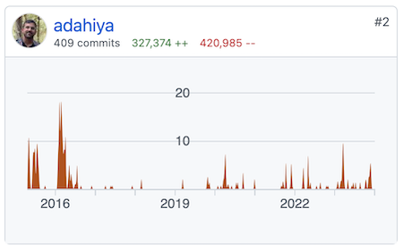

I led the development of [Blueprint](https://blueprintjs.com/), [Palantir](https://www.palantir.com/)'s open source UI toolkit and design language. You can view its [GitHub repository here](https://github.com/palantir/blueprint). I helped design its APIs, abstractions, and interactions. I also engaged with the TypeScript and React open source community to continually improve the project.

&rarr; [View the interactive documentation here](https://blueprintjs.com/docs/).

Commit contributions as of March 2019 ([open source](https://github.com/palantir/blueprint/graphs/contributors))

Commit contributions as of March 2019 (closed source)

