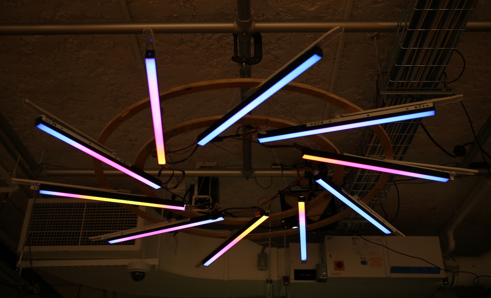
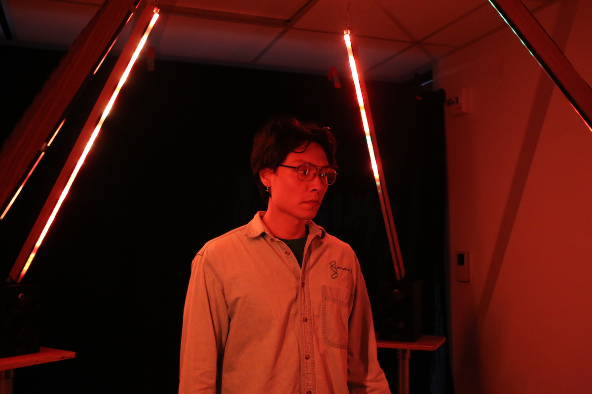
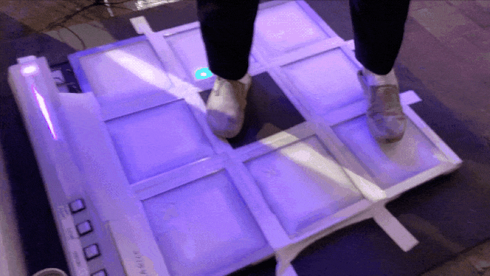
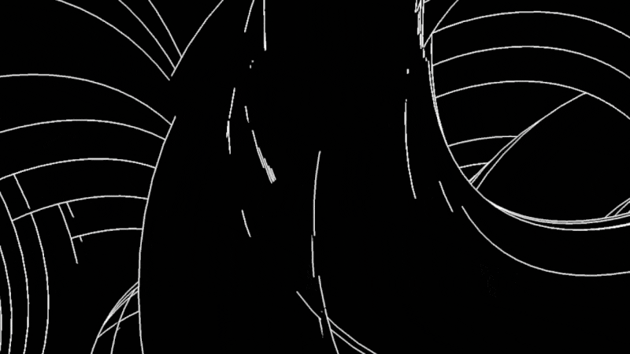

A selection of my course projects at [ITP](https://tisch.nyu.edu/itp).

-   [Digital Dance Hall](#ddh)
-   [Aperture](#aperture)
-   [Spatial Synesthedia](#spatial-synesthesia)
-   [Untitled (live video performance)](#untitled-lipp)
-   [Dance Floor MPC](#dance-floor-mpc)
-   [100 days of mixing & sound collage](#100-days-mixing)
-   [Weird Type AR study](#weird-type-ar-study)

 

<h3 id="ddh">Digital Dance Hall (2020)</h3>

My ITP thesis completed during the COVID-19 pandemic: the first iteration of a new social video platform for internet dance parties. [More info here](https://digital-dance-hall.netlify.app/about/) and [here](/slices/digital-dance-hall/).

`video({ title = "DDH", src = "https://digital-dance-hall.s3.amazonaws.com/assets/about-documentation.mp4" })`

   

<h3 id="aperture">Aperture (2019)</h3>

Suspended kinetic light sculpture which rotates between two spatial configurations.

   

<h3 id="spatial-synesthesia">Spatial Synesthesia (2019)</h3>

Quadraphonic spatial audio installation with audioreactive visuals mapped onto LED strips.

   

<h3 id="untitled-lipp">Untitled (live video performance, 2019)</h3>

Generative abstract live video performance accompanied by an original musical score. Built using Max/MSP and Ableton Live.

`video({ title = "untitled", src = "../../static/video/abstract-video/untitled-lipp-snippet.mp4" })`

   

<h3 id="dance-floor-mpc">Dance Floor MPC (2018)</h3>

An interactive matrix of LED-lit dance floor tiles which control a drum rack sampler & step sequencer. [Read more about the project and process behind it here](/slices/dance-floor-mpc).

   

<h3 id="100-days-mixing">100 days of mixing & sound collage (2019)</h3>

In an effort to improve my mixing and DJ skills, I committed to a daily creative practice of 100 days of mixing & sound collage. [Read about the inspiration and motivation for this project here](/blog/itp/100-days-of-making/day-1/).

<iframe width="100%" height="450" scrolling="no" frameborder="no" allow="autoplay" src="https://w.soundcloud.com/player/?url=https%3A//api.soundcloud.com/playlists/697712136&color=%23ff5500&auto_play=false&hide_related=true&show_comments=false&show_user=true&show_reposts=false&show_teaser=false"></iframe>

<h3 id="weird-type-ar-study">Weird Type AR study (2018)</h3>

I spent a couple months exploring the affordances and possibilities inside the container of Weird Type.
I produced a [performance art piece which is a study of creative play in AR](/slices/weird-type-ar-study).

