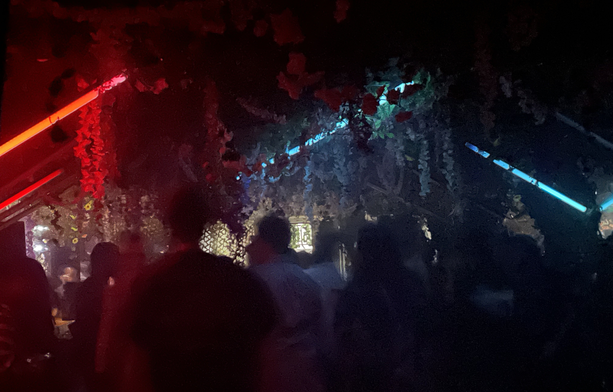
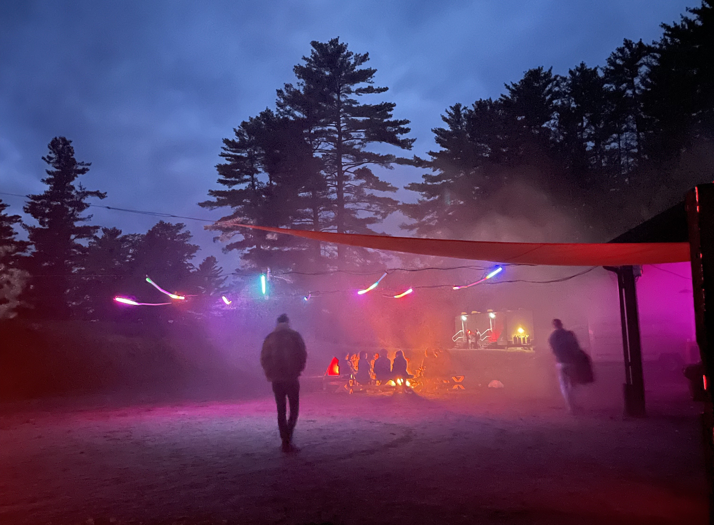
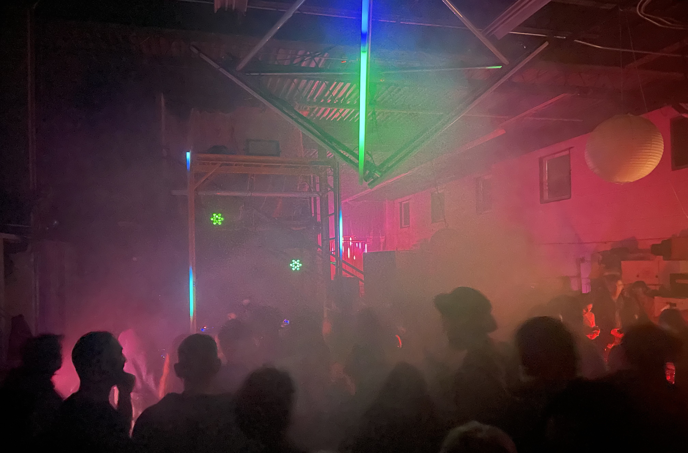
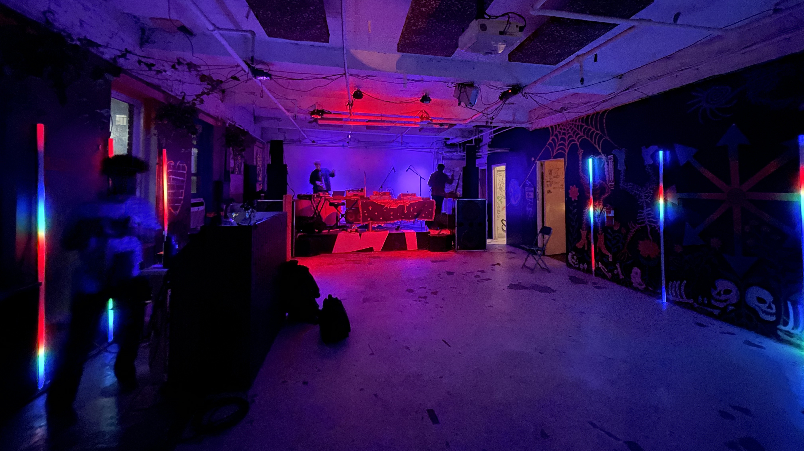

<h3 id="buena-onda">Buena Onda (June 2023)</h3>

`video({ src = "/video/lighting-design/buena-onda-1.mp4" })`

<h3 id="shaker-mountain">Shaker Mountain Second Nature Stage (May 2023)</h3>

`video({ src = "/video/lighting-design/shaker-mountain-ambient.mp4" })`

<h3 id="depth-perception">Depth Perception (March 2023)</h3>

`video({ src = "/video/lighting-design/depth-perception-1.mp4" })`

`video({ src = "/video/lighting-design/depth-perception-2.mp4" })`

<h3 id="29-speedway">29 Speedway (January 2023)</h3>

`video({ src = "/video/lighting-design/29-speedway-1.mp4" })`

<h3 id="sweet-sixteen">Sweet Sixteen (December 2022)</h3>

`video({ src = "/video/lighting-design/sweet-sixteen-1.mp4" })`

`video({ src = "/video/lighting-design/sweet-sixteen-2.mp4" })`

<h3 id="water-shrine">Water Shrine (August 2022)</h3>

_Collaboration with Aileen Amaya_.

Light installation at [Shaker Mountain](https://www.shakermountain.com/) which elevates and celebrates hydration, reminding us of the importance of free water at the rave / party / festival. For more info about the project to advocate for free water, [go here](/slices/free-water).

   

<h3 id="aperture">Aperture (2019)</h3>

Suspended kinetic light sculpture which rotates between two spatial configurations.

