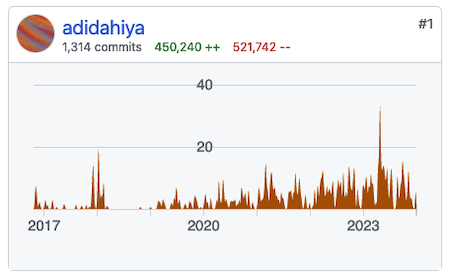

<h3 id="raga">Raga (2023-present)</h3>

[_raga_](https://github.com/adidahiya/raga) is a collection of tools and a desktop applications for
managing a large digital music library, designed for DJs. It is under active development and it
supports my art practice as a DJ.

<h3 id="blueprint">Blueprint (2015-2023)</h3>

I led the development of [Blueprint](https://blueprintjs.com/), [Palantir](https://www.palantir.com/)'s
open source UI toolkit and design language. You can view its
[GitHub repository here](https://github.com/palantir/blueprint). I helped design its APIs,
abstractions, and interactions. I also engaged with the TypeScript and React open source community
to maintain and continuously improve the project.

&rarr; [View the interactive documentation here](https://blueprintjs.com/docs/).

Commit contributions as of December 2023 ([open source](https://github.com/palantir/blueprint/graphs/contributors))

Commit contributions as of December 2023 (closed source)

