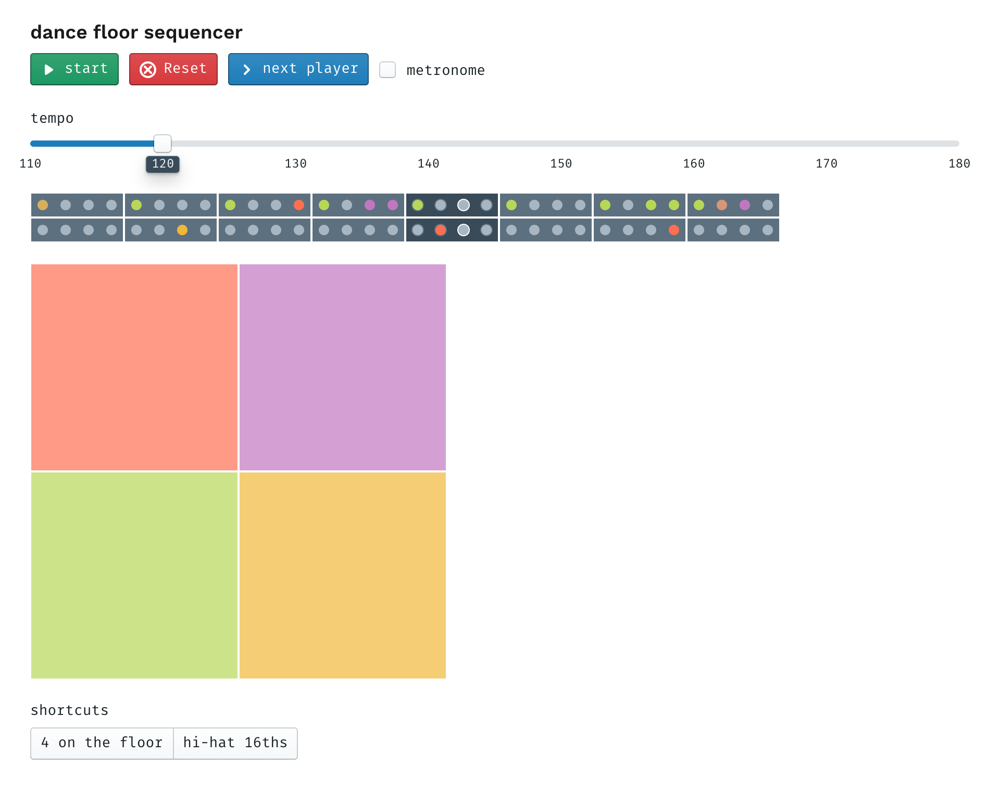

by Adi Dahiya

Application for Winter Show, Fall 2018

## Project idea

I'm making a matrix of dance floor tiles which act as a controller for a drum rack sampler & step sequencer. The software implements some of the key ideas from an [Akai MPC](https://en.wikipedia.org/wiki/Akai_MPC) and modern production workstations like Ableton. Users are invited to step up to the device, express themselves with a little dance over a 2- or 4-bar phrase, and hear back the resulting rhythm produced by the "Dance floor MPC". Successive users can choose to "collaborate" with the previous user's recorded sequence. This is not a precise production tool, but rather a playful experience which enables anyone to enjoy making beats with their body.

## Current status

I have a working hardware prototype constructed mostly of cardboard. In the next week I will rebuild this with sturdier materials (foam pads, U-channel aluminum framing) and add more visible lighting with LED strips.

[You can view the current state of the software (and play with it yourself!) here](/projects/physical-computing/dance-floor-sequencer). It can only play [Roland TR-808](https://en.wikipedia.org/wiki/Roland_TR-808) samples right now, but I have already started building support for additional sample banks (feel free to check out my [commit history](https://github.com/adidahiya/website/commits/develop/src/pages/projects/physical-computing)).

<iframe src="https://player.vimeo.com/video/304532875?loop=1&title=0&byline=0&portrait=0" style="position:absolute;top:0;left:0;width:100%;height:100%;" frameborder="0" webkitallowfullscreen mozallowfullscreen allowfullscreen></iframe>

In this video you see me controlling some parts of the experience by clicking buttons in the web UI; the final device will have hardware affordances for common controls (start/stop, advance to next user, change sample bank, etc). The sequencer timeline UI will also become hardware using LED strips (see the sketch at the top of the page) which are placed in front of the pad matrix.

Relevant deadlines:

- Due as a Code of Music final on Monday, December 10
- Due as a Physical Computing final on Wednesday, December 12

At this point I think the biggest risk factor for this project is the timely fabrication of sturdy tiles. I plan to dedicate nearly all of Thurs-Sun to this build, and I think the above deadlines will help as a forcing function to get the project in a good state.

## Progress blog posts

These should give you an idea of my rapid progress over the past few days and how I'm thinking about fabrication:

- [Week 13 - Dance floor MPC progress, part 3](/blog/itp/physical-computing/week-13-dance-floor-mpc-1)
- [Week 13 - Dance floor sequencer progress, part 2](/blog/itp/physical-computing/week-13-dance-floor-progress)
- [Week 12 - Dance floor sequencer progress, part 1](/blog/itp/physical-computing/week-12-dance-floor-progress)
- [Week 12 - Dance floor sequencer](/blog/itp/physical-computing/week-12-dance-floor-sequencer)

